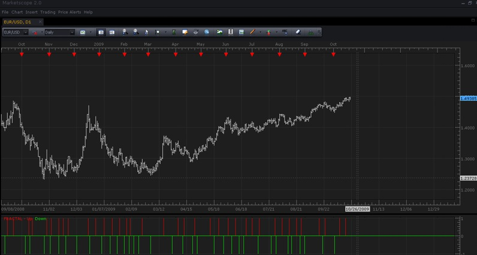

# Bill William's FRACTALS Indicator

> Source: https://fxcodebase.com/code/viewtopic.php?f=17&t=21  
> Forum: 17 · Topic 21 · 7 post(s)

---

## Bill William's FRACTALS Indicator

**admin** · Tue Oct 20, 2009 4:20 pm

**DESCRIPTION:**

"Fractal — it is price behavior change. It means if fractal has appeared - price will change it direction. Fractal is a five bars sequence, where the central bar has higher maximum or lower minimum. The fractal arrow shows central bar position."

Copyright © Bill Williams. From: "Trading Chaos". Buy “Trading Chaos” on Amazon.com: [http://www.amazon.com/Trading-Chaos-Technical-Techniques-Marketplace/dp/0471463086/ref=sr_1_1?ie=UTF8&s=books&qid=1255980582&sr=1-1](https://www.amazon.com/Trading-Chaos-Technical-Techniques-Marketplace/dp/0471463086/ref=sr_1_1?ie=UTF8&s=books&qid=1255980582&sr=1-1)

**HOW TO USE:**

"Our first signal entry into any market is always the first fractal outside the Alligator’s mouth. Once this signal is hit, we will take any and all signals that are triggered in that direction.
If the buy signal is above the Red Balance Line (the Alligator’s Teeth), we would place a buy stop one tick above the high of the up fractal. If the sell signal is below the Red Balance Line, we would place a sell stop one tick below the low of the fractal sell signal.
We would not take a fractal sell signal if, at the time it is hit, the price is above the Red Balance Line. This is the best method we have found to filter out non-profitable fractal trades."

Copyright © Bill Williams. From: "Trading Chaos". Buy “Trading Chaos” on Amazon.com: [http://www.amazon.com/Trading-Chaos-Technical-Techniques-Marketplace/dp/0471463086/ref=sr_1_1?ie=UTF8&s=books&qid=1255980582&sr=1-1](https://www.amazon.com/Trading-Chaos-Technical-Techniques-Marketplace/dp/0471463086/ref=sr_1_1?ie=UTF8&s=books&qid=1255980582&sr=1-1)

 

*Screenshot*

**CALCULATION:**
UP exists at i if HIGH(I – 2) < HIGH(i) and HIGH(I – 1) < HIGH(i) and HIGH(I + 1) < HIGH(i) and HIGH(I + 2) < HIGH(i)
DOWN exists at i if LOW(I – 2) > LOW(i) and LOW(I – 1) > LOW(i) and LOW(I + 1) > LOW(i) and LOW(I + 2) > LOW(i)

The indicator was revised and updated

 [fractal.lua](files/22/fractal.lua)

Tags: Fractal, indicator, Marketscope, Trading Station, FXCM, dbFX

---

## Re: Bill William's FRACTALS Indicator

**kirchhof** · Wed Dec 02, 2009 12:35 pm

Hi Bill.

It seems like a great indicator and looks like it works well.
To filter out false fractals I am not exactly sure if I understood your info.
Can you clarify this for me, maybe with a screen shot of all 3 indicators and an example.
Thank you, and I hope you get this massage.

Ben

---

## Re: Bill William's FRACTALS Indicator

**renewme** · Thu Dec 03, 2009 6:02 pm

Pardon my confusion. I have this and the alligator on charts but i am having trouble understanding the instructions. Can any part of the fractual be in the "mouth"? also do you only buy and sell with the immediate trend? and if so then all buy signals would be above all the lines and vice-versa? Any help would be appreciated and thanks for the indicator!

---

## Re: Bill William's FRACTALS Indicator

**kirchhof** · Fri Dec 04, 2009 3:35 pm

If you don't want to read the book, go to this web discussion and you can learn more about it.

[http://www.forexfactory.com/showthread.php?t=26044](http://www.forexfactory.com/showthread.php?t=26044)

---

## Re: Bill William's FRACTALS Indicator

**kirchhof** · Fri Dec 04, 2009 7:36 pm

Can you create a fractal indicator the produces arrows on the chart?

Thank you, Ben

---

## Re: Bill William's FRACTALS Indicator

**TonyMod** · Mon Dec 07, 2009 11:21 am

> **kirchhof wrote:**
> Can you create a fractal indicator the produces arrows on the chart?
>
> Thank you, Ben

Thanks for replying with URL that has a discussion about use of this indicator.

Now regarding Arrows... As i understand, at this point MarketScope 2.0 cannot display arrows for this indicator. Maybe in the near future this functionality will be added. That's why developers made this Fractals indicator in form of Oscillator. Calculations are of course made by same formula.

Best Regards,

TonyMod

---

## Re: Bill William's FRACTALS Indicator

**Apprentice** · Mon Dec 26, 2016 6:46 am

Indicator was revised and updated.
