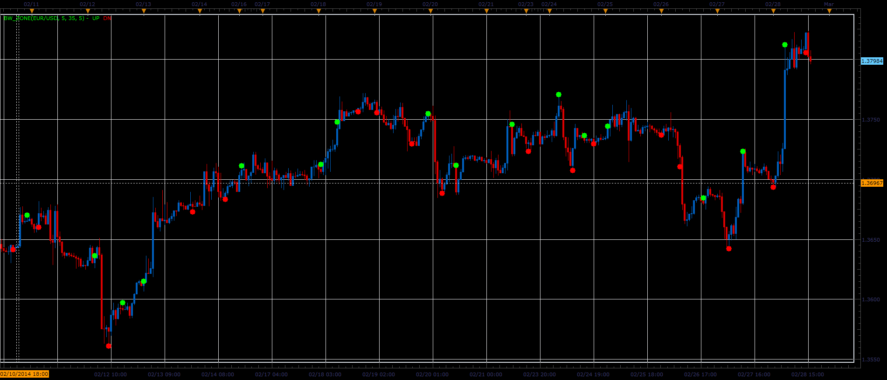

# Bill William's zone indicator

> Source: https://fxcodebase.com/code/viewtopic.php?f=17&t=60393  
> Forum: 17 · Topic 60393 · 3 post(s)

---

## Bill William's zone indicator

**Alexander.Gettinger** · Mon Mar 03, 2014 10:05 am

This indicator is a ported MQL5 indicator from [http://www.mql5.com/en/code/1977](http://www.mql5.com/en/code/1977).

 

Download:

 [BW_Zone.lua](files/92994/BW_Zone.lua)

The indicator was revised and updated

---

## Re: Bill William's zone indicator

**Alexander.Gettinger** · Mon Mar 03, 2014 10:09 am

MQL4 version of Bill William's zone indicator: [viewtopic.php?f=38&t=60394](https://fxcodebase.com/code/viewtopic.php?f=38&t=60394).

---

## Re: Bill William's zone indicator

**Apprentice** · Fri Jun 16, 2017 6:39 am

The indicator was revised and updated.
