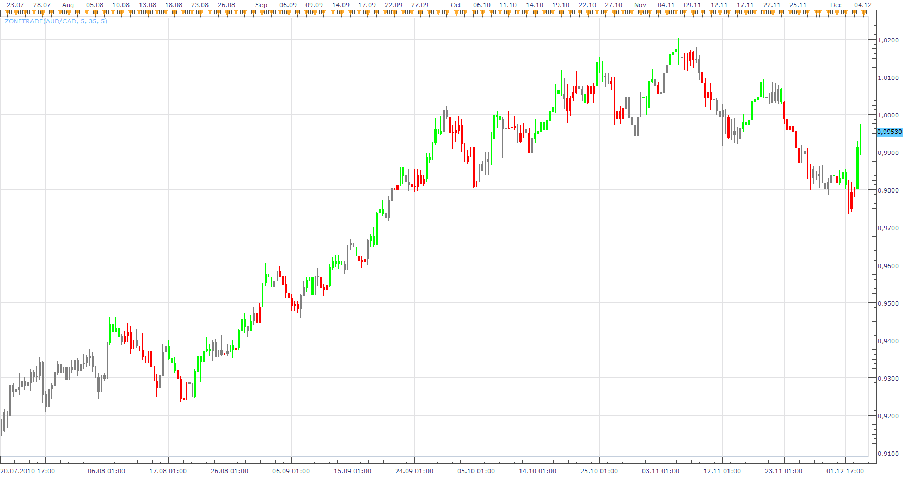

# Bill Williams Zone Trade

> Source: https://fxcodebase.com/code/viewtopic.php?f=17&t=638  
> Forum: 17 · Topic 638 · 11 post(s)

---

## Bill Williams Zone Trade

**Nikolay.Gekht** · Tue Apr 13, 2010 4:58 pm

The Bill Williams Zone trade indicator highlights the source using Awesome and Acceleration/Deceleration oscillators.

If both AC and AO are green - the bar highlighted green (uptrend)
If both AC and AO are red - the bar highlighted red (downtrend)
If AC and AO color differs, the bar highlighted gray.

 

Download the indicator:

 [ZoneTrade.lua](files/1134/ZoneTrade.lua)

 [Zone Trade Bar Chart.lua](files/1134/Zone%20Trade%20Bar%20Chart.lua)

The indicator was revised and updated

---

## Re: Bill Williams Zone Trade

**Nikolay.Gekht** · Tue Apr 13, 2010 5:00 pm

Hint: You can use Location tab on the indicator properties to put the indicator into different area, to avoid hiding the source data. Just check "Show indicator/oscillator in a new area".

---

## Re: Bill Williams Zone Trade

**Apprentice** · Fri Dec 03, 2010 4:31 pm

I adapted this indicator to demonstrated some of the features that will be available in the next version of the trading platform.

In this example, using output_stream: setColor (period, color)
we can determine the color of each candle,
number of color is no longer limited to two.

---

## Re: Bill Williams Zone Trade

**jcervinka** · Wed May 04, 2011 2:58 am

Hi

This indicator is great!
Can you just fixed so that the collors changes also in the "bar chart mode".
When i am in the candelstick mode everything is ok, but on the bar chart nothing happend.

P.S.
Just one question...
In the B.Williams book "N. T. dimenssions" there is an explanation about the AO oscilator to be set on 5/34. Why is on the Marketscope default parameters set on 5/35??
Or there is not such a big difference?

Thanks for your suporting and sorry for my "ignorance..." =(

Regards
Jernej

---

## Re: Bill Williams Zone Trade

**Apprentice** · Wed May 04, 2011 4:32 am

Currently this functionality is not supported by TS.
It can be applied only to Japanese candles.
We are aware of this problem.

In this version default parameters are 5 / 35.
You can change them easily, when adding indicator.

---

## Re: Bill Williams Zone Trade

**Apprentice** · Wed Nov 19, 2014 4:51 am

Bump Up.

---

## Re: Bill Williams Zone Trade

**Apprentice** · Sun May 15, 2016 8:55 am

Zone Trade Bar Chart.lua Added.

---

## Re: Bill Williams Zone Trade

**hasanoguz1** · Tue Apr 11, 2017 2:43 pm

Is it possible to have an option to format ascending candles empty and descending candles filled as it is in Marketscope options?

Thanks in advance..

---

## Re: Bill Williams Zone Trade

**Apprentice** · Wed Apr 12, 2017 2:38 am

Not that I know of.
But we can draw this via draw instances.

---

## Re: Bill Williams Zone Trade

**hasanoguz1** · Thu Apr 13, 2017 8:30 pm

Thank you Apprentice,

It sounds a little difficult, alternatively can you code a bar version of "Zone Trade"?

Thank you

---

## Re: Bill Williams Zone Trade

**hasanoguz1** · Fri Apr 14, 2017 6:42 am

To be clear, I mean bar version like this one

[viewtopic.php?f=17&t=11367&hilit=bar](https://fxcodebase.com/code/viewtopic.php?f=17&t=11367&hilit=bar)

not a OHLC bar on chart..

thanks in advance.
