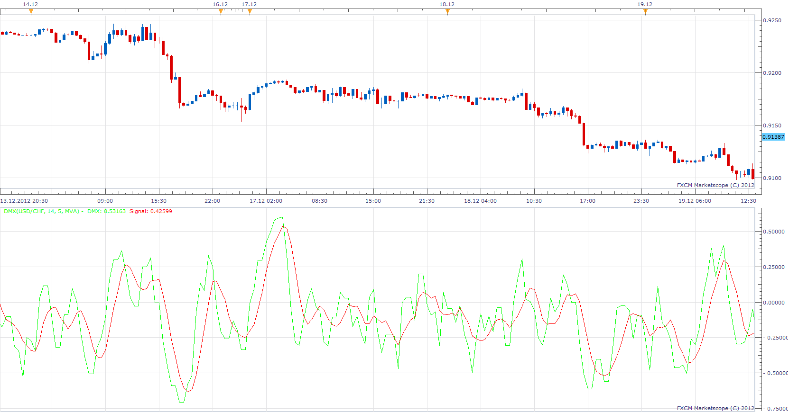

# Bipolar DMI (DMX)

> Source: https://fxcodebase.com/code/viewtopic.php?f=17&t=27832  
> Forum: 17 · Topic 27832 · 3 post(s)

---

## Bipolar DMI (DMX)

**Apprentice** · Wed Dec 19, 2012 6:18 pm

This indicator and ADX have a similar formula.
ADX = | DMI.up - DMI.down| / | DMI.up + DMI.down|
DMX=( DMI.up - DMI.down ) / ( DMI.up + DMI.down )

According to the author.
DMX is low lag substitute for classical DMI and ADX indicators.

 [DMX.lua](files/48788/DMX.lua)

The indicator was revised and updated

---

## Re: Bipolar DMI (DMX)

**Alexander.Gettinger** · Tue Sep 23, 2014 10:38 am

MQL4 version of DMX oscillator: [viewtopic.php?f=38&t=61233](https://fxcodebase.com/code/viewtopic.php?f=38&t=61233).

---

## Re: Bipolar DMI (DMX)

**Apprentice** · Fri Jun 23, 2017 7:11 am

The indicator was revised and updated.
