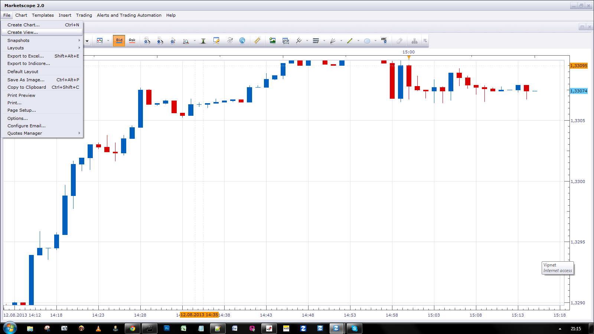

# Blue Sky Index

> Source: https://fxcodebase.com/code/viewtopic.php?f=17&t=58967  
> Forum: 17 · Topic 58967 · 3 post(s)

---

## Blue Sky Index

**Apprentice** · Mon Aug 12, 2013 2:14 pm

Blue Sky Index is ratio between S&P 100 and VIX index

 [Blue Sky Index.lua](files/88364/Blue%20Sky%20Index.lua)

U can Import View as any other Indicator.
Here is shown How U can add View to Chart.

 

Please add this ddl to your TS folder.

 [http_lua.dll](files/88364/http_lua.dll)

The indicator was revised and updated

---

## Re: Blue Sky Index

**Apprentice** · Thu Jun 08, 2017 4:02 pm

The indicator was revised and updated.

---

## Re: Blue Sky Index

**Apprentice** · Thu Nov 25, 2021 10:44 am

Updated.
