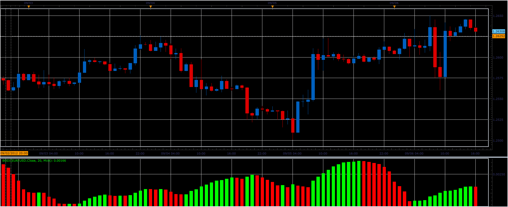

# BoDi indicator

> Source: https://fxcodebase.com/code/viewtopic.php?f=17&t=23089  
> Forum: 17 · Topic 23089 · 2 post(s)

---

## BoDi indicator

**Alexander.Gettinger** · Thu Sep 06, 2012 3:21 pm

Indicator described in Forex Magazine issue #438.

Formula:
BoDi[i]=sqrt(S/Period), where
S - sum (Price[i-k]-MA[i]) for k from 0 to (Period-1).

 

Download:

 [BoDi.lua](files/39795/BoDi.lua)

For this indicator must be installed Averages indicator ([viewtopic.php?f=17&t=2430](https://fxcodebase.com/code/viewtopic.php?f=17&t=2430)).

The indicator was revised and updated

---

## Re: BoDi indicator

**Apprentice** · Wed Apr 12, 2017 6:25 am

Indicator was revised and updated.
