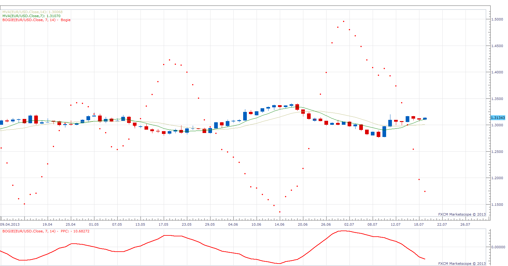

# Bogie

> Source: https://fxcodebase.com/code/viewtopic.php?f=17&t=54668  
> Forum: 17 · Topic 54668 · 8 post(s)

---

## Bogie

**Apprentice** · Sun Jul 21, 2013 2:18 am

As described in the article Triggering Your Trading Signal by Benjamin L. Cotton.
Here’s an indicator that calculates the future price movement necessary to trigger a moving average cross.

 [Bogie.lua](files/82231/Bogie.lua)

---

## Re: Bogie

**gnarlyarbitrage** · Sun Jul 21, 2013 5:41 am

I always find myself thinking what would it take to move the MA right now. Now I can somewhat answer that question.

---

## Re: Bogie

**gnarlyarbitrage** · Mon Jul 22, 2013 12:59 am

Can you make it so that you can choose which type of MA to use for both? Like if I wanted to use the SMA and EMA?

---

## Re: Bogie

**Apprentice** · Mon Jul 22, 2013 4:10 am

This complicates things a bit.
There is no ready-made formula.
I need to think about this problem.

---

## Re: Bogie

**030985** · Tue Jul 23, 2013 10:40 am

> **gnarlyarbitrage wrote:**
> I always find myself thinking what would it take to move the MA right now. Now I can somewhat answer that question.

It is the same thing for me.

Hello,

I was wondering if it could be possible to have the choice to display it as a line instead of points ?

Thank you in advance and have a nice day.

030985

---

## Re: Bogie

**Apprentice** · Sun Jul 28, 2013 2:03 am

Bogie Line Option Added.

---

## Re: Bogie

**Alexander.Gettinger** · Thu Aug 29, 2013 11:17 am

MQL4 version of Bogie indicator: [http://www.fxcodebase.com/code/viewtopi ... 38&t=59354](http://www.fxcodebase.com/code/viewtopic.php?f=38&t=59354).

---

## Re: Bogie

**Apprentice** · Fri Jun 22, 2018 8:25 am

The indicator was revised and updated.
