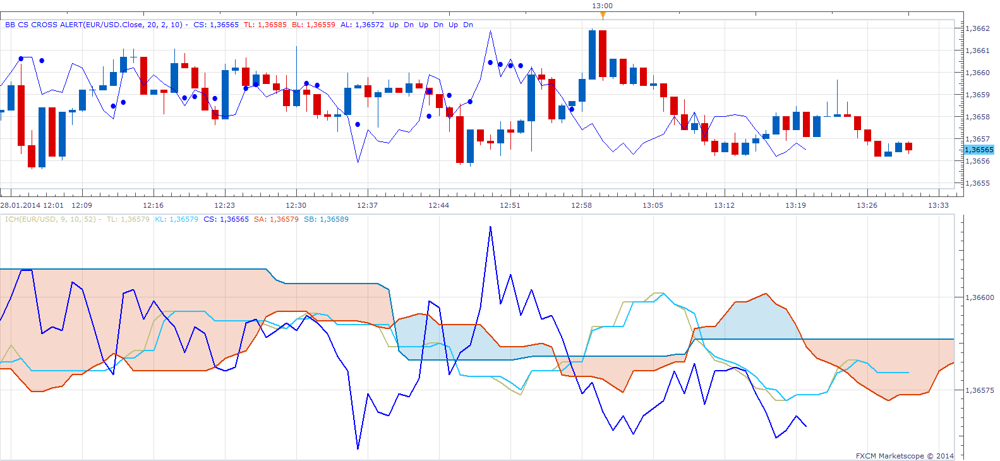
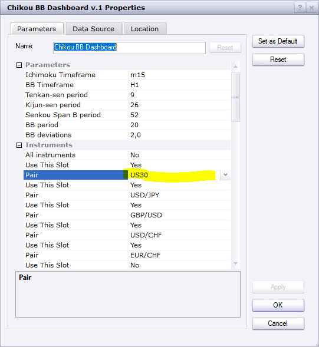

# Bollinger Band / Chinkou Span Cross Alert

> Source: https://fxcodebase.com/code/viewtopic.php?f=17&t=60245  
> Forum: 17 · Topic 60245 · 31 post(s)

---

## Bollinger Band / Chinkou Span Cross Alert

**Apprentice** · Sun Jan 26, 2014 8:49 am

This indicator provides Audio / Email Alerts on BB Lines / Ichomoku Kinko Hyo Chikou Span Line Cross.
 Chikou Span Line is Price N periods ago.

 [BB CS Cross Alert.lua](files/92283/BB%20CS%20Cross%20Alert.lua)

The indicator was revised and updated

---

## Re: Bollinger Band / Chinkou Span Cross Alert

**rch05000** · Tue Jan 28, 2014 8:05 am

Hello Apprentice,

There is a gap between the CS of the indicator BB CS Cross and Ichimoku

On the image, the BB is at 2 am and ichimoku 1 hour

 

I tested him on several TF (BB H1, H2, etc.)

Thank you in advance

---

## Re: Bollinger Band / Chinkou Span Cross Alert

**Apprentice** · Tue Jan 28, 2014 1:28 pm

My test does not detect this problem.
Do you perhaps use different parameters.
Results from two different time frames, are not comparable.

---

## Re: Bollinger Band / Chinkou Span Cross Alert

**rch05000** · Wed Jan 29, 2014 12:48 am

Hi Apprentice,

The tests that I made, are that the BB is superior in the time of ichimoku.
For example:
- Ichimoku in 1H , and I puts the BB in 2H
- Ichimoku in M15, and BB 30M or 2H
It is from there that there is a gap.
Is it possible to modify the indicator BB CS cross ?

Thank you in advance

---

## Re: Bollinger Band / Chinkou Span Cross Alert

**Apprentice** · Thu Jan 30, 2014 4:23 am

Theoretically, yes, we need to introduce two time frame selector for ICH and BB:

---

## Re: Bollinger Band / Chinkou Span Cross Alert

**Jacques** · Thu Jan 30, 2014 9:26 am

Hi there, Apprentice.

Thanks for such awesome indicator. It's pretty accurate to determine the trend movement.

I'm wondering if you can make a strategy based on this indicator. I think it'll be awesome. Chikou Span Cross Over / Cross Under the Upper Band, Middle Band, and Lower Band. If possible, please provide an option to do "One action Cancel Other action" or OCO so that the previous opened position will close automatically when the new position is opened without the need to set the "Close Position" option.

Thanks for your help.

Best regards,
Jacques

---

## Re: Bollinger Band / Chinkou Span Cross Alert

**Apprentice** · Sat Feb 01, 2014 2:38 pm

Your request is added to the development list.

---

## Re: Bollinger Band / Chinkou Span Cross Alert

**rch05000** · Sun Feb 02, 2014 6:00 am

Hi Apprentice,

You answered me:

> Theoretically, yes, we need to introduce two time frame selector for ICH and BB:

You can modify the indicator, so that we can have, for example:
The chinkou span TF 1H which cross the BB TF 2H

Thank you in advance for your help

---

## Re: Bollinger Band / Chinkou Span Cross Alert

**neosimeone** · Sun Feb 02, 2014 11:54 am

Hello, Thank you very much for this indicator.
I'm waiting for with big interest the new version with the possibility to put BBH2 and Chinkou Span 15 min. For the moment we can do it but only with the same frame.

Thank you for advance for your help

---

## Re: Bollinger Band / Chinkou Span Cross Alert

**neosimeone** · Wed Feb 19, 2014 8:01 pm

Hello,
Have you got any news about version with the possibility to put BBH2 and Chinkou Span 15 min ?
Thanks for advance

---

## Re: Bollinger Band / Chinkou Span Cross Alert

**Apprentice** · Sat Feb 22, 2014 5:57 am

Unfortunately no new developments for now.

---

## Re: Bollinger Band / Chinkou Span Cross Alert

**neosimeone** · Sat Feb 22, 2014 7:12 am

OK i'm waiting for...
The development is almots done, it miss only to put BBH2 and Chinkou Span 15 min.
I hope that you could do a new development soon...
Thanks for advance

---

## Re: Bollinger Band / Chinkou Span Cross Alert

**neosimeone** · Sat Mar 22, 2014 2:49 am

Hello, any news about development of the new version of indicator ?
Thanks for advance

---

## Re: Bollinger Band / Chinkou Span Cross Alert

**Hyperion** · Sun Jan 18, 2015 9:45 am

Hello Apprentice,

Any new development on this strategy in relation to what neosimeone suggested ?

Thanks in advance,

Regards,

Hyperion

---

## Re: Bollinger Band / Chinkou Span Cross Alert

**Apprentice** · Sun Dec 06, 2015 7:06 am

Compatibility issue fixed.
_Alert Helper is not longer needed.

---

## Re: Bollinger Band / Chinkou Span Cross Alert

**Apprentice** · Fri Jul 21, 2017 9:00 am

The indicator was revised and updated.

---

## Re: Bollinger Band / Chinkou Span Cross Alert

**jelogui83** · Fri Nov 15, 2019 5:34 pm

i see that it has already been asked in 2014 without answer.
could you please tell me what was the result of all this ?
regards.

---

## Re: Bollinger Band / Chinkou Span Cross Alert

**druuna** · Wed Apr 15, 2020 10:14 am

> **Apprentice wrote:**
> Theoretically, yes, we need to introduce two time frame selector for ICH and BB:

Hello apprentice, thank you for all your kind help here

Is this indicator finally existing now? there is a really interresting one

It will be also interresting to get a dashboard to find currencies where chinkou 15 min are crossing BB 2h for example , is there a way to get that ?

have a nice day, stay home and take care of you

---

## Re: Bollinger Band / Chinkou Span Cross Alert

**Apprentice** · Wed Apr 15, 2020 1:10 pm

Your request is added to the development list.
Development reference 1068.

---

## Re: Bollinger Band / Chinkou Span Cross Alert

**Apprentice** · Mon Apr 20, 2020 8:04 am

 [chinkou BB Dashboard.lua](files/132986/chinkou%20BB%20Dashboard.lua)

---

## Re: Bollinger Band / Chinkou Span Cross Alert

**druuna** · Wed Apr 22, 2020 9:19 am

hello, what a nice tool, is it right to have signal in the middle line of bb ?
i was reaching on bb themself

is it possible ?

thank you so much

 

---

## Re: Bollinger Band / Chinkou Span Cross Alert

**Apprentice** · Wed Apr 22, 2020 10:28 am

Your request is added to the development list.
Development reference 1103.

---

## Re: Bollinger Band / Chinkou Span Cross Alert

**Apprentice** · Thu Apr 23, 2020 4:38 am

[chinkou BB Dashboard.lua](files/133099/chinkou%20BB%20Dashboard.lua)

Try this version.

---

## Re: Bollinger Band / Chinkou Span Cross Alert

**druuna** · Mon Apr 27, 2020 5:02 am

Wow, really great thank you

can i ask you to add some audio signal please ?
for example one general signaél on selected pars can be enough i think, if it is more easy for you ?

take care about you

---

## Re: Bollinger Band / Chinkou Span Cross Alert

**Apprentice** · Mon Apr 27, 2020 2:47 pm

Your request is added to the development list.
Development reference 1160.

---

## Re: Bollinger Band / Chinkou Span Cross Alert

**Apprentice** · Tue Apr 28, 2020 11:01 am

[chinkou BB Dashboard.lua](files/133308/chinkou%20BB%20Dashboard.lua)

Try this version.

---

## Re: Bollinger Band / Chinkou Span Cross Alert

**druuna** · Mon May 18, 2020 12:30 pm

> **Apprentice wrote:**
>
>
> chinkou BB Dashboard.lua
>
>
> Try this version.

Thank you very much, this is a perfect one

---

## Re: Bollinger Band / Chinkou Span Cross Alert

**jelogui83** · Mon Jun 08, 2020 9:24 am

Hello Dear Apprentice !
here's a great job again ...

but ... to improve it, it should be interesting to be able to change pairs or add some new parameters.
it seems you limited them to 20, and most of all we don't have markets (US30, NAS100, ...) or commodities (USOIL, XAUUSD ...).

so, if you could add them, it should be wonderful.

best regards !

---

## Re: Bollinger Band / Chinkou Span Cross Alert

**Apprentice** · Tue Jun 09, 2020 6:05 am

Your request is added to the development list.
Development reference 1440.

---

## Re: Bollinger Band / Chinkou Span Cross Alert

**Apprentice** · Tue Jun 09, 2020 9:56 am

chinkou BB Dashboard and TS will allow US 30.
About the 20 instrument limit,
you will have to contact FXCM and ask them to remove this restriction for your account.

 

Some of instruments on my trading station.

---

## Re: Bollinger Band / Chinkou Span Cross Alert

**jelogui83** · Wed Jun 10, 2020 7:48 pm

excellent
all the best !
