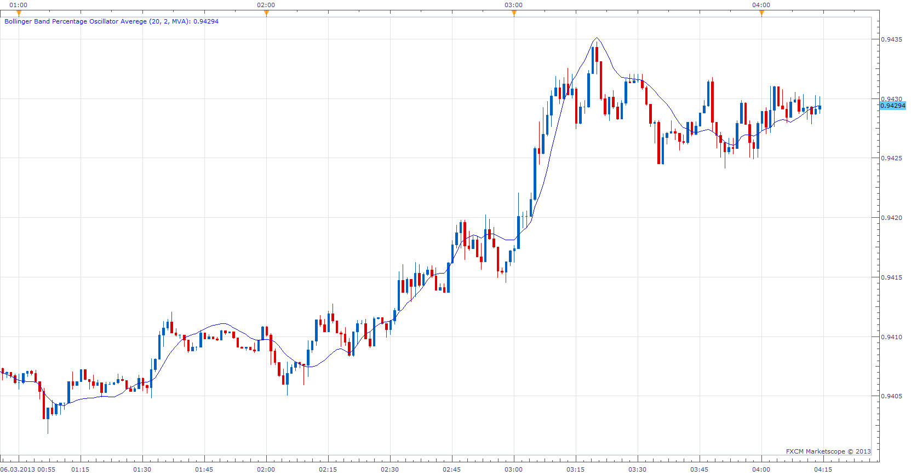
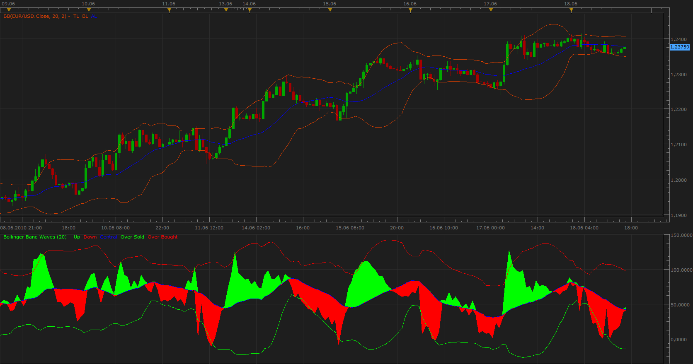

# Bollinger Band Percentage Oscillator Averege

> Source: https://fxcodebase.com/code/viewtopic.php?f=17&t=1373  
> Forum: 17 · Topic 1373 · 12 post(s)

---

## Bollinger Band Percentage Oscillator Averege

**Apprentice** · Fri Jun 18, 2010 2:49 pm

*Bollinger Band Percentage Oscillator Averege*

Derived from the normalized, averaged value of price within the channel, defined by Standard Deviations. Bollinger Band Oscillator Percentage Averege and Price Action have limited correlation. Price level, around Which Price oscillates, will be shown by BBOPA.

Tip.
Instead Candles use the line chart, gives less noise.
I can not remember when i have traded only with a line chart.

 [BBPOMVA.bin](files/2643/BBPOMVA.bin)

---

## Bollinger Band Waves

**Apprentice** · Sat Jun 19, 2010 2:57 pm

*Bollinger Band Waves*

This is the first version of Bollinger Band Waves oscillator.

BBW have two, Overbought levels 100 and upper belt line
and two, Oversold, levels 0 and the lower belt line.

Signals are generated when BBW cross the center line.

Strong signals of opposite directions are generated in or near Oversold, Overbought areas.
Weak signals of same directions are generated in or near Oversold, Overbought areas.

Buy signals while the central line is falling are questionable, and vice versa, They should be ignored.

Test, combine with other indicators.

 [BBW.lua](files/2650/BBW.lua)

To work you need to have, download BB-Percentages Oscillator.
[viewtopic.php?f=17&t=226&hilit=Bandwidth](https://fxcodebase.com/code/viewtopic.php?f=17&t=226&hilit=Bandwidth)

---

## Re: Bollinger Band Percentage Oscillator Averege

**Hailkayy** · Mon May 07, 2012 3:18 pm

This Website is a Gold Mine.
Judicisously combined this is highly effective, along with %b updated version.
Congrats keep up.

---

## Re: Bollinger Band Percentage Oscillator Averege

**Apprentice** · Wed Mar 20, 2013 3:49 pm

Bollinger Band Percentage Oscillator Averege Update.

---

## Re: Bollinger Band Percentage Oscillator Averege

**speakinmymind** · Thu Mar 21, 2013 7:33 pm

Can you create a strategy and alert using the output of the oscillator and slope of the midline? Also, I can't seem to change the size of the midline.

---

## Re: Bollinger Band Percentage Oscillator Averege

**Apprentice** · Sat Mar 23, 2013 6:05 am

Bollinger Band Waves Style Fixed.

---

## Re: Bollinger Band Percentage Oscillator Averege

**Apprentice** · Sat Mar 23, 2013 6:27 am

Requested can be found here.
[viewtopic.php?f=31&t=33740](https://fxcodebase.com/code/viewtopic.php?f=31&t=33740)

---

## Re: Bollinger Band Percentage Oscillator Averege

**Apprentice** · Tue Aug 20, 2013 2:25 am

Bump Up

---

## Re: Bollinger Band Percentage Oscillator Averege

**pakoromeu** · Sat May 03, 2014 3:24 am

There is any possibility to convert Bollinger Band Percentage Oscillator Averege (BBPOMVA) to MT4. I'll be very grateful. Blessings

---

## Re: Bollinger Band Percentage Oscillator Averege

**Apprentice** · Sat May 03, 2014 12:01 pm

Requested can be found here.
[viewtopic.php?f=38&t=60631&p=93808#p93808](https://fxcodebase.com/code/viewtopic.php?f=38&t=60631&p=93808#p93808)

---

## Re: Bollinger Band Percentage Oscillator Averege

**pakoromeu** · Sun May 04, 2014 2:03 pm

Infinitely grateful. You're the man Apprentice

---

## Re: Bollinger Band Percentage Oscillator Averege

**Apprentice** · Sun Feb 04, 2018 1:17 pm

The indicator was revised and updated.
