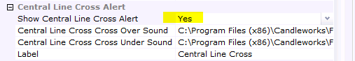

# Bollinger Band with Alert

> Source: https://fxcodebase.com/code/viewtopic.php?f=17&t=60189  
> Forum: 17 · Topic 60189 · 23 post(s)

---

## Bollinger Band with Alert

**Apprentice** · Sat Jan 11, 2014 5:30 am

 [BB with Alert.lua](files/91921/BB%20with%20Alert.lua)

This indicator provides Audio / Email Alerts on BB Lines / Price Cross.

Compatibility issue fixed.
_Alert Helper is not longer needed.

---

## Re: Bollinger Band with Alert

**ldemarchi** · Sun Jan 12, 2014 7:16 pm

Hi apprentice,

When I install and use this indicator I get this error (see below) then the bollinger bands dissaper.

Please advise.

An error occurred during the calculation of the indicator 'BB WITH ALERT'. The error details: BB with Alert.lua:462: attempt to call method 'barSize' (a nil value).

---

## Re: Bollinger Band with Alert

**bluegreen** · Mon Jan 13, 2014 4:32 am

Thanks for posting this great alert but I still get the error
"An error occurred during the calculation of the indicator 'BB WITH ALERT'. The error details: BB with Alert.lua:412: attempt to call method 'barSize' (a nil value)."
even after downloading new version you posted after fixing old one.

As I understand it, you have to download alert.lua, install it into strategies and alerts, go to new strategy/alert then chose the alert.lua and clikc ok. then install the bb indicator by going to import on the add indicator menu.

---

## Re: Bollinger Band with Alert

**Apprentice** · Mon Jan 13, 2014 5:50 am

I have missed this one, please redownload.

---

## Re: Bollinger Band with Alert

**bluegreen** · Tue Jan 14, 2014 5:03 am

Thanks Apprentice, it works now, however I only get alerts when I have the chart with the Bollinger band indicator on showing, is it supposed to produce audio alerts when marketscope is closed ? otherwise I have to keep the chart open all the time?

---

## Re: Bollinger Band with Alert

**rch05000** · Tue Jan 14, 2014 10:16 am

Hello Apprentice,

Good year
Is it possible to create an alert when Chikou Span cross over/ Band Bollinger or cross Under/ Band Bollinger

Thank you in advance

---

## Re: Bollinger Band with Alert

**Apprentice** · Sun Jan 26, 2014 8:50 am

Requested can be found here.
[viewtopic.php?f=17&t=60245&p=92283#p92283](https://fxcodebase.com/code/viewtopic.php?f=17&t=60245&p=92283#p92283)

---

## Re: Bollinger Band with Alert

**rch05000** · Sun Jan 26, 2014 10:54 am

Thank you very much Apprentice

---

## Re: Bollinger Band with Alert

**ytsarik** · Wed Jul 08, 2015 1:59 am

Dear Apprentice, thank you very much for that signal! Works perfectly with Marketscope 2.0.
Is that possible to create the same, but signalling only when the price hits Higher or Lower Band, not the Middle Band, as Middle Band is not so relevant for the strategy I use?

---

## Re: Bollinger Band with Alert

**Apprentice** · Mon Jul 13, 2015 3:52 am

You can do it via this option.

---

## Re: Bollinger Band with Alert

**ytsarik** · Sun Sep 20, 2015 2:25 pm

> **Apprentice wrote:**
>
>
> Capture.PNG
>
>
> You can do it via this option.

Thank you very much for that!

---

## Re: Bollinger Band with Alert

**Apprentice** · Sun Dec 06, 2015 7:09 am

Compatibility issue fixed.
_Alert Helper is not longer needed.

---

## Re: Bollinger Band with Alert

**SuperTrader** · Tue Jun 21, 2016 10:18 am

> **Apprentice wrote:**
> Compatibility issue fixed.
> _Alert Helper is not longer needed.

great job! (as always) thank you!

---

## Re: Bollinger Band with Alert

**Apprentice** · Mon Sep 04, 2017 9:51 am

The indicator was revised and updated.

---

## Re: Bollinger Band with Alert

**Trader** · Wed Jan 03, 2018 12:19 am

Hello Apprentice
1] received/ thank you
2] with best wishes; and
Regards
Trader

---

## Re: Bollinger Band with Alert

**Apprentice** · Thu May 03, 2018 12:13 pm

The indicator was revised and updated.

---

## Re: Bollinger Band with Alert

**Trader** · Mon Dec 10, 2018 9:09 am

Hello Apprentice
1] with reference to the indicator Bollinger Band With Alert;
[http://fxcodebase.com/code/viewtopic.php?f=17&t=60189&hilit=bollinger+band+with+alert#p91921](https://fxcodebase.com/code/viewtopic.php?f=17&t=60189&hilit=bollinger+band+with+alert#p91921)
the version that allows the upper/lower band lines to be formatted seperately
2] in the section of size/color of up/down arrows/ can you please add the option of;
 Show Historical = Yes/No
3] so it should be possible to select if the arrows should be displayed on all the candles or only the last candle
4] thank you in advance
Regards
Trader

---

## Re: Bollinger Band with Alert

**Apprentice** · Wed Dec 12, 2018 4:40 am

Try this version.

 [BB with Alert.lua](files/122705/BB%20with%20Alert.lua)

---

## Re: Bollinger Band with Alert

**Trader** · Thu Dec 13, 2018 7:13 am

Hello Apprentice
1] thank you for the post
2] can you please add the option of 'Show Historical = Yes/No' to the part of Up/Dn arrows
Thank you; and
Regards
Trader

---

## Re: Bollinger Band with Alert

**Apprentice** · Thu Dec 13, 2018 10:24 am

Your request is added to the development list under Id Number 4364

---

## Re: Bollinger Band with Alert

**Trader** · Thu Dec 13, 2018 11:40 am

Hello Apprentice
Thank you
Regards
Trader

---

## Re: Bollinger Band with Alert

**Apprentice** · Wed Dec 19, 2018 4:57 am

Show Historical option added.

---

## Re: Bollinger Band with Alert

**Trader** · Sun Dec 23, 2018 5:30 am

Hello Apprentice
Received/ thank you; and
Best regards
Trader
