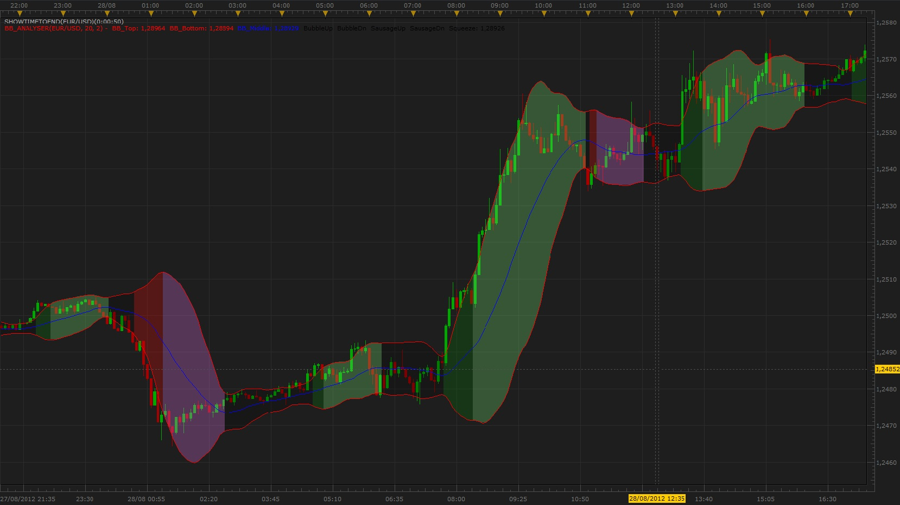

# Bollinger Bands Analyser

> Source: https://fxcodebase.com/code/viewtopic.php?f=17&t=23335  
> Forum: 17 · Topic 23335 · 23 post(s)

---

## Bollinger Bands Analyser

**Scrat_Power** · Wed Sep 12, 2012 2:04 pm

Hi,

Here an indicator devevelopped following Tymen's analysis of the Bollinger Bands.
There's not the entire Tymen's method, only the analysis of the market.
Concepts of squeeze, bubble and sausage are well known otherwise, but Tymen has published some parameters to define more precisely what are conditions to define these forms.
The CBL parts of the method is not programmed.
If someone has an idea, you are welcome .

Don't hesitate to give me feedbacks.

"AVERAGES" indicator is also needed as used to smooth BB streams.

 

Regards,
Scrat.

MT4/Mq4 version
[viewtopic.php?f=38&t=64453](https://fxcodebase.com/code/viewtopic.php?f=38&t=64453)

The indicator was revised and updated

---

## Re: Bollinger Bands Analyser

**fxdirekt** · Mon Sep 17, 2012 3:59 am

Thanks, this is great.

It would be nice to have either an option to hide the mid-band or to color it as in the AVARAGES_MA_SLOPE indicator.

fxdirekt

---

## Re: Bollinger Bands Analyser

**Scrat_Power** · Mon Sep 17, 2012 9:14 am

Hi,

I will add these options.

For the color, do you want a simple slope detection or a slope detection with a pips/minute limit ?

Regards,
Scrat.

---

## Re: Bollinger Bands Analyser

**amazon1a** · Mon Sep 17, 2012 10:38 am

Hi, For some reason I can not get it to work. All I see is the Squeeze coloration between the BBs. No Bubble or Sausage is identified on either D1 or H4 charts. Am I doing something wrong? I have Averages loaded and I am looking at 10 mos of data for GBPAUD which has good trend examples.

---

## Re: Bollinger Bands Analyser

**Coondawg71** · Mon Sep 17, 2012 3:11 pm

Same problem with me...I don't get the coloration differences on the price chart.

I second the idea of changing the color of the middle line such as what the AVERAGES SLOPE offers.

Otherwise, Great indicator, nice work.

thanks,

sjc

---

## Re: Bollinger Bands Analyser

**amazon1a** · Tue Sep 18, 2012 10:20 am

By changing the default Minimum Slope to 0.0001 I can see now the Bubble/Sausage coloration. As an aside, I hear that Tymen no longer uses this indicator. I think that it has real promise, but his use of CBL will work only in highly selected setups.

---

## Re: Bollinger Bands Analyser

**Scrat_Power** · Sat Sep 22, 2012 9:54 am

Hi,

Here the version 2.
Changes :
- Show (or not) the BB middle stream
- Normal slope detection (dark green and red)
- Pip/minute slope detection (light green and red)

Regards,
Scrat.

---

## Re: Bollinger Bands Analyser

**amazon1a** · Sat Sep 22, 2012 10:29 am

HI Scrat, I really like the new version with the ability to change the color of the middle BB line with the slope. Would it be possible to add a function to change the style and size of the BB lines independently - at least the outer lines separate from the middle line. Great work!! Bob

---

## Re: Bollinger Bands Analyser

**Scrat_Power** · Sun Sep 23, 2012 2:06 am

Hi,

Version 2 updated with line width and line style.

Regards,
Scrat.

---

## Re: Bollinger Bands Analyser

**amazon1a** · Sun Sep 23, 2012 7:54 am

Looks great, Thanks

---

## Re: Bollinger Bands Analyser

**TMos1124** · Tue Apr 16, 2013 2:14 pm

I believe I accidentally deleted my request, but could an alert be made at the change of color/form of the bollinger band?

Many Thanks.

---

## Re: Bollinger Bands Analyser

**tayjuichuan** · Wed May 07, 2014 9:35 pm

Hi,
I am a new user.
I am interested to download this indicator into my MT4 platform.
Can you send the full indicator link to [[email protected]](https://fxcodebase.com/cdn-cgi/l/email-protection#f286938b98879b919a87939cb28b9f939b9edc919d9f)(Appreciate)
Or please let me know where and how to download?
I think it is very useful in my Binary Option trading strategy!!
Thank you very much

---

## Re: Bollinger Bands Analyser

**Apprentice** · Thu May 08, 2014 1:53 am

As far as I know such indicator has never been developed.

---

## Re: Bollinger Bands Analyser

**tayjuichuan** · Thu May 08, 2014 4:55 am

Hi,
Do you know any of such indicator , color coded, which is effective to indicate a momentum shift for say 15 minutes chart??
Please advise
Tks

---

## Re: Bollinger Bands Analyser

**kingos497** · Fri May 09, 2014 2:16 pm

is it possible to developp this indicator for mt4 please?

---

## Re: Bollinger Bands Analyser

**Apprentice** · Sat May 10, 2014 2:27 am

Your request is added to the development list.

---

## Re: Bollinger Bands Analyser

**Babylon** · Tue Feb 02, 2016 3:46 pm

Hello, I have used this amazing indicator in the past , but recently I had to reinstall my TS platform and now appears the following message:
An error occurred during the calculation of the indicator 'BB_ANALYSER_2(EUR/USD, 20, 2)'. The error details: C:/Program Files (x86)/Candleworks/FXTS2/Indicators/Custom/BB_Analyser_2.lua:178: attempt to index upvalue 'AVG_Top' (a nil value).

Hope you can help me with this...

---

## Re: Bollinger Bands Analyser

**Apprentice** · Tue Feb 02, 2016 4:14 pm

Make sure to install AVERAGES.LUA

---

## Re: Bollinger Bands Analyser

**Babylon** · Tue Feb 02, 2016 11:26 pm

Thank you so much Apprentice, I´ve done that and works perfectly.
Also tks to Scrat for your time and help.
YOU GUYS ROCK!!!

---

## Re: Bollinger Bands Analyser

**albertparis** · Thu May 12, 2016 4:04 am

is it possible to developp this indicator for strategy ?

I am French sorry for my bad english . Can have your strategy with this 2 indicator?
BB_Analyser_2.lua :
[viewtopic.php?f=17&t=23335&hilit=BB_ANALYSER_2](https://fxcodebase.com/code/viewtopic.php?f=17&t=23335&hilit=BB_ANALYSER_2)
For the filter : Highly adaptable CCI Strategy
[viewtopic.php?f=31&t=4562](https://fxcodebase.com/code/viewtopic.php?f=31&t=4562)
Thank you in advance

---

## Re: Bollinger Bands Analyser

**Apprentice** · Fri May 13, 2016 1:34 pm

Your request is added to the development list.

---

## Re: Bollinger Bands Analyser

**albertparis** · Fri May 13, 2016 2:52 pm

Looks great, Thanks

---

## Re: Bollinger Bands Analyser

**Apprentice** · Sat Feb 11, 2017 4:57 am

Indicator was revised and updated.
