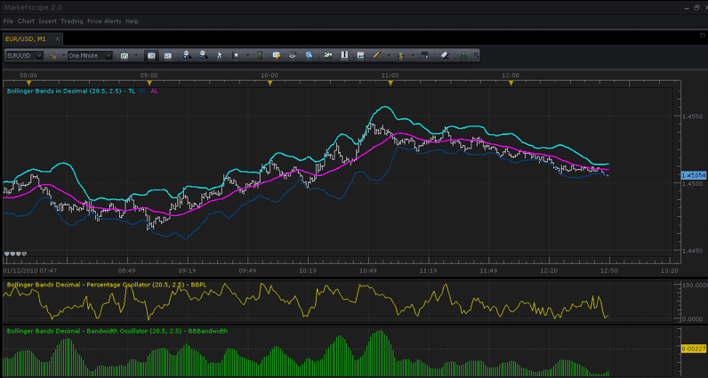
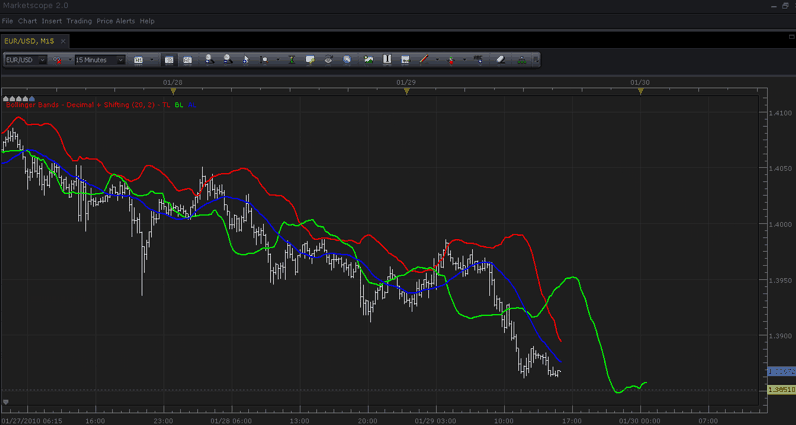

# Bollinger Bands Decimal - Original, Percentage, Bandwidth

> Source: https://fxcodebase.com/code/viewtopic.php?f=17&t=237  
> Forum: 17 · Topic 237 · 15 post(s)

---

## Bollinger Bands Decimal - Original, Percentage, Bandwidth

**TonyMod** · Tue Jan 12, 2010 1:02 pm

As per member's request posting Bollinger Bands indicator with Decimal parameter support:

**Bollinger Bands Decimal:**

 [BB-Decimal.lua](files/339/BB-Decimal.lua)

Since lately there was 2 more Bollinger Bands oscillators developed developed by our member's requests, posting them too with same type of modification - decimal parameter support:

**Bollinger Bands Percentage Decimal:**

 [BB-Percentages-Decimal.lua](files/339/BB-Percentages-Decimal.lua)

**Bollinger Bands Bandwidth Decimal:**
BAND = ((TL - BL) / CL);

 [BB-Bandwidth-Decimal.lua](files/339/BB-Bandwidth-Decimal.lua)

**Bollinger Bands Bandwidth with Simple Bollinger Bands Bandwidth option**
BAND = (TL - BL) ;

 [BB-Bandwidth.lua](files/339/BB-Bandwidth.lua)

**Screen shot of all 3 working together in MarketScope with 20.5 and 2.5 decimal parameters:**

 

*SCREENSHOT of all 3 working together with parameters set to 20.5 and 2.5*

Information on Bollinger Bands can be found at official Bollinger Bands website: [http://www.bollingerbands.com/](http://www.bollingerbands.com/)

For any question please respond to this thread of contact a moderator.

The indicator was revised and updated

---

## Re: Bollinger Bands Decimal - Original, Percentage, Bandwidth

**6519036543** · Tue Jan 12, 2010 1:34 pm

Very nice work, guy's i search for Bbands can somebody help me ?

---

## Re: Bollinger Bands Decimal - Original, Percentage, Bandwidth

**TonyMod** · Wed Jan 13, 2010 1:28 pm

> **6519036543 wrote:**
> Very nice work, guy's i search for Bbands can somebody help me ?

First i was little confused.... "BBands" name seems to hint "Bollinger Bands" that i just posted. But then i google:d the name and saw that you probably mean totally different one.

Yeah it could be possible to implement it. For that "BBands Indicator" keyword google.com shows [http://forex-strategies-revealed.com/mt4/stochastic-bbands-stop](http://forex-strategies-revealed.com/mt4/stochastic-bbands-stop) as top search. Is this the indicator you want?

---

## Re: Bollinger Bands Decimal - Original, Percentage, Bandwidth

**6519036543** · Wed Jan 13, 2010 2:11 pm

Yes this one what i need Bbands_stop
can you make it ?

---

## Re: Bollinger Bands Decimal - Original, Percentage, Bandwidth

**TonyMod** · Thu Jan 14, 2010 1:58 pm

> **6519036543 wrote:**
> Yes this one what i need Bbands_stop can you make it ?

Possibly yes, i personally don't see any problem in making it, but maybe there are some limitations that i personally don't know about. I passed your request to developers, and i'll keep you updated.

Cheers.

---

## Re: Bollinger Bands Decimal - Original, Percentage, Bandwidth

**6519036543** · Thu Jan 14, 2010 2:36 pm

Thanks

---

## Re: Bollinger Bands Decimal - Original, Percentage, Bandwidth

**gg_frx** · Mon Jan 18, 2010 5:59 am

> **TonyMod wrote:**
> As per member's request posting Bollinger Bands indicator with Decimal parameter support:
>
> **Bollinger Bands Decimal:**
>
>
> BB-Decimal.lua

thanks guys for your efforts ...
only a little on this indicator ... as my previous request, is it possible to add the parameter to shift the bands ? (like the alligator indicator )
thank you again

---

## Re: Bollinger Bands Decimal - Original, Percentage, Bandwidth

**TonyMod** · Mon Jan 18, 2010 12:13 pm

> **gg_frx wrote:**
>
>
> > **TonyMod wrote:**
> > As per member's request posting Bollinger Bands indicator with Decimal parameter support:
> >
> > **Bollinger Bands Decimal:**
> >
> >
> > BB-Decimal.lua
>
>
>
> thanks guys for your efforts ...
> only a little on this indicator ... as my previous request, is it possible to add the parameter to shift the bands ? (like the alligator indicator )
> thank you again

Ugh, sorry so much work.... I totally forgot to reply to you that its possible
So you need 1 parameter to specify by which n-periods you want to shift entire indicator output? Or you want a parameter for EACH band?

Also you'll have to enter this into all 3 instances, 1 for indicator, 1 for % oscillator, and 1 for bandwidth oscillator.

---

## Re: Bollinger Bands Decimal - Original, Percentage, Bandwidth

**gg_frx** · Mon Jan 18, 2010 2:25 pm

> **TonyMod wrote:**
>
> Ugh, sorry so much work.... I totally forgot to reply to you that its possible
> So you need 1 parameter to specify by which n-periods you want to shift entire indicator output? Or you want a parameter for EACH band?
>
> Also you'll have to enter this into all 3 instances, 1 for indicator, 1 for % oscillator, and 1 for bandwidth oscillator.

don't worry
if it is an easy job is better to have a parameter for each band.
and the shift is only for the bands, not needed for indicators
bye

---

## Re: Bollinger Bands Decimal - Original, Percentage, Bandwidth

**TonyMod** · Fri Jan 29, 2010 3:56 pm

> **gg_frx wrote:**
>
>
> > **TonyMod wrote:**
> >
> > Ugh, sorry so much work.... I totally forgot to reply to you that its possible
> > So you need 1 parameter to specify by which n-periods you want to shift entire indicator output? Or you want a parameter for EACH band?
> >
> > Also you'll have to enter this into all 3 instances, 1 for indicator, 1 for % oscillator, and 1 for bandwidth oscillator.
>
>
>
> don't worry
> if it is an easy job is better to have a parameter for each band.
> and the shift is only for the bands, not needed for indicators
> bye

Ok here it is. JUST the Bollinger Bands themselves with Shifting Capability. It still have Decimal variables, but now it also contains 3 more variables that set at 0, but if u put any positive value there, it will move the band by that amount of periods.

Here is the screenshot with one of the bands shifted by 35 periods:

 

*Screenshot of Bollinger Bands with Green Band shifted by 35 periods.*

Here is the lua file:

 [BB-Decimal-WITH-Shifting.lua](files/407/BB-Decimal-WITH-Shifting.lua)

What you think? Try it out and let me know.

Just remember, percentage and bandwidth oscillators wont show "shifted" values, you'll only see actual bands shifting, and thats all.

I'll wait for your reply, sorry it took a while to get it to you, we're very short on resources lately. But regardless we're trying to get things to people as fast as possible

Cheers.

---

## Re: Bollinger Bands Decimal - Original, Percentage, Bandwidth

**gg_frx** · Sat Jan 30, 2010 11:05 am

> **TonyMod wrote:**
> Ok here it is. JUST the Bollinger Bands themselves with Shifting Capability. It still have Decimal variables, but now it also contains 3 more variables that set at 0, but if u put any positive value there, it will move the band by that amount of periods.

tested and ...... VERY VERY VERY good job !
Thank you guys

---

## Re: Bollinger Bands Decimal - Original, Percentage, Bandwidth

**TonyMod** · Mon Feb 01, 2010 1:18 pm

> **gg_frx wrote:**
>
>
> > **TonyMod wrote:**
> > Ok here it is. JUST the Bollinger Bands themselves with Shifting Capability. It still have Decimal variables, but now it also contains 3 more variables that set at 0, but if u put any positive value there, it will move the band by that amount of periods.
>
>
>
>
> tested and ...... VERY VERY VERY good job !
> Thank you guys

Excellent! Glad it we helped you. If you need anything else, just dont hesitate to ask!

Cheers.

---

## Re: Bollinger Bands Decimal - Original, Percentage, Bandwidth

**Alexander.Gettinger** · Sat Jun 04, 2011 11:21 am

Bollinger Bands with two different colors for UP and DOWN.

 [BB-Bandwidth_C.lua](files/11373/BB-Bandwidth_C.lua)

 [BB-Bandwidth-Decimal_C.lua](files/11373/BB-Bandwidth-Decimal_C.lua)

 [BB-Percentages-Decimal_C.lua](files/11373/BB-Percentages-Decimal_C.lua)

---

## Re: Bollinger Bands Decimal - Original, Percentage, Bandwidth

**Alexander.Gettinger** · Fri Jul 13, 2012 8:47 am

MQL4 version of this indicators: [viewtopic.php?f=38&t=21029&p=36855#p36855](https://fxcodebase.com/code/viewtopic.php?f=38&t=21029&p=36855#p36855)

---

## Re: Bollinger Bands Decimal - Original, Percentage, Bandwidt

**Apprentice** · Thu Apr 06, 2017 3:49 pm

Indicator was revised and updated.
