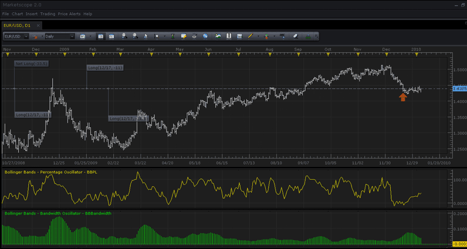

# Bollinger Bands - Percentage and Bandwidth

> Source: https://fxcodebase.com/code/viewtopic.php?f=17&t=226  
> Forum: 17 · Topic 226 · 24 post(s)

---

## Bollinger Bands - Percentage and Bandwidth

**TonyMod** · Wed Jan 06, 2010 12:55 pm

Hello,

These are 2 additions to Bollinger Bands indicator:

1. Bollinger Bands - Percentage (Line)
Formula: **b% = ((close - lower band) / (upper band - lower band)) * 100**

**NOTE** There is [NEW version](https://fxcodebase.com/code/viewtopic.php?f=17&t=2464) or %B indicator.

 [BB-Percentages.lua](files/316/BB-Percentages.lua)

2. Bollinger Bands - Bandwidth (Histogram/Bar)
Formula: **Bandwidth = ((upper band - lower band) / middle band)**

 [BB-Bandwidth.lua](files/316/BB-Bandwidth.lua)

These two and original Bollinger Bands from MarketScope, can be ran together for best effect.

Here is a screenshot of % and bandwidth running:

 

*Bollinger Bands: Percentage and Bandwidth, two indicators at the same time in MarketScope.*

Buy/Sell signals (provided by fxcodebase.com user):
Buy Signal - Bollinger Percent = 0 (<0.1)
Sell Signal - Bollinger Percent = 1 (>0.9)

Detailed Description of Bollinger Bands can be found here at their official website:
[http://www.bollingerbands.com/services/bb/](http://www.bollingerbands.com/services/bb/)

---

## Re: Bollinger Bands - Percentage and Bandwidth

**Apprentice** · Wed Jan 06, 2010 1:20 pm

Thanks for the effort, as far as I can see, Bollinger Percentages (% B) corresponds to the specification, I gave.
I have two suggestions, would be helpful to add line a line at 0.5 and 1 (50 and 100 percent).

---

## Re: Bollinger Bands - Percentage and Bandwidth

**TonyMod** · Wed Jan 06, 2010 1:30 pm

> **Apprentice wrote:**
> Thanks for the effort, as far as I can see, Bollinger Percentages (% B) corresponds to the specification, I gave.
> I have two suggestions, would be helpful to add line a line at 0.5 and 1 (50 and 100 percent).

Good, i'm really glad our work is useful to people. Let me know if anything needs to be fixed or changed, tweaked, etc....

As far as adding lines, yes its possible to do using an indicator, but doesn't MarketScope allow adding of any type of lines user desires right on top of the chart?

---

## Re: Bollinger Bands - Percentage and Bandwidth

**Apprentice** · Wed Jan 06, 2010 2:26 pm

you're right, I'm a little lazy

---

## Re: Bollinger Bands - Percentage and Bandwidth

**skipper** · Wed Nov 17, 2010 9:34 pm

There is a little extension of BBW oscillator

Bollinger Bandswidth oscillator would help to measure price plot’s volatility; it shows result as a width of Bollinger Bands in times, points or price %. Technically speaking Bollinger Bandswidth is a standard deviation of price movement multiplied by [some] number of deviations.

When the BBW is close to 0 it shows low volatility and when it moves to its high levels volatility is high. You have to understand that width of Bollinger Bands is VERY depend on time frame; so you have to setup range levels of the oscillator every time when you change the time frame. Default levels (0.28-1.4) are good for BB(5min,75,2) only.

As a rule, volatility moves in cycles - periods of low volatility are replaced by periods of high volatility. In general, periods of high volatility can be noted during down-trends and corrections downward. Periods of low volatility can be observed during up-trends and recoveries.

Also this nutty oscillator could help to filter out a noise of insufficient signals producing by some indicators (like Volty Channel Stop) in low volatile market.

Attached 2 versions of Oscillator: single time frame and bigger time frame.

---

## Re: Bollinger Bands - Percentage and Bandwidth

**nookie** · Fri May 27, 2011 5:15 am

Hello,

I would like to ask is it possible to change/tweak this indicator a bit with showing it like a histogram or otherwise tell me how to add lines to this indicator itself so I can later remove/add this indicator with the lines I setup before ... if this is possible?

Thanks

---

## Re: Bollinger Bands - Percentage and Bandwidth

**Apprentice** · Fri May 27, 2011 9:23 am

Like This.

 [BB-Percentages.lua](files/11103/BB-Percentages.lua)

Simply replacing core.Line with core.Bar.
When you define indicator output stream.

---

## Re: Bollinger Bands - Percentage and Bandwidth

**nookie** · Tue Jun 07, 2011 5:13 am

Sorry again for bothering but how is it possible to add lines to this indicator and with different colours.. for example lines on levels 100 and 0 ?

Thanks a lot

nookie

---

## Re: Bollinger Bands - Percentage and Bandwidth

**Apprentice** · Tue Jun 07, 2011 11:28 am

I'll try to write something.

---

## Re: Bollinger Bands - Percentage and Bandwidth

**Apprentice** · Fri Jun 24, 2011 1:16 pm

Style Option Added to Bollinger Band - Percentage Oscillator

---

## Re: Bollinger Bands - Percentage and Bandwidth

**nookie** · Tue Jul 19, 2011 6:00 am

It looks good but what I would like is to have 2 lines when loading this indicator and choosing the levels where they should be on the percentage oscillator - for example 60 and 40 or 80 and 20. I know I can add lines from the toolbar but I add/remove this indicator sometimes and its really unpleasant to draw them lots of times per day.
Please tell me if its possible to happen

Cheers
Nookie

---

## Re: Bollinger Bands - Percentage and Bandwidth

**Apprentice** · Wed Jul 20, 2011 7:02 am

Request has been added to the database.

---

## Re: Bollinger Bands - Percentage and Bandwidth

**Apprentice** · Fri Oct 07, 2011 6:20 am

Bollinger Band - Bandwidth Oscillator Style and Line Options Added.

As required by Danko.

---

## Re: Bollinger Bands - Percentage and Bandwidth

**TraderK** · Tue Mar 31, 2015 7:07 pm

> **Apprentice wrote:**
> Bollinger Band - Bandwidth Oscillator Style and Line Options Added.
>
> As required by Danko.

Is it possible to add percentage lines to this indicator to represent the percentage increase in the Bandwidth. For example a line that indicates a 20% increase in the bandwidth for the current time frame used on the chart?

---

## Re: Bollinger Bands - Percentage and Bandwidth

**Apprentice** · Wed Apr 01, 2015 3:39 am

OB/OS Lines introduced to BB-Bandwidth.lua and BB-Percentages.lua
Performance update

---

## Re: Bollinger Bands - Percentage and Bandwidth

**TraderK** · Fri Apr 03, 2015 6:44 am

> **Apprentice wrote:**
> OB/OS Lines introduced to BB-Bandwidth.lua and BB-Percentages.lua
> Performance update

Hi Apprentice. Thanks for your response.

What I'm looking for is the traditional Bollinger Bandwith Indicator, but instead of it showing over bought or oversold, I would like to be able to see the percentage increase of the the Bollinger Bandwidth over a set period. for example Number of periods: 75 and the scale on the indicator is calculated/represents the percent increase/decrease of the Bollinger Bandwith . The BB_WIDTH.lua caluculates the the output as price percent, Price points and Traditional. Is it possible to add a fourth option that calculates the percentage increase/decrease of the Bandwidth over the specified number of periods?

Thanks,
TraderK

---

## Re: Bollinger Bands - Percentage and Bandwidth

**Apprentice** · Wed Apr 08, 2015 3:02 am

Bollinger Bandwith Delta can be found here.
[viewtopic.php?f=17&t=62078](https://fxcodebase.com/code/viewtopic.php?f=17&t=62078)

---

## Re: Bollinger Bands - Percentage and Bandwidth

**Johanson2424** · Tue Aug 16, 2016 12:48 pm

Is there anyway someone could code this in python for quantopian using long entries only?

---

## Re: Bollinger Bands - Percentage and Bandwidth

**Johanson2424** · Tue Aug 16, 2016 12:50 pm

> **Apprentice wrote:**
> Request has been added to the database.

where is the database? link please. thanks, sorry for the neediness

---

## Re: Bollinger Bands - Percentage and Bandwidth

**Apprentice** · Wed Aug 17, 2016 2:16 pm

This is an internal forum.
For developers only.

---

## Re: Bollinger Bands - Percentage and Bandwidth

**Apprentice** · Sat Sep 02, 2017 5:24 am

The indicator was revised and updated.

---

## Re: Bollinger Bands - Percentage and Bandwidth

**jaricarr** · Sun Oct 08, 2017 11:09 pm

Hi Apprentice,

Can you please add the ability to use decimals for "Number of standard deviations".

---

## Re: Bollinger Bands - Percentage and Bandwidth

**Apprentice** · Mon Oct 09, 2017 3:50 am

Try it now.

---

## Re: Bollinger Bands - Percentage and Bandwidth

**Apprentice** · Mon May 07, 2018 1:02 pm

The indicator was revised and updated.
