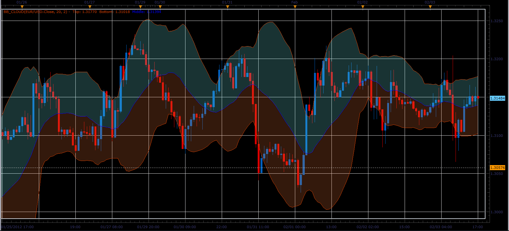
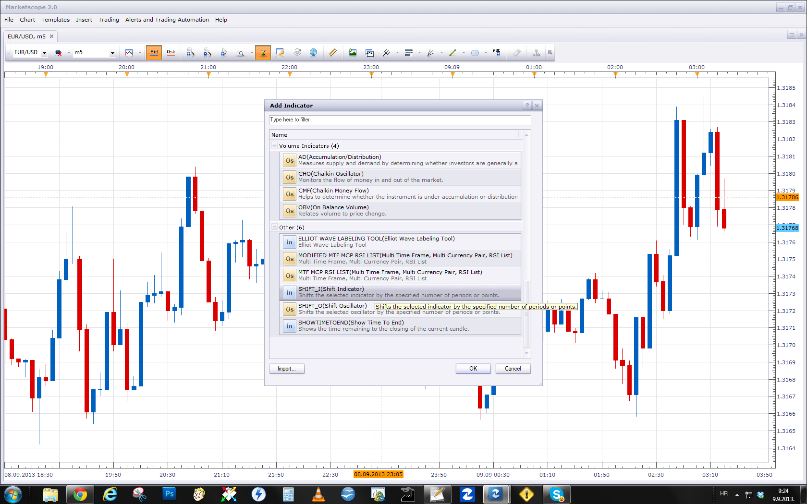

# Bollinger bands with color zones

> Source: https://fxcodebase.com/code/viewtopic.php?f=17&t=12838  
> Forum: 17 · Topic 12838 · 6 post(s)

---

## Bollinger bands with color zones

**Alexander.Gettinger** · Sat Feb 04, 2012 8:58 pm

Colored areas make it easier visual perception of indicator.

 

Download:

 [BB_Cloud.lua](files/25181/BB_Cloud.lua)

The indicator was revised and updated

---

## Re: Bollinger bands with color zones

**Hailkayy** · Sat Feb 04, 2012 9:38 pm

Great help man thank you very much !

---

## Re: Bollinger bands with color zones

**Alexander.Gettinger** · Tue May 08, 2012 5:24 pm

MQL4 version of indicator: [viewtopic.php?f=38&t=17985](https://fxcodebase.com/code/viewtopic.php?f=38&t=17985)

---

## Re: Bollinger bands with color zones

**Trinbago22** · Sun Sep 08, 2013 7:51 pm

Good looking BB indicator, does this indicator have the shift function?? Can this indicator be used on MT4,I tried to download, but the down did not work.

---

## Re: Bollinger bands with color zones

**Apprentice** · Mon Sep 09, 2013 2:28 am

Market Scope have, building Shift function.
Try to use, Shift_I and Shift_O Indicator.

Lua will now work with MT4.
MQL4 version of indicator can be found here.
[viewtopic.php?f=38&t=17985](https://fxcodebase.com/code/viewtopic.php?f=38&t=17985)

---

## Re: Bollinger bands with color zones

**Apprentice** · Sun Jun 04, 2017 6:09 am

The indicator was revised and updated.
