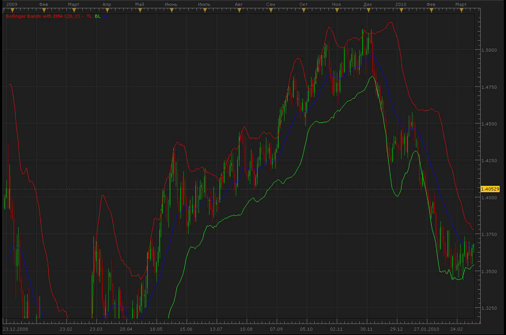

# Bollinger Bands with EMA

> Source: https://fxcodebase.com/code/viewtopic.php?f=17&t=679  
> Forum: 17 · Topic 679 · 4 post(s)

---

## Bollinger Bands with EMA

**Alexander.Gettinger** · Fri Apr 16, 2010 5:31 pm

Original Bollinger Bands with an EMA instead of a simple ma.

MiddleLine = EMA(N)
TopLile = MiddleLine + (D * StdDev)
BottomLine = MiddleLine — (D * StdDev)
D - standard deviations.

 

Code: [Select all](https://fxcodebase.com/code/)
`function Init()
    indicator:name("Bollinger Bands with EMA");
    indicator:description("Original Bollinger Bands with an EMA instead of a simple ma");
    indicator:requiredSource(core.Tick);
    indicator:type(core.Indicator);

    indicator.parameters:addDouble("N", "Number of periods", "Number of periods", 20.0);
    indicator.parameters:addDouble("Dev", "Number of standard deviations", "Number of standard deviations", 2.0);
   
    indicator.parameters:addColor("clrBBP", "clrBBP", "clrBBP", core.rgb(255, 0, 0));
    indicator.parameters:addColor("clrBBM", "clrBBM", "clrBBM", core.rgb(0, 255, 0));
    indicator.parameters:addColor("clrBBA", "clrBBA", "clrBBA", core.rgb(0, 0, 255));
end

local N;
local D;

local first;
local source = nil;

local TL = nil;
local BL = nil;

local MA=nil;

-- Routine
function Prepare()
    N = instance.parameters.N;
    D = instance.parameters.Dev;
   
    source = instance.source;
    first = source:first()+N-1;

    local name = "Bollinger Bands with EMA (" .. N .. ", " .. D .. ")";
    instance:name(name);
   
    MA = core.indicators:create("EMA", source, N);
   
    TL = instance:addStream("TL", core.Line, name .. ".TL", "TL", instance.parameters.clrBBP, first)
    BL = instance:addStream("BL", core.Line, name .. ".BL", "BL", instance.parameters.clrBBM, first)
    AL = instance:addStream("AL", core.Line, name .. ".AL", "AL", instance.parameters.clrBBA, first)
end

-- Indicator calculation routine
function Update(period,mode)
    MA:update(mode);
    if(period >= first) then
     local ml=MA.DATA[period];
     local d = core.stdev(source, core.rangeTo(period, N));
     TL[period] = ml + D * d;
     BL[period] = ml - D * d;
     AL[period] = ml;
    end
end`

---

## Re: Bollinger Bands with EMA

**Thecity** · Sun Apr 26, 2015 2:54 pm

Could you add all the grafic options like the standard bollinger bands, please? Thanks in advance.

---

## Re: Bollinger Bands with EMA

**Apprentice** · Mon Apr 27, 2015 2:44 am

Style Option Added.

---

## Re: Bollinger Bands with EMA

**Apprentice** · Fri Oct 19, 2018 4:12 am

The indicator was revised and updated.
