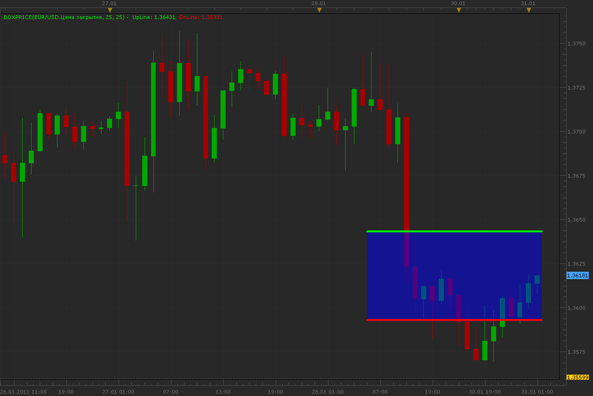

# Box price

> Source: https://fxcodebase.com/code/viewtopic.php?f=17&t=3292  
> Forum: 17 · Topic 3292 · 26 post(s)

---

## Box price

**Alexander.Gettinger** · Mon Jan 31, 2011 1:51 am

Indicator draw lines above and below the current price and cloud between them.

 

Download:

 [BoxPrice.lua](files/7816/BoxPrice.lua)

Similar indicator, but cloud size depends on standard deviation (StDev).

Download:

 [BoxPriceStDev.lua](files/7816/BoxPriceStDev.lua)

The indicator was revised and updated

---

## Re: Box price

**patick** · Mon Jan 31, 2011 5:31 am

Beautiful!

Thank you very much!!!

---

## Re: Box price

**RJH501** · Wed Jul 27, 2011 8:26 pm

Alex this is a very nice piece of work!

I set it up to identify a range setting up after a breakout trend comes to an end.

Thanks,

Richard

---

## Re: Box price

**Panther** · Fri Feb 10, 2012 6:24 pm

Alexander, could you modify this to be a "Box Range" indicator?
1. The lines do not move until price passes through the upper or lower line
 to a new high or to a new low.
2. Also, a Cloud Yes,No option Thanks

---

## Re: Box price

**Apprentice** · Sun Feb 12, 2012 4:10 am

Your request is added to the list of developers.

---

## Re: Box price

**Panther** · Sat Feb 18, 2012 12:44 pm

Instead of having someone modify this indicator, could you modify the Box Indicator as follows?:
1. Only one box. Specify bars to count back
2. Box move dynamically
Thanks. Maybe call it the Dynamic Box. The Box indicator has been very useful.
Thanks again for your work.

---

## Re: Box price

**Alexander.Gettinger** · Mon Feb 20, 2012 2:09 pm

If Transparency=100, cloud is invisible.
I do not understand how to move the box.

---

## Re: Box price

**Apprentice** · Mon Feb 20, 2012 4:56 pm

Panther.
I have two questions for you.
How do you want to determine the height of the box.
From High to Low, Standard deviation, set by user (in pips)
or another.
Is it limited in time.

---

## Re: Box price

**Panther** · Mon Feb 20, 2012 6:55 pm

The box moves dynamically.

Set by user in Pips
Is it limited in time? No

---

## Re: Box price

**Panther** · Mon Feb 27, 2012 6:21 am

I am looking for 2 horizontal lines. The user sets the distance between the 2.
The lines move like trailing stops. For example, when price moves up through the high line, both lines begin to move up. When price reverses off the high line, the lines do not move until price moves either up through the high line or down through the low line.
Does this clarify my request? Thank you.

---

## Re: Box price

**Apprentice** · Tue Feb 28, 2012 5:42 am

Everything is clear, unfortunately I have not had time to work on this.

---

## Re: Box price

**Alexander.Gettinger** · Fri Mar 02, 2012 3:53 pm

> **Panther wrote:**
> I am looking for 2 horizontal lines. The user sets the distance between the 2.
> The lines move like trailing stops. For example, when price moves up through the high line, both lines begin to move up. When price reverses off the high line, the lines do not move until price moves either up through the high line or down through the low line.
> Does this clarify my request? Thank you.

I hope I understand you correctly.

 [BoxPrice2.lua](files/27467/BoxPrice2.lua)

---

## Re: Box price

**Panther** · Sun Mar 04, 2012 4:29 pm

Hi Alexander .
Imagine a dynamic trailing stop of 20 pips, and price is moving up. The DnLine is the trailing stop. The UpLine remains 20 pips above the DnLine. As price moves up the lines move up. When price reverses the lines do not move. When price moves down, and hits the DnLine, then the UpLine acts like a dynamic trailing stop. The distance between the lines stays the same.

In this example, the start calculation is 10 pips above and 10 pips below current price. The lines do not move until price contacts one of the lines. At that time, action is like a dynamic trailing stop.
Movement is on a tick by tick basis (not close of candle). Thanks

---

## Re: Box price

**Panther** · Tue Mar 27, 2012 3:58 pm

Apprentice, is Alexander working on this, or are you able to?

---

## Re: Box price

**nazaar** · Wed Mar 28, 2012 10:25 pm

This is another brilliant trading tool!

There is another trading tool called **breakout**combining elements of box price with the breakout indicator could be very useful. see breakout here: [viewtopic.php?f=17&t=966](https://fxcodebase.com/code/viewtopic.php?f=17&t=966)

from the break out high and low line please give the user the option to draw a horizontal line X pip above and below.

thanks and great work as always!

---

## Re: Box price

**nazaar** · Thu Mar 29, 2012 9:55 am

> **Apprentice wrote:**
> Panther, I have two questions for you. How do you want to determine the height of the box. From High to Low, Standard deviation, set by user (in pips) or another. Is it limited in time.

Hello,

May I suggest, one possible way to determine the height of a box is to add the ruler tool to the rectangle/box tool. If adding the ruler to the rectangle box is possible you can then draw the height of your box to any level you choose and then be able to place it anywhere you want as a starting level.

thoughts?

---

## Re: Box price

**Panther** · Thu Mar 29, 2012 4:09 pm

> **Apprentice wrote:**
> Everything is clear, unfortunately I have not had time to work on this.

Nazaar, I am not aware of any issues per Apprentice's reply. Thanks, Panther

---

## Re: Box price

**Apprentice** · Sat Mar 31, 2012 3:50 am

Nazaar, Your request is added to the development list.

---

## Re: Box price

**Victor.Tereschenko** · Thu Aug 09, 2012 6:56 am

> **Panther wrote:**
> Hi Alexander .
> Imagine a dynamic trailing stop of 20 pips, and price is moving up. The DnLine is the trailing stop. The UpLine remains 20 pips above the DnLine. As price moves up the lines move up. When price reverses the lines do not move. When price moves down, and hits the DnLine, then the UpLine acts like a dynamic trailing stop. The distance between the lines stays the same.
>
> In this example, the start calculation is 10 pips above and 10 pips below current price. The lines do not move until price contacts one of the lines. At that time, action is like a dynamic trailing stop.
> Movement is on a tick by tick basis (not close of candle). Thanks

Try this version. It acts like a dynamic trailing stop.

---

## Re: Box price

**Panther** · Sat Jul 06, 2013 5:32 am

Change to BoxPrice3.lua- I wish for the lines to stay in the same relative position to each other.
Once price contacts one line, both move in the same direction until price reverses.
When price reverses, the lines do not move again until price touches the opposite line.
At that point the lines move in the opposite direction.
Thanks

---

## Re: Box price

**Victor.Tereschenko** · Sun Oct 27, 2013 10:44 pm

> **Panther wrote:**
> Change to BoxPrice3.lua- I wish for the lines to stay in the same relative position to each other.
> Once price contacts one line, both move in the same direction until price reverses.
> When price reverses, the lines do not move again until price touches the opposite line.
> At that point the lines move in the opposite direction.
> Thanks

This is the version with the modification you have requested.

---

## Re: Box price

**Panther** · Thu May 29, 2014 6:47 am

Hi. Re: BoxPrice3_ modified.lua
Would it be possible to put price labels on the lines? The label would look just like
the horizontal line labels to the 5th decimal. For example, 1.46 would read 1.46000.
The placement would be the same (to the right of the Y axis).
Thanks

---

## Re: Box price

**Apprentice** · Fri May 30, 2014 4:02 am

Price Label Added.

---

## Re: Box price

**amine.dechemi** · Sat Aug 16, 2014 5:07 pm

HEllo
could you please modify the Box Indicator as follows?
pip's blow and pip's back must be determined by ATR% in N periode
think's a lot

---

## Re: Box price

**Apprentice** · Wed Aug 20, 2014 2:05 pm

Your request is added to the development list.

---

## Re: Box price

**Apprentice** · Sat Jul 01, 2017 5:08 am

The indicator was revised and updated.
