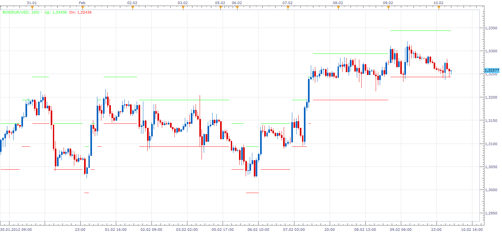

# Box

> Source: https://fxcodebase.com/code/viewtopic.php?f=17&t=13128  
> Forum: 17 · Topic 13128 · 2 post(s)

---

## Box

**Apprentice** · Fri Feb 10, 2012 6:21 am

Box indicator moves box up or down.
When price moves through the high line, the box move up.
When price moves through the low line, the box move down.

 [Box.lua](files/25637/Box.lua)

---

## Re: Box

**Apprentice** · Mon Mar 05, 2018 2:00 pm

The Indicator was revised and updated.
