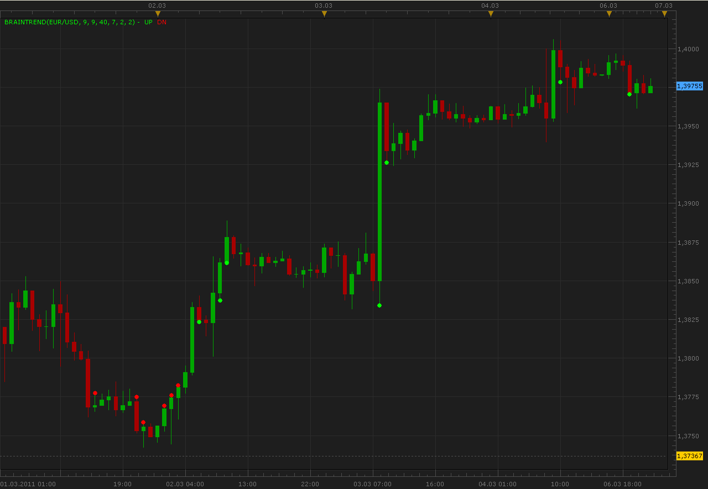

# Brain trend indicator

> Source: https://fxcodebase.com/code/viewtopic.php?f=17&t=3605  
> Forum: 17 · Topic 3605 · 3 post(s)

---

## Brain trend indicator

**Alexander.Gettinger** · Sun Mar 06, 2011 10:53 pm

Indicator show up/down trends.

Formulas:
for DOWN trend must be:
Stochastic K<[Stochastic Level] and ABS(Close[i]-Close[i-Shift])>ATR/Range

for UP trend must be:
Stochastic K>1-[Stochastic Level] and ABS(Close[i]-Close[i-Shift])>ATR/Range

 

Download:

 [BrainTrend.lua](files/8668/BrainTrend.lua)

The indicator was revised and updated

---

## Re: Brain trend indicator

**Alexander.Gettinger** · Sun Mar 06, 2011 10:59 pm

Strategy based on this indicator: [viewtopic.php?f=31&t=3606](https://fxcodebase.com/code/viewtopic.php?f=31&t=3606)

---

## Re: Brain trend indicator

**Apprentice** · Fri Feb 17, 2017 10:52 am

Indicator was revised and updated.
