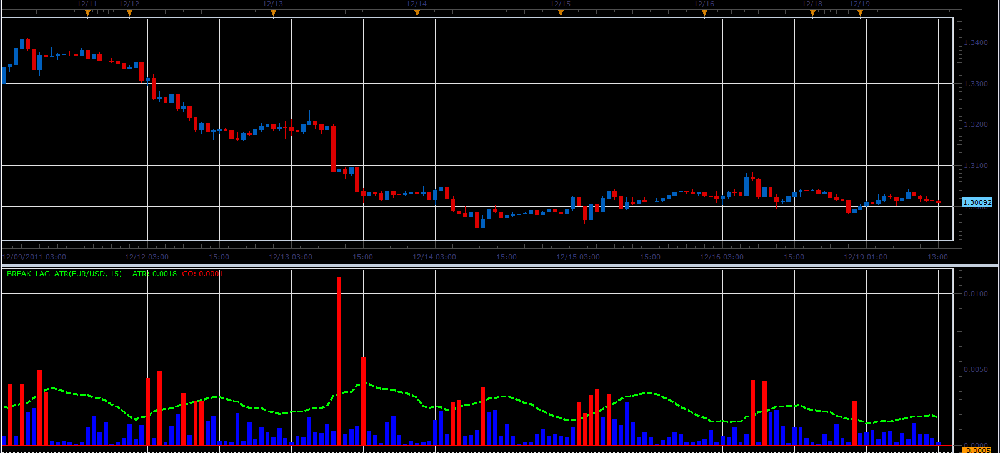

# Break Lag ATR

> Source: https://fxcodebase.com/code/viewtopic.php?f=17&t=10143  
> Forum: 17 · Topic 10143 · 2 post(s)

---

## Break Lag ATR

**Alexander.Gettinger** · Mon Dec 19, 2011 1:37 pm

This indicator is a ported MQL5 indicator from [http://www.mql5.com/ru/code/703](http://www.mql5.com/ru/code/703) (in Russian).

Formulas:
ATR[i]=ATR[i-1]+(TR[i]-TR[i-Period])/Period, where
TR[i]=Max(High[i],Close[i-1])-Min(Low[i],Close[i-1]),
CO[i]=Abs(Close[i-1]-Open[i-1]).

 

Download:

 [Break_Lag_ATR.lua](files/21241/Break_Lag_ATR.lua)

The indicator was revised and updated

---

## Re: Break Lag ATR

**Apprentice** · Tue Mar 21, 2017 6:21 am

Indicator was revised and updated.
