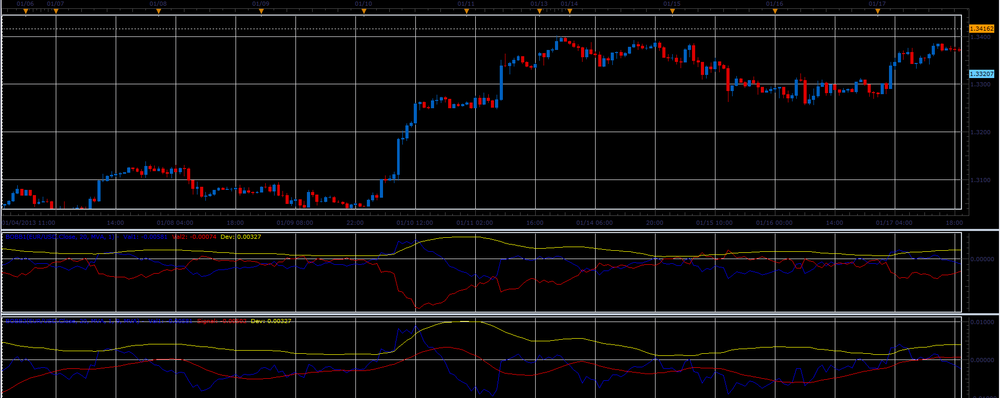

# Break Out of Bollinger Bands (aka BoBB) indicators

> Source: https://fxcodebase.com/code/viewtopic.php?f=17&t=31126  
> Forum: 17 · Topic 31126 · 2 post(s)

---

## Break Out of Bollinger Bands (aka BoBB) indicators

**Alexander.Gettinger** · Fri Jan 18, 2013 5:54 pm

This indicator is a ported MQL4 indicators from [viewtopic.php?f=27&t=27851](https://fxcodebase.com/code/viewtopic.php?f=27&t=27851)

 

Download:

 [BOBB1.lua](files/53123/BOBB1.lua)

 [BOBB2.lua](files/53123/BOBB2.lua)

For this indicator must be installed Averages indicator ([viewtopic.php?f=17&t=2430](https://fxcodebase.com/code/viewtopic.php?f=17&t=2430)).

The indicator was revised and updated

---

## Re: Break Out of Bollinger Bands (aka BoBB) indicators

**Apprentice** · Thu Apr 27, 2017 4:17 am

Indicator was revised and updated.
