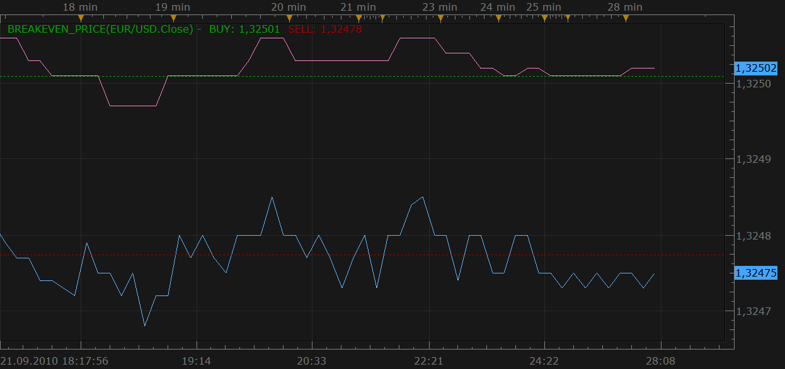
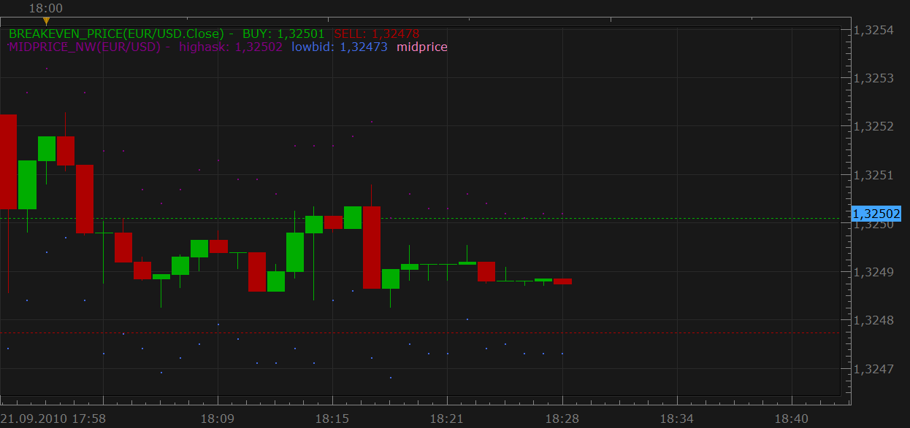

# Breakeven indicator

> Source: https://fxcodebase.com/code/viewtopic.php?f=17&t=2236  
> Forum: 17 · Topic 2236 · 7 post(s)

---

## Breakeven indicator

**Nikolay.Gekht** · Tue Sep 21, 2010 5:36 pm

The indicator shows the average netting price of all sell and buy positions held for the chart's instrument on all trader's accounts. This price is the price at which the netting position gets zero profit/loss. The information is similar to the information from "Show Trading Info" option of Marketscope, but lets you show the netting position only, without showing all individual trades.

The indicator can be applied at any timeframe. Data is updated every second.

 

It is also convenient to use this indicator together with bid/ask mid price indicator ([viewtopic.php?f=17&t=1916](https://fxcodebase.com/code/viewtopic.php?f=17&t=1916))

 

Download the indicator:

 [BREAKEVEN_PRICE.lua](files/4685/BREAKEVEN_PRICE.lua)

I hope that this indicator is a good example of new Trading Station features for the developers: timer and access to the trading tables.

---

## Re: Breakeven indicator

**Ancient** · Sat Nov 20, 2010 7:40 pm

Hi,

It would be good if we could also have a further Option to set this Strategy such that when we have X Gains plus to move Stop Loss to Breakeven = 0 or Breakeven +5. User Defines Preferences.

If Market > X Pips Eg 100
Set Break Even = Open + X Eg (X = 0 or X = +10)

Alternativley pertaining to the above, it would also be good to have the Option to also select that if the Market has gone against us X Pips to Set Take Profit to 0 or +5 User Defines Preferences.

If Market < X Pips Eg -80
Set Break Even (Take Profit) = Open +X Eg (X = 0 or X = +10) [This Option Modifies Take Profit]

To Substantiate: We normally enter a Position Setting Stop Loss 150 Pips away. It is normal for the market not to go in our favour if it initially moves against us say 80 Pips, but then on the other hand it might! With this Alternative Option, we can Risk Up to our Initial Stop Loss, but if it does not get hit and the Market goes Back to where we had opened the trade for the Trade to Exit with 0 Profit or +30, whatever the user has defined in the field.

---

## Re: Breakeven indicator

**Ancient** · Sat Nov 20, 2010 7:52 pm

Pertaining to my previous Comment, It was meant to reference further options pertaining to the BREAKEVEN_Strategy rather than the Indicator!

---

## Re: Breakeven indicator

**Apprentice** · Sun Nov 21, 2010 5:15 am

We have noted your suggestion.

---

## Re: Breakeven indicator

**Ancient** · Sun Nov 21, 2010 1:18 pm

Oops, I see someone else has requested something similar and which has been placed in development cue... Topic is at - [viewtopic.php?f=27&t=2480](https://fxcodebase.com/code/viewtopic.php?f=27&t=2480)

---

## Re: Breakeven indicator

**PipGrabber** · Tue Nov 29, 2011 7:10 pm

Hello,

Does this indicator still works on the new update of the marketscope? I've tried it. But it does not show anything. Likewise when used together with the breakeven strategy, it does not close trades when going back to breakeven area. It only detects if a buy or sell was taken.,. then nothing happens thereafter.

---

## Re: Breakeven indicator

**Apprentice** · Mon Mar 05, 2018 1:56 pm

The Indicator was revised and updated.
