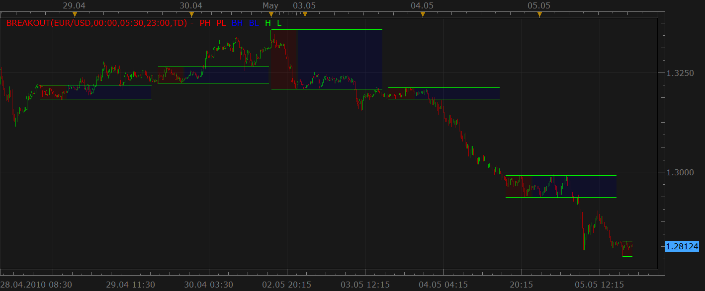
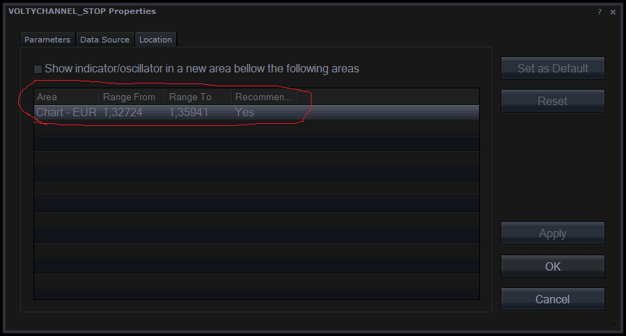
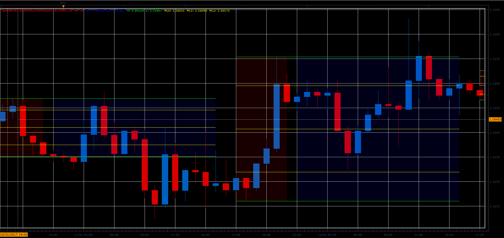

# Breakout indicator

> Source: https://fxcodebase.com/code/viewtopic.php?f=17&t=966  
> Forum: 17 · Topic 966 · 76 post(s)

---

## Breakout indicator

**Nikolay.Gekht** · Wed May 05, 2010 6:15 pm

**Upd Nov 5, 2010: Indicator updated to support a time frame containing "end of day" mark. For example 21:00-8:00**

The indicator highlight two zones: "period" and "box". During the period zone the high and low are calculated.

The zones are specified by the hh:mm offset against the beginning of the data (0:00). The following beginning of the day may be used:
- Trading Day begin (17:00 EST)
- EST midnight
- GMT midnight
- User local time zone midnight

 

Download the indicator:

 [breakout.lua](files/1781/breakout.lua)

p.s. I suggest that the next request will be to develop the signal . This is why I introduced the parameter "Marketscope mode" in the indicator. When it is true, the indicator draws boxes, when it is false - the indicator will prepare the data for signal.

---

## Re: Breakout indicator

**a135711** · Wed May 05, 2010 7:57 pm

how about a signal? and maybe if i am not pushing my luck with indicator development, wrap this little gem into the tradesession highlight indicator as well

this breakout indicator would also be quite nice if it marked in the same fashion declining and rising channels,
SYMMETRICAL TRIANGLES
HEAD AND SHOULDERS CHARTS
ASCENDING TRIANGLES CHARTS
INVERTED HEAD AND SHOULDERS
DESCENDING TRIANGLES
FLAGS AND PENNANTS
WEDGES CHARTS
RECTANGLES CHARTS

for reference: [http://www.chartpatterns.com/](http://www.chartpatterns.com/)

this is seriously excellent work
thank you for your time

---

## Re: Breakout indicator

**Nikolay.Gekht** · Thu May 06, 2010 12:54 am

Let's go step by step. Yeah, the market figures is pretty sweet thing. I hope one day we will have enough resources to create and release it.
Signal will be tomorrow.

---

## Re: Breakout indicator

**barbs666** · Thu May 06, 2010 9:56 pm

Nice work, Thanks,

is there a problem with doing bigger time frames other than 1hr?
This indicator does not load on a 1hr chart.

Thanks anyways

---

## Re: Breakout indicator

**Nikolay.Gekht** · Fri May 07, 2010 9:04 am

The question is how to show the correct border between period and box when the date time is inside the bar?

E.g. I set the end of the period at 3:00 against the beginning of the trading day and H4 candles are chosen. In that case the first three hours of the first candle belongs to the period and the last hour belongs to box. I just have no idea how to show it correctly.

---

## Re: Breakout indicator

**barbs666** · Fri May 07, 2010 6:59 pm

Yeah I see your problem,

maybe, it can overlap boxes in that candle, so that when the different coloured boxes appear the high/low of the market session will differentiate the boxes on its own.

As a trader, that would not bother me to much as an overlap (which I assume would change the coloured boxes for the overlap) would not be a bad thing??

If I was using the 4hr chart, I would expect that a market overlap would occur and that the candle would not show any other sign thatn the high/low/open close so for me there would not be a big problem in having the boxes align at t he begining of the candle....... see what I mean?

Thanks

---

## Re: Breakout indicator

**hanscf** · Mon Sep 13, 2010 11:52 pm

How do we use this indicator? Please explain. Thanks!!!

---

## Re: Breakout indicator

**Apprentice** · Tue Sep 14, 2010 3:47 am

Now I'm speculating.

Depending on the type of strategy that you are using.
You can enter the position when the breakout occurs below / above the line support / resistance.
That is to enter the position when the line of support / resistance is confirmation.

Breakout Confirmation may be increased volume,
ie, reduction of volume, as we approach the lines, it can be a sign of their confirmation, power.

---

## Re: Breakout indicator

**panzer41** · Sat Sep 18, 2010 9:06 am

and the default time frames for start and end time of box are made based of which market? could you explain it little more

---

## Re: Breakout indicator

**joyfreecn** · Tue Sep 21, 2010 12:01 am

How it's works? could you supply more details?
THX a lot!

---

## Re: Breakout indicator

**Nikolay.Gekht** · Wed Sep 22, 2010 7:34 am

One of trading methods supposes that in the beginning of the trading day the price sets the borders which will be broken only in one direction. For example, if the price goes above the first five hour highs it means that the price will go up today.

This indicator is intended to work with this method - you can choose when the trading day is started (at 17:00EST aka FXCM trading day, at midnight GMT or at midnight of your local time) and how long to collect the data for "the first part of day".

---

## Re: Breakout indicator

**nica33** · Mon Sep 27, 2010 1:09 am

Hi,

When I load this indicator, it's showing in a different area than the chart, even though it says is the location in the cart is marked as yes.

Thanks,

nica

---

## Re: Breakout indicator

**Nikolay.Gekht** · Mon Sep 27, 2010 9:15 am

Any indicator is shown on all available data. So, if you open a chart which convers three days - the indicator shows three boxes - for all days on the chart, not for the current day only.

---

## Re: Breakout indicator

**nica33** · Mon Sep 27, 2010 10:22 pm

what I meant to say, is the indicator is showing in a lower area different than the area where the candlesticks appear. It's showing under my Stochastic indicator

---

## Re: Breakout indicator

**Nikolay.Gekht** · Tue Sep 28, 2010 11:55 am

By default, it must be shown in the chart area if nothing is changed on the Location tab.
Could you please check whether the "Chart" area is selected in that tab for the indicator like on the image below:

 

If this indicator is always located in area like an oscillator, could you please make a snapshot of the chart and snapshot of the "location" tab when the breakout indicator is initially added to the chart?

---

## Re: Breakout indicator

**anurag_momo** · Tue Sep 28, 2010 12:51 pm

Hello , please tell me how to use this indicator in MT4...

thanx...

---

## Re: Breakout indicator

**Nikolay.Gekht** · Tue Oct 12, 2010 3:56 pm

To use the indicator in MT4 it must be converted into MT4 format. We don't provide such service for free, but you can look for independent developer or use our premium development services.

---

## Re: Breakout indicator

**borsaty** · Fri Oct 15, 2010 12:45 pm

Dear
Please can you make strategy for this indicator where you put pending order buy stop at the high and sell stop at the low
condition only two order per day where the order if hit either stop loss or take profit not repeated at this day

---

## Re: Breakout indicator

**Apprentice** · Fri Oct 15, 2010 1:20 pm

Added to development cue.

---

## Re: Breakout indicator

**DarkSummon** · Mon Oct 25, 2010 8:58 am

Heya.

First off, great work once again guys! Really loving the work you are all doing, you can tell a lot of hard work goes into this and the community .

Anyways, regarding this indicator...It seems you cannot have a time frame input like 21:00 - 8:00, as it wants time values for the same day only.

My question is then, can it be changed to allow such values? This would be a lot better and more perfect for people who want to monitor the highs and lows of the nights range for some currency pairs.

If this can be done and I've just simply missed something, let me know .

Thanks.

---

## Re: Breakout indicator

**Nikolay.Gekht** · Mon Oct 25, 2010 12:43 pm

Sure, it can be changed. Added to development queue.

---

## Re: Breakout indicator

**wizardpro** · Tue Oct 26, 2010 12:54 am

Hi , Any way to configure london market breakout base on pervious and today and etc?

---

## Re: Breakout indicator

**vstrelnikov** · Fri Nov 05, 2010 6:23 pm

Top post updated. Inidcator now supports time frames like 21:00-8:00.

---

## Re: Breakout indicator

**vstrelnikov** · Tue Nov 09, 2010 11:11 am

You can find the initial version of strategy based on this indicator here. [http://fxcodebase.com/code/viewtopic.php?f=31&t=2639](https://fxcodebase.com/code/viewtopic.php?f=31&t=2639)

---

## Re: Breakout indicator

**luciana** · Mon Nov 29, 2010 5:10 pm

Hi, I have a question please, why the breakout INDICATOR cannot be set for different time frames, i.e. based on previous range within 5 min, 30 min etc rather than once a day. This way we may have more opportunities and breakouts. Thanks.

---

## Re: Breakout indicator

**luciana** · Tue Nov 30, 2010 4:37 pm

Hi, please advise whether the indicator can be used solely - vs. includeded in the breakout strategy, in different timeframes? Thanks in advance.

---

## Re: Breakout indicator

**Ancient** · Sat Dec 18, 2010 4:01 pm

> **vstrelnikov wrote:**
> Top post updated. Inidcator now supports time frames like 21:00-8:00.

You mention the Top Post is Updated, but after downloading and Testing, I still got the message: **Period Begin must be before the Period End**

Where is the Updated version that supports time frames like 21:00-8:00?

---

## Re: Breakout indicator

**craige** · Fri Dec 24, 2010 9:53 am

thank you very much

my english is not good, but I see what you have done for us.

thanks for helping us

---

## Re: Breakout indicator

**craige** · Fri Dec 24, 2010 9:56 am

I am looking forward to the new version of this indicator which could use the bigger time frame at least 4H.

thank you

---

## Re: Breakout indicator

**craige** · Sat Dec 25, 2010 3:32 am

Hi Dear

It is me again, I also need this BREAKOUT INDICATOR's original code just like the VOLTY CHANNEL STOP INDICATOR-bigger time frame version.

thanks for your hard work

this is very very important to me

PS: my English is not good, hoping you are capable of what I am saying.

best regards

---

## Re: Breakout indicator

**Apprentice** · Sat Dec 25, 2010 5:21 am

Added to developmental cue.

---

## Re: Breakout indicator

**bgmays** · Thu Jan 20, 2011 12:03 pm

Incredible work guys. Many thanks!

---

## Re: Breakout indicator

**RJH501** · Thu Sep 22, 2011 12:06 pm

Can anyone explain how the trailing stop works on this indicator?

Thanks much,

Richard

---

## Re: Breakout indicator

**zmender** · Fri Feb 10, 2012 12:05 am

Would it be possible to add the option of displaying how many pips there is between the top and bottom lines?

---

## Re: Breakout indicator

**Apprentice** · Fri Feb 10, 2012 4:38 am

It is possible to write something similar.

---

## Re: Breakout indicator

**nazaar** · Thu Mar 22, 2012 9:34 pm

Hello,

could you please add the option to display the distance in pips between the high and low line? And an option to draw a line by a given # of pips from the high line or the low line.

thanks.

---

## Re: Breakout indicator

**Apprentice** · Fri Mar 23, 2012 2:57 am

Your request is added to the development list.

---

## Re: Breakout indicator

**fishstick** · Mon Jun 25, 2012 7:38 am

Hi,

I've been testing out the indicator, and have found it to be a bit strange when using "00:00" as the PeriodBegin time.

If I set the time frame to H1:

PeriodBegin time - "00:00" , red section begin time in Marketscope - "01:00"
PeriodBegin time - "01:00" , red section begin time in Marketscope - "01:00"

This is the same when I switch to m1 time frame:

PeriodBegin time - "23:59" , red section begin time in Marketscope - "23:59"
PeriodBegin time - "00:00" , red section begin time in Marketscope - "00:01"
PeriodBegin time - "01:00" , red section begin time in Marketscope - "00:01"

Any idea why? I've been struggling to work it out.

Thanks,

FishStick

---

## Re: Breakout indicator

**fishstick** · Thu Jul 12, 2012 11:54 am

Any suggestions on above question?

Thanks,

FishStick

---

## Re: Breakout indicator

**arstechnica** · Sat Nov 10, 2012 9:41 am

I think this stategy could became very successfull if You could add some filters like:

EMA: long position only over EMA, short position only under EMA

MVA stop order could increase the profit

---

## Re: Breakout indicator

**Apprentice** · Sat Nov 10, 2012 6:01 pm

Your request is added to the development list.

---

## Re: Breakout indicator

**amazon1a** · Thu Dec 20, 2012 10:37 pm

I would also like to see an EMA filter. Thanks so much for all your great work!!

---

## Re: Breakout indicator

**mjf1288** · Fri Dec 21, 2012 8:52 am

EMA filter please try 384 period on a 5min chart.....it works very well!

could we integrate this into the indicator?

---

## Re: Breakout indicator

**Coondawg71** · Thu Aug 22, 2013 10:51 am

I would like to request an amendment to this indicator.

I think this indicator could be expanded for very useful and effective trading which I will illustrate with the attached image.

1. I have utilized the Breakout Indicator to automatically highlight a specific time period that I utilize which in my opinion has a tendency to forecast future movement for intraday prices. Please allow this indicator to plot a trendline very much the same way our Trade Sessions indicator plots a trendline from the start to end of the user specified time periods. I utilized this with first period 21:00 EST to last period 22:00. The trendline should begin at close price of first period to close price of last period and extend into the future. The colorization of the breakout box to indicate last period close price occurring above/below the the first period close price would be beneficial to eliminate the need of zooming in.

2. A "period open line" plotted horizontal like our already established "Period Open" indicator would help form our triangle formation.

3. (Optional) I have not seen anyone able to conduct an automatic Fib Fan, perhaps by using this narrow of a period used with the Breakout Indicator we can perform that task. If a Fib Fan can utilized the first period close and the last period close to plot a Fib Fan it would prove very beneficial.

Thanks!

sjc

---

## Re: Breakout indicator

**Apprentice** · Fri Aug 23, 2013 1:59 am

Your request is added to the development list.

---

## Re: Breakout indicator

**jorgearana** · Tue Aug 27, 2013 10:55 pm

Hi, i am trying to see the breakout indicator in a program in VB.net, but i can't do it because the indicator needs the parameters as "00:00" but vb.net transform it into #12:00 AM#.

I tried changing the format and changing the value as string but i can't find the way to make it work.

Can you help me please?

---

## Re: Breakout Indicator

**nazaar** · Sun Nov 17, 2013 2:16 pm

Hello!

The breakout.lua is excellent tool to assist in quickly identifying key areas. I like how you can choose the opening and closing reference time periods.

I would like to suggest adding the following edits:

1: Add the option to display the pip difference between the breakout range period.
2: Add the option to display the hour when the period begins.
3: Draw a horizontal line from the opening price to the end of the period. Give the option to extend line to opening of next period opening hour.

Please see attached chart for examples of what it may look like.

Thanks in advance.
**"Timing is everything"**

---

## Re: Breakout indicator

**Apprentice** · Mon Nov 18, 2013 5:38 am

Your request has been added to the development list.

---

## Re: Breakout indicator

**nazaar** · Mon Nov 18, 2013 4:53 pm

I'm trying to make the edits myself. I am **guessing**from other tools what the needed code might be.

Here is what I have got from looking at other tools with the requested change but I cannot get it to work.

Theoretically, this does not sound complicated to add a label, draw line and do a simple calculation but I do not how to code that. Please help!

To begin, I think it needs label text colour:
**indicator.parameters:addColor("Text_color", "Text color", "Text color", core.rgb(0, 0, 0));
 indicator.parameters:addInteger("TextSize", "Text size", "Text size", 6);**

Then, the options for the line (colour, style and width)

**indicator.parameters:addColor("clr", "Open Line Color", "", core.rgb(192, 192, 192));
 indicator.parameters:addInteger("Style", "Line Style", "", core.LINE_DOT);
 indicator.parameters:addInteger("Width", "Line Width", "", 1, 1, 5);
 indicator.parameters:setFlag("Style2", core.FLAG_LEVEL_STYLE);**
...

Then, data source to calculate the difference between high and low, in pips

**local hilo_data = nil; -- the high/low data
local H; -- high stream
local L; -- low stream
local O; -- open stream**

...

**-- the function which is called to calculate the period
function Update(period, mode)
 -- get date and time of the hi/lo candle in the reference data
 local hilo_candle;
 hilo_candle = core.getcandle(BS, source:date(period), offset, weekoffset);

 -- if data for the specific candle are still loading
 -- then do nothing
 if loading and hilo_candle >= loadingFrom and (loadingTo == 0 or hilo_candle <= loadingTo) then
 return ;
 end**

After this, I don't know what else to do and where to place these lines.

Thanks for any help available.

---

## Re: Breakout indicator

**babelli** · Mon May 26, 2014 1:30 am

Hi, could u convert this indicator to mq4. please..

---

## Re: Breakout indicator

**Apprentice** · Mon May 26, 2014 5:21 am

Your request is added to the development list.

---

## Re: Breakout indicator

**chathuranga3** · Mon Aug 03, 2015 7:00 am

Hi,

Wondering whether you can create a strategy to Place stop orders directly at the end of period ends.

BUY stop at high level and Sell Stop at low level, and delete the opposite when one of them triggered.

Many Thanks.

---

## Re: Breakout indicator

**Apprentice** · Wed Aug 05, 2015 7:21 am

Your request is added to the development list.

---

## Re: Breakout indicator

**paololuigi** · Fri Sep 04, 2015 5:28 am

> **Nikolay.Gekht wrote:**
> **Upd Nov 5, 2010: Indicator updated to support a time frame containing "end of day" mark. For example 21:00-8:00**
>
> The indicator highlight two zones: "period" and "box". During the period zone the high and low are calculated.
>
> The zones are specified by the hh:mm offset against the beginning of the data (0:00). The following beginning of the day may be used:
> - Trading Day begin (17:00 EST)
> - EST midnight
> - GMT midnight
> - User local time zone midnight
>
>
>
> breakout.png
>
>
>
> Download the indicator:
>
>
> breakout.lua
>
>
>
> p.s. I suggest that the next request will be to develop the signal . This is why I introduced the parameter "Marketscope mode" in the indicator. When it is true, the indicator draws boxes, when it is false - the indicator will prepare the data for signal.

Sorry it's possible that the indicator show the breakout lines only for the current day ?

thanks in advance

---

## Re: Breakout indicator

**Apprentice** · Sun Sep 06, 2015 4:19 am

Your request is added to the development list.

---

## Re: Breakout indicator

**Note7Rebel** · Fri Nov 11, 2016 11:47 pm

Can you convert this to work on cTrader/c

---

## Re: Breakout indicator

**Apprentice** · Sat Nov 12, 2016 2:48 pm

Unfortunately, we do not provide support for cTrader.

---

## Re: Breakout indicator

**BadTunaSalad** · Mon Nov 14, 2016 9:44 pm

Apprentice -

Would it be possible to add a "Mid-point" or 50% Line between the high and the low? Or Fibo numbers? Thank you in advance.

BTS

---

## Re: Breakout indicator

**Apprentice** · Tue Nov 15, 2016 3:20 am

Your request is added to the development list, Under Id Number 3673
 If someone is interested to do this task, please contact me.

---

## Re: Breakout indicator

**BadTunaSalad** · Tue Nov 15, 2016 3:06 pm

I'm not sure if this helps, code wise, but there is another indicator with similar functionality and includes stylized line options.

---

## Re: Breakout indicator

**Alexander.Gettinger** · Mon Nov 06, 2017 11:53 am

> **BadTunaSalad wrote:**
> Apprentice -
>
> Would it be possible to add a "Mid-point" or 50% Line between the high and the low? Or Fibo numbers? Thank you in advance.
>
> BTS

Please, try this version of the indicator.

 

Download:

 [breakout2.lua](files/115895/breakout2.lua)

---

## Re: Breakout indicator

**JADragon3** · Thu Dec 07, 2017 1:15 pm

Is there anyway to add a weekly and monthly period to this ? Like the first few hours of the first day of the month or week ?

---

## Re: Breakout indicator

**Apprentice** · Fri Dec 15, 2017 6:30 am

Your request is added to the development list under Id Number 3975

---

## Re: Breakout indicator

**Apprentice** · Tue Aug 07, 2018 4:39 am

The Indicator was revised and updated.

---

## Re: Breakout indicator

**chai88888** · Fri Sep 06, 2019 7:07 am

is the indicator has an alert?

specific time when it breaks live or end of turn

and display the number of pips of the box
thanks

---

## Re: Breakout indicator

**ionutpotop** · Sun Sep 22, 2019 6:04 am

is not even working

---

## Re: Breakout indicator

**Apprentice** · Mon Sep 23, 2019 5:45 am

Your request is added to the development list.
Development reference 110.

---

## Re: Breakout indicator

**Apprentice** · Mon Sep 30, 2019 6:29 am

[breakout.lua](files/128907/breakout.lua)

Try this version.

---

## Re: Breakout indicator

**CharlesEzenwanne** · Thu Oct 17, 2019 3:32 am

Can you convert to mt4?

---

## Re: Breakout indicator

**Richstocks99** · Thu Oct 17, 2019 9:02 am

Hello, Could you convert this into a MT4 file Please? Thank You.

---

## Re: Breakout indicator

**Richstocks99** · Thu Oct 17, 2019 9:44 am

Can you make this for MT4 Please?

---

## Re: Breakout indicator

**Apprentice** · Thu Oct 17, 2019 3:11 pm

Your request is added to the development list.
Development reference 204.

---

## Re: Breakout indicator

**Apprentice** · Fri Oct 18, 2019 11:38 am

Try this version.
[viewtopic.php?f=38&t=19944](https://fxcodebase.com/code/viewtopic.php?f=38&t=19944)

---

## Re: Breakout indicator

**Infime** · Mon Oct 21, 2019 4:58 am

Hi,

Is it possible to create one with a D1 time frame ? Here, it's less H1.

Thanks

---

## Re: Breakout indicator

**Apprentice** · Mon Oct 21, 2019 5:01 am

Your request is added to the development list.
Development reference 225.

---

## Re: Breakout indicator

**Apprentice** · Tue Oct 22, 2019 4:28 am

I don't think it's possible with that algorithm.
