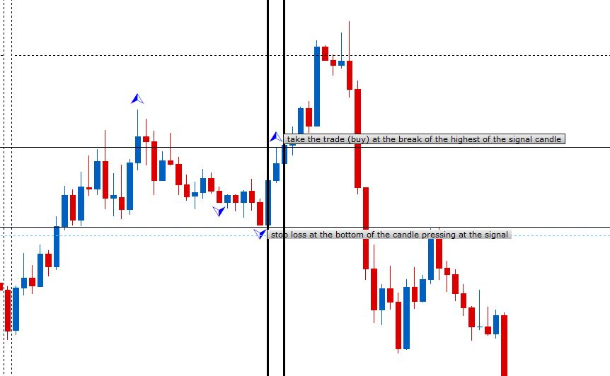

# Breaks

> Source: https://fxcodebase.com/code/viewtopic.php?f=17&t=66861  
> Forum: 17 · Topic 66861 · 7 post(s)

---

## Breaks

**Apprentice** · Sat Oct 27, 2018 12:40 pm

Based on request.
[viewtopic.php?f=27&t=66857](https://fxcodebase.com/code/viewtopic.php?f=27&t=66857)

 [breaks.lua](files/121795/breaks.lua)

---

## Breaks can not show!

**gosdar** · Mon Oct 29, 2018 4:13 am

HI! Thanks to share this indicator of "Breaks"
But can not show any image on screen.

---

## Re: Breaks

**Apprentice** · Mon Oct 29, 2018 5:20 am

Works as expected.
The note will only work on FXCM TS2 platform.

---

## Re: Breaks

**bruno2017** · Wed Nov 14, 2018 12:52 pm

Hello
can you code me a strategy to signal itself ??
attached a screenshot
thank you

---

## Re: Breaks

**Apprentice** · Wed Nov 14, 2018 4:28 pm

Your request is added to the development list under Id Number 4313

---

## Re: Breaks

**bruno2017** · Thu Nov 15, 2018 6:32 am

Hello
can you add a SL on a moving average and a tp 1 also on a moving average
thank you

---

## Re: Breaks

**Apprentice** · Mon Nov 19, 2018 10:08 am

Try this version.
[viewtopic.php?f=31&t=66940](https://fxcodebase.com/code/viewtopic.php?f=31&t=66940)
