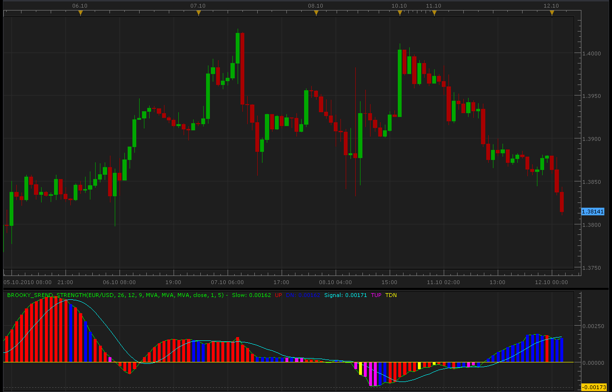

# Brooky trend strength indicator

> Source: https://fxcodebase.com/code/viewtopic.php?f=17&t=2377  
> Forum: 17 · Topic 2377 · 4 post(s)

---

## Brooky trend strength indicator

**Alexander.Gettinger** · Tue Oct 12, 2010 1:27 am

[viewtopic.php?f=27&t=2363](https://fxcodebase.com/code/viewtopic.php?f=27&t=2363)

 

The indicator was revised and updated

For this indicator must be installed indicator StdDev2 ([viewtopic.php?f=17&t=870&p=5132#p5132](https://fxcodebase.com/code/viewtopic.php?f=17&t=870&p=5132#p5132))

---

## Re: Brooky trend strength indicator

**Apprentice** · Fri Jan 27, 2017 4:20 am

Indicator was revised and updated.

---

## Re: Brooky trend strength indicator

**fxlion** · Fri Jan 27, 2017 1:41 pm

hi apprendice can you create a strategy based on this indicator :

buy level; 0
sell level: 0

**buy: signal < buy level and UP < buy level and UP cross over signal
sell; signal< sell level and DN < sell level and DN cross over signal**

---

## Re: Brooky trend strength indicator

**Apprentice** · Sat Jan 28, 2017 8:02 am

Try this version.
[viewtopic.php?f=31&t=64361](https://fxcodebase.com/code/viewtopic.php?f=31&t=64361)
