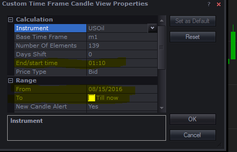
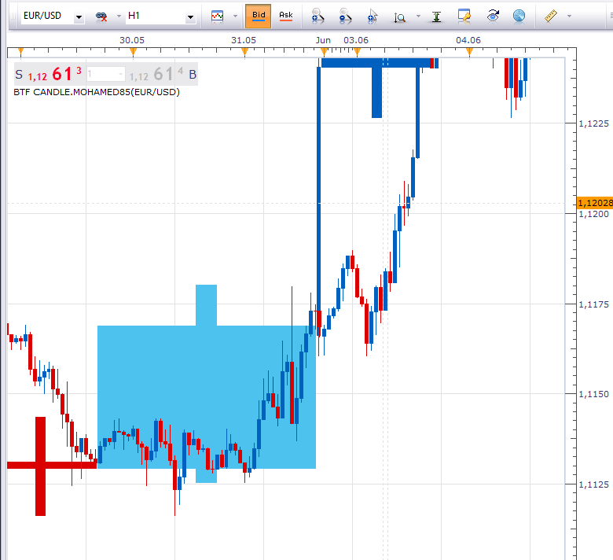
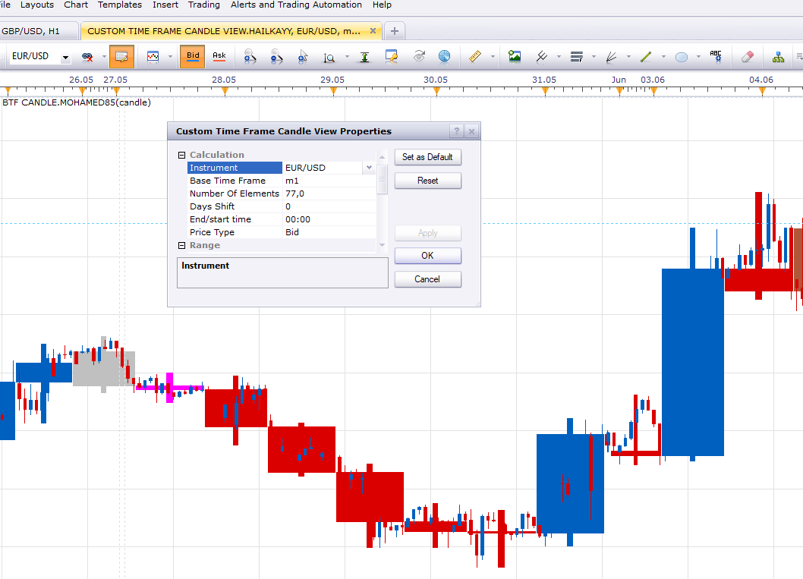

# BTF Candle

> Source: https://fxcodebase.com/code/viewtopic.php?f=17&t=3987  
> Forum: 17 · Topic 3987 · 54 post(s)

---

## BTF Candle

**Apprentice** · Thu Apr 21, 2011 9:05 am

As additional functionality, you can define Max. body length of the doji candle.
And as such is painted in different color.

 [BTF Candle.lua](files/9906/BTF%20Candle.lua)

 [BTF Candle Old.lua](files/9906/BTF%20Candle%20Old.lua)

This indicator is also known as GG-TimeBox.

MT4/MQ4 version.
[viewtopic.php?f=38&t=68400](https://fxcodebase.com/code/viewtopic.php?f=38&t=68400)

Tick Time frame version.
[https://fxcodebase.com/code/viewtopic.php?f=17&t=69807](https://fxcodebase.com/code/viewtopic.php?f=17&t=69807)

---

## Re: BTF Candle

**CHISEL** · Tue Aug 30, 2011 3:20 am

Hi Apprentice,

I like your BTF CANDLE. I am using it to overlay settings 8H on a 5 min chart, as I trade in Australia and set the trade station to UTC time. Can you alter your BTF TO OPEN AT 00:00???

chisel

---

## Re: BTF Candle

**Apprentice** · Tue Aug 30, 2011 4:22 pm

When I find time I will try to offer this option.

---

## Re: BTF Candle

**CHISEL** · Wed Aug 31, 2011 5:36 am

Thank you !!

CHISEL

---

## Re: BTF Candle

**CHISEL** · Fri Dec 23, 2011 5:13 am

> **Apprentice wrote:**
> When I find time I will try to offer this option.

Hi was wondering if you can code the BTF to open to give me 8 hour candles begining at GMT 00:00, GMT 08:00, GMT 16:00.

I did request before but maybe you forgot.

CHISEL

---

## Re: BTF Candle

**desmo888** · Sat Dec 24, 2011 5:14 pm

Hello,
I am getting an error on loading the BTF Candle to Marketscope 2.0. Is there a fix for this issue, or a setting that I would need to adjust in order to load the indicator?
Thank you,
Justin

---

## Re: BTF Candle

**desmo888** · Sat Dec 24, 2011 5:14 pm

Hello,
I am getting an error on loading the BTF Candle to Marketscope 2.0. Is there a fix for this issue, or a setting that I would need to adjust in order to load the indicator?
Thank you,
Justin

---

## Re: BTF Candle

**Apprentice** · Sun Dec 25, 2011 5:34 am

In initial tests I was unable to reproduce this bug.
Can you write down the error that you have.

---

## Re: BTF Candle

**trendwatch** · Fri May 31, 2013 4:07 am

Hi,

Can you add a 'time shift' option? Like the attached mq4.

Keep up the superb work you all are doing!

---

## Re: BTF Candle

**Apprentice** · Sun Jun 02, 2013 11:21 am

Your request is added to the development list.

---

## Re: BTF Candle

**MeiniOz** · Mon Jun 10, 2013 5:09 am

Thank for this indicator Apprentice. While it works well on a Marketscope 2.0 chart, it seems to misbehave when using on Strategy Backtester chart. It does not produce any graphical output, and the log error I get is this:

"An error occurred during the calculation of the indicator 'BTF CANDLE'. The error details: BTF Candle.lua:278: BTF Candle.lua:172: (null)."

Since it works in MS2, it is not a big deal, but it would be great if it worked on both.

---

## Re: BTF Candle

**HazLaRock** · Fri Aug 28, 2015 12:47 am

[Been looking for this ... Thanks]

> **Apprentice wrote:**
>
>
> BTF Candle.png
>
>
> As additional functionality, you can define Max. body length of the doji candle.
> And as such is painted in different color.
>
>
> BTF Candle.lua
>
>
>
> This indicator is also known as GG-TimeBox.

---

## Re: BTF Candle

**fjasonfx** · Sat Aug 20, 2016 1:48 pm

Hi Apprentice,

 Is there any way to make the wicks of the BTF candle a line for the wicks instead of a shadow? Something like this. Ignore the horizontal lines.

Thanks

 

---

## Re: BTF Candle

**Apprentice** · Sun Aug 21, 2016 5:53 am

Try BTF Candle.lua now.

---

## Re: BTF Candle

**fjasonfx** · Sun Aug 21, 2016 8:29 am

That's even better than what I was asking for. Looks great!

Thanks Apprentice!

---

## Re: BTF Candle

**Apprentice** · Fri Dec 02, 2016 5:22 am

Minor update.

---

## Re: BTF Candle

**adloule** · Wed Jan 04, 2017 3:10 pm

hi,
is it possible to have this indicator but with line version not the candle
thank you

---

## Re: BTF Candle

**Apprentice** · Sat Jan 07, 2017 8:28 am

Try this version.
[viewtopic.php?f=17&t=2213&p=4613&hilit=btf+source#p4613](https://fxcodebase.com/code/viewtopic.php?f=17&t=2213&p=4613&hilit=btf+source#p4613)

---

## Re: BTF Candle

**efh123** · Wed Feb 22, 2017 12:59 pm

hello there,

can you please add a 3min candle or the option of select a free timeframe?

best regards an thanks

---

## Re: BTF Candle

**Apprentice** · Fri Feb 24, 2017 6:00 am

[BTF Candle.lua](files/111179/BTF%20Candle.lua)

In this version u can type "m3"

---

## Re: BTF Candle

**HazLaRock** · Wed Apr 24, 2019 6:08 pm

any body got a mt4 version of this

---

## Re: BTF Candle

**Apprentice** · Fri Apr 26, 2019 6:29 am

Something similar.
[viewtopic.php?f=38&t=63985](https://fxcodebase.com/code/viewtopic.php?f=38&t=63985)

---

## Re: BTF Candle

**Apprentice** · Fri Apr 26, 2019 6:30 am

Your request is added to the development list under Id Number 4617

---

## Re: BTF Candle

**Apprentice** · Wed May 01, 2019 5:50 am

MT4/MQ4 version.
[viewtopic.php?f=38&t=68400](https://fxcodebase.com/code/viewtopic.php?f=38&t=68400)

---

## Re: BTF Candle

**Hailkayy** · Fri May 10, 2019 1:34 am

Hi Apprentice,

How are you ?

Can you please add to the version of this indic available on page 2, the option of selecting a Date in the calendar and a date at which the time frame will start ?
Just a quick option please!

Thank you very much if you can !

Royce.

---

## Re: BTF Candle

**Apprentice** · Sat May 11, 2019 5:41 am

From that date, D1 and higher time frame candles will start?

---

## Re: BTF Candle

**Hailkayy** · Sun May 12, 2019 8:31 pm

Hi Apprentice,

Very good question, I forgot one thing :
Here is in picture, highlighted in yellow the parameters I would be grateful if you could implement to BTF.

 

Please make as all the new typed time frames should be affected by the change of date.

In this BTF where we can select free time frame I triedW2 ok H12 ok D2 ok but BTF m500 for example was not working on regular h1 or m200 custom view, could you please investigate ? I'd like to make it work.

Thank you very much for your work.

Best.

---

## Re: BTF Candle

**Apprentice** · Mon May 13, 2019 6:16 am

Your request is added to the development list under Id Number 4655

---

## Re: BTF Candle

**Apprentice** · Tue May 14, 2019 12:25 pm

Try this version.

 [BTF Candle.Hailkayy.lua](files/126335/BTF%20Candle.Hailkayy.lua)

---

## Re: BTF Candle

**Hailkayy** · Sun May 19, 2019 10:22 am

Hi Apprentice,

It is almost to the result !

Could you please let us choose a custom time frame m250 or, H5 or D12 etc. instead of H1 etc ?
Then that would be complete.

Best regards,

R.

---

## Re: BTF Candle

**Apprentice** · Tue May 21, 2019 5:02 am

Your request is added to the development list under Id Number 4669

---

## Re: BTF Candle

**Apprentice** · Tue May 21, 2019 9:10 am

[BTF Candle.Hailkayy.lua](files/126456/BTF%20Candle.Hailkayy.lua)

Try this version.

---

## Re: BTF Candle

**Mohamed85** · Fri May 24, 2019 9:52 am

Hi Apprentice,
Have a nice day,

is it possible to combine the attached code with BTF candle indicator, so that it will be represented the same way,

Regards,
Mohamed.

---

## Re: BTF Candle

**Mohamed85** · Fri May 24, 2019 9:53 am

Sorry here is the code.

---

## Re: BTF Candle

**Apprentice** · Sat May 25, 2019 3:05 am

Your request is added to the development list under Id Number 4677

---

## Re: BTF Candle

**Apprentice** · Wed May 29, 2019 4:38 am

Try this version.

 [BTF Candle.Mohamed85.lua](files/126605/BTF%20Candle.Mohamed85.lua)

---

## Re: BTF Candle

**Mohamed85** · Wed May 29, 2019 8:18 am

Thank you so much apprentice for the support,
I am facing an error as shown below asking for the hailkawy version and when I try to install it, it also asks for the same version .... not sure actually which version it is asking for.

so, if it is possible, please modify it to be independent version (custom time is not required), otherwise if you can check/fix this error, or advise how to overcome it.

Regards,
Mohamed.

---

## Re: BTF Candle

**Apprentice** · Thu May 30, 2019 3:06 am

You will have to download and install CUSTOM TIME FRAME CANDLE VIEW.HAILKAYY.lua indicator

---

## Re: BTF Candle

**Mohamed85** · Thu May 30, 2019 8:17 am

thank you Apprentice,

Can you please check the code, as shown below it doesn't reflect the correct colors and the wick are not showing as well.

Regards,

---

## Re: BTF Candle

**Apprentice** · Mon Jun 03, 2019 6:10 am

Done! I fixed the base indicator as well, both indicators need to be
reinstalled.

---

## Re: BTF Candle

**Mohamed85** · Mon Jun 03, 2019 1:06 pm

Thank you Apprentice, it works great now.

but would it be too much asking, if I asked for it to show wicks as well,
cheers.

---

## Re: BTF Candle

**Apprentice** · Tue Jun 04, 2019 6:14 am

Your request is added to the development list under Id Number 4696

---

## Re: BTF Candle

**Apprentice** · Wed Jun 05, 2019 2:41 am

It does show wicks already.
Try to re-download.

---

## Re: BTF Candle

**Hailkayy** · Thu Jun 06, 2019 1:29 am

Hello Apprentice,

Thanks for making the version for me of this indicator.

I have tried to plot it on a custom view and nothing appears could you please advise ?

Try to open a m77 view for example
Try to plot a BTF H12 on it

Basically I would like to have the display you posted on your last picture but with customed views, and customed btf so that any timeframe [m77, H15 etc] would be work in both at the same time.

Thanks or your help and thanks for your work so far.

---

## Re: BTF Candle

**Apprentice** · Sat Jun 08, 2019 2:12 am

I have no issues on m77+H15

 

---

## Re: BTF Candle

**Mohamed85** · Sat Jun 08, 2019 6:47 am

Thank you Apprentice for your continuous support.
Regardless whatever I've tried, I can't generate the view that showing in your snap shoot, it is only showing as below.

I've uninstalled all the three codes (Custom Time Frame Candle View.Hailkayy.lua, Bar Analysis.lua, BTF Candle.Mohamed85.lua) then re-downloaded and re-installed them but still facing the same issue.

so if you can please advise what else I can try that would be so helpful.

---

## Re: BTF Candle

**Mohamed85** · Wed Jun 12, 2019 6:32 am

any advise?!!

---

## Re: BTF Candle

**adloule** · Thu Feb 16, 2023 12:03 pm

hi
is it possible to put this Indicator on a tick chart ?
thank you

---

## Re: BTF Candle

**Apprentice** · Wed Feb 22, 2023 3:25 am

It is the current version no.
Will have to write a new template.

We have added your request to the development list.
Development reference 173.

---

## Re: BTF Candle

**Apprentice** · Thu Feb 23, 2023 4:22 am

Try this version.
[https://fxcodebase.com/code/viewtopic.php?f=17&t=69807](https://fxcodebase.com/code/viewtopic.php?f=17&t=69807)

---

## Re: BTF Candle

**zhlongji** · Sun Mar 31, 2024 10:22 pm

> **Apprentice wrote:**
>
>
> BTF Candle.lua
>
>
> In this version u can type "m3"

hi,the width of the latest candlestick is not the normal width,it has widened over time,could you be modified to the same width as other candlesticks?thanks

---

## Re: BTF Candle

**zhlongji** · Sun Mar 31, 2024 10:28 pm

> **Apprentice wrote:**
>
>
> The attachment **BTF Candle.lua** is no longer available
>
>
> In this version u can type "m3"

hi,the width of the latest candlestick is not the normal width,it has widened over time,could you be modified to the same width as other candlesticks?thanks

---

## Re: BTF Candle

**Apprentice** · Fri Apr 05, 2024 6:00 pm

We have added your request to the development list.
Development reference 289

---

## Re: BTF Candle

**Apprentice** · Tue Dec 03, 2024 1:29 pm

 [BTF_Candle.lua](files/157432/BTF_Candle.lua)
