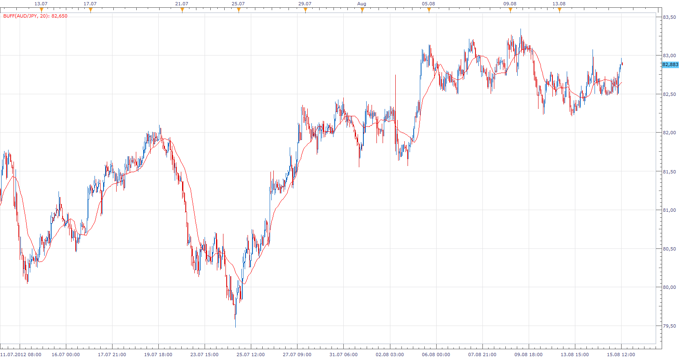

# Buff Average

> Source: https://fxcodebase.com/code/viewtopic.php?f=17&t=22436  
> Forum: 17 · Topic 22436 · 3 post(s)

---

## Buff Average

**Apprentice** · Wed Aug 15, 2012 12:01 pm

The Buff Averages, as described by Buff Dormeier, in his article Buff Up Your Moving Averages.
Buff = Sum( Volume * Close, Period ) / Sum( Volume, Period )

 [Buff.lua](files/38725/Buff.lua)

The indicator was revised and updated

---

## Re: Buff Average

**Alexander.Gettinger** · Mon Nov 17, 2014 5:24 pm

MQL4 version of Buff Average indicator: [viewtopic.php?f=38&t=61456](https://fxcodebase.com/code/viewtopic.php?f=38&t=61456).

---

## Re: Buff Average

**Apprentice** · Tue Jun 27, 2017 4:32 am

The indicator was revised and updated.
