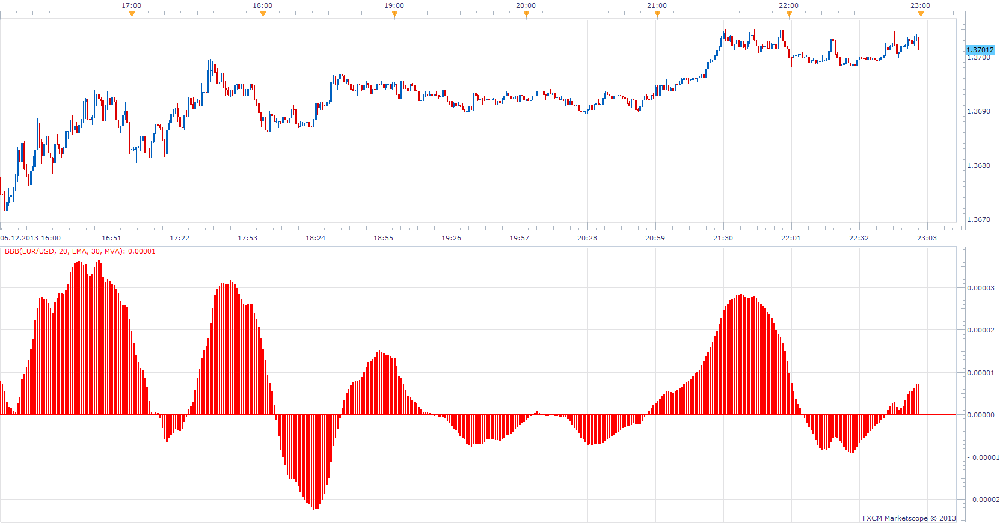

# Bull And Bear Balance Indicator

> Source: https://fxcodebase.com/code/viewtopic.php?f=17&t=60072  
> Forum: 17 · Topic 60072 · 3 post(s)

---

## Bull And Bear Balance Indicator

**Apprentice** · Sun Dec 08, 2013 10:15 am

As described in an article "Bull And Bear Balance Indicator" by Vadim Gimelfarb.
Indicator analyzes the balance between bullish and bearish sentiment.

 [BBB.lua](files/91408/BBB.lua)

Indicator-based strategy.
[viewtopic.php?f=31&t=68334](https://fxcodebase.com/code/viewtopic.php?f=31&t=68334)

---

## Re: Bull And Bear Balance Indicator

**Alexander.Gettinger** · Wed Aug 20, 2014 10:06 am

MQL4 version of Bull And Bear Balance: [viewtopic.php?f=38&t=61059](https://fxcodebase.com/code/viewtopic.php?f=38&t=61059).

---

## Re: Bull And Bear Balance Indicator

**Apprentice** · Sun Jun 25, 2017 1:27 pm

The indicator was revised and updated.
