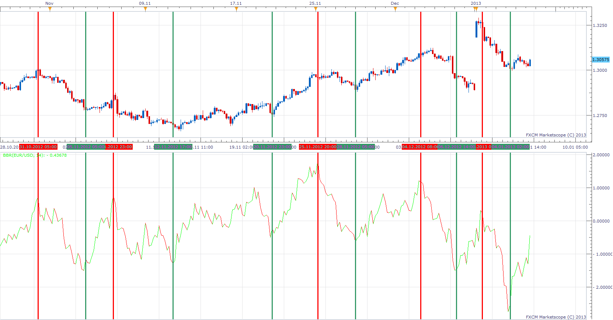

# Bull Bear Ratio

> Source: https://fxcodebase.com/code/viewtopic.php?f=17&t=28171  
> Forum: 17 · Topic 28171 · 4 post(s)

---

## Bull Bear Ratio

**Apprentice** · Mon Jan 07, 2013 11:07 am

This one is my own implementation.
Indicator, weighs successful and unsuccessful Bulls and Bear Market runs for selected periods.
Composite Index is also available.

 [BBR.lua](files/49527/BBR.lua)

Slope changes or Zero Line Cross, can be used as Signal to Open new position.

The indicator was revised and updated

---

## Re: Bull Bear Ratio

**Blackcat2** · Tue Jan 08, 2013 5:05 am

Hi apprentice,
How to get the vertical lines?

Thanks..
BC

---

## Re: Bull Bear Ratio

**Apprentice** · Wed Jan 09, 2013 4:50 pm

I drew these lines by hand, using Add Vertical Line Tool.

---

## Re: Bull Bear Ratio

**Apprentice** · Tue May 02, 2017 11:26 am

Indicator was revised and updated.
