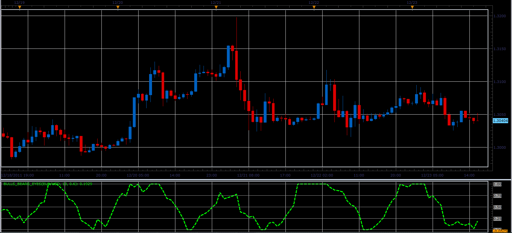

# Bulls-Bears eyes oscillator

> Source: https://fxcodebase.com/code/viewtopic.php?f=17&t=10400  
> Forum: 17 · Topic 10400 · 2 post(s)

---

## Bulls-Bears eyes oscillator

**Alexander.Gettinger** · Sun Dec 25, 2011 2:37 pm

This indicator is a ported MQL5 indicator from [http://www.mql5.com/ru/code/776](http://www.mql5.com/ru/code/776) (in Russian).
Indicator values ​​are calculated as the sum of the indicators Bears Power and Bulls Power, averaged with an algorithm Laguerre.

 

Download:

 [Bulls_Bears_Eyes.lua](files/21609/Bulls_Bears_Eyes.lua)

For this oscillator must be installed Bear Power and Bull Power ([viewtopic.php?f=17&t=1376&p=2648](https://fxcodebase.com/code/viewtopic.php?f=17&t=1376&p=2648)).

The indicator was revised and updated

---

## Re: Bulls-Bears eyes oscillator

**Apprentice** · Mon Mar 20, 2017 8:34 am

Indicator was revised and updated.
