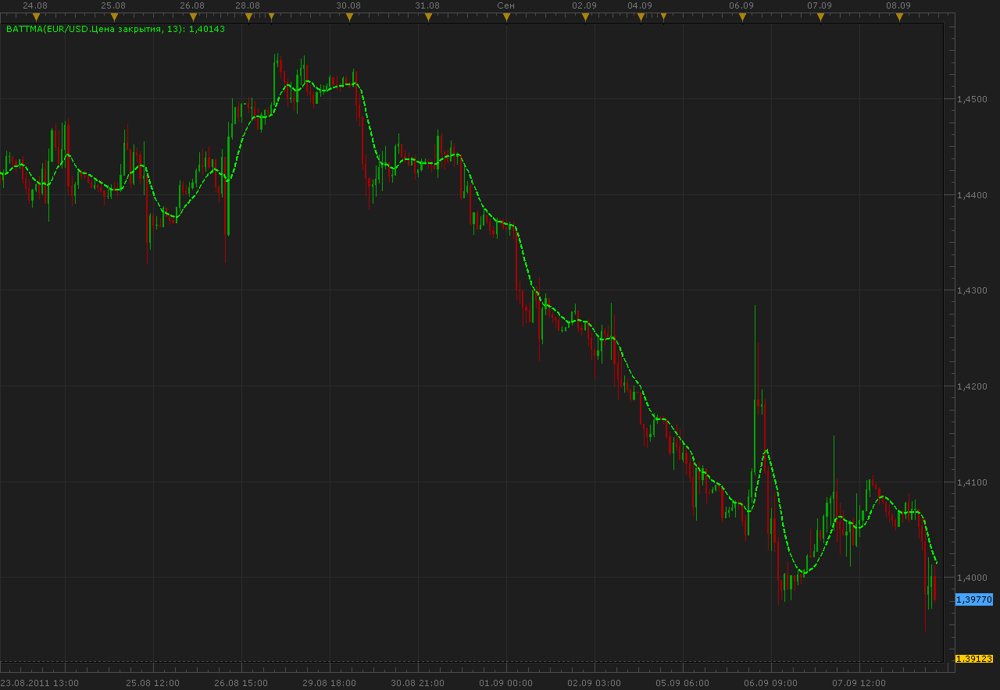

# Butterworth Moving Average

> Source: https://fxcodebase.com/code/viewtopic.php?f=17&t=6400  
> Forum: 17 · Topic 6400 · 2 post(s)

---

## Butterworth Moving Average

**Alexander.Gettinger** · Thu Sep 08, 2011 10:36 am

Indicator is a moving average with smoothing Butterworth filter.

Formulas:
ButtMA[i]=p1*Price+p2*BattMA[i-1]-p3*BattMA[i-2], where
p1=2/(1+Period),
p2=2*(1-Kf),
p3=(1-Kf)*(1-Kf),
Kf=sqrt(p1).

 

Download:

 [ButtMA.lua](files/14696/ButtMA.lua)

The indicator was revised and updated

---

## Re: Butterworth Moving Average

**Apprentice** · Thu Mar 16, 2017 2:43 pm

Indicator was revised and updated.
