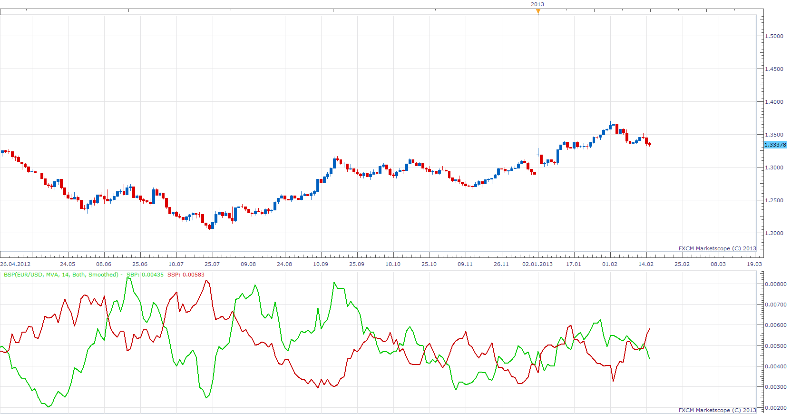

# Buying/Selling Pressure

> Source: https://fxcodebase.com/code/viewtopic.php?f=17&t=32052  
> Forum: 17 · Topic 32052 · 24 post(s)

---

## Buying/Selling Pressure

**Apprentice** · Fri Feb 15, 2013 6:53 am

BP = high-open
SP = open -low

Prevailing pressure filter
If BP > SP then
PP = BP
If SP > BP then
PP = SP

 [BSP.lua](files/54675/BSP.lua)

Indicator based strategy.
[viewtopic.php?f=31&t=68786](https://fxcodebase.com/code/viewtopic.php?f=31&t=68786)

---

## Re: Buying/Selling Pressure

**compulsive** · Wed Feb 20, 2013 10:46 pm

What is this based on?

---

## Re: Buying/Selling Pressure

**Apprentice** · Thu Feb 21, 2013 3:54 pm

U should ask Jeff.
[viewtopic.php?f=27&t=32048](https://fxcodebase.com/code/viewtopic.php?f=27&t=32048)
I'm just a programmer for this one.

---

## Re: Buying/Selling Pressure

**greentrader** · Thu Feb 21, 2013 8:24 pm

hi,
can you create mtf strategy based on this indicator

**indicators:**

**1. buying /selling pressure**

with default parameters
time frames m15,H1,H4

**2.ATR**

 period : 14
 time frames : H1,H4
 multiplier for H1: 1.0
 multiplier for H4: 2.0

**BUY:**

1. SBP (H4) > SSP( H4) AND SBP (H4)- SSP(H4) > ATR(H4) *MULTIPLIER FOR H4(2.0)

2.SBP(H1)> SSP(H1) AND SBP(H1)-SSP(H1) > ATR(H1)*MULTIPLIER FOR H1(1.0)

3. SBP (M15 ) CROSS OVER SSP (M 15)

**SELL:**

1. SSP(H4) > SSP( H4) AND SSP(H4) -SBP(H4) > ATR (H4) * MULTIPLIER FOR H4( 2.0)

2.SSP(H1) > SBP(H1) AND SSP(H1) - SBP(H1) > ATR(H1)*MULTIPLIER FOR H1(1.0)

3.SSP (M15) CROSS OVER SBP (M15)

---

## Re: Buying/Selling Pressure

**Apprentice** · Sat Feb 23, 2013 7:34 am

Your request is added to the development list.

---

## Re: Buying/Selling Pressure

**Apprentice** · Mon Feb 25, 2013 4:13 pm

Update, Minor bug fix added.

---

## Re: Buying/Selling Pressure

**Jeffreyvnlk** · Mon Mar 11, 2013 8:31 pm

> **Apprentice wrote:**
>
>
> BSP.png
>
>
> BP = high-open
> SP = open -low
>
>
> BSP.lua

Thank you. But im sorry for missing some detail. The indicator should focus on:

- green days for selling pressure (calculated Selling Pressure only in green days)
- red days for buying one

Kind of filtering. Appreciated if you could adjust a bit. Using: when Selling Pressure increases, meaning reverse could be ahead

---

## Re: Buying/Selling Pressure

**Apprentice** · Tue Mar 12, 2013 5:27 am

like this
If BP > SP
Show only SP

If SP > BP
Show only BP

---

## Re: Buying/Selling Pressure

**Jeffreyvnlk** · Sun Mar 24, 2013 4:13 pm

yes, very simple,the beauty of math, thank you

---

## Re: Buying/Selling Pressure

**Apprentice** · Mon Mar 25, 2013 6:38 pm

Prevailing pressure filter Added.

---

## Re: Buying/Selling Pressure

**Jeffreyvnlk** · Tue Mar 26, 2013 12:25 am

Thank you

---

## Re: Buying/Selling Pressure

**Jeffreyvnlk** · Thu Apr 25, 2013 3:42 am

For those who want to use it for trading he the strategy from LW:

1.Set up: look at a declined market so rally of some sort should be in the future and a day with Close lower than that of previous 5 days
2. For the trading day:
- Calculated "Buying Swing" by averaging 4 "Buying Pressure" of previous 4 days.
- Pending buy at today' open + 180% of Buying Swing

3.You can filter by Trading days of the Week (the concept from Larry Williams), for example, Monday usually a bad one for SP500 (Friday might be next candidate for short)

For selling, just do vice verse. Thursday is strong for Sp500

P/s: so i guess we back to an original BSP indicator without filtering

---

## Re: Buying/Selling Pressure

**Jeffreyvnlk** · Thu Apr 25, 2013 4:25 am

Sorry might be we in a mess, my bad. I was not good reading that concept from Mr.Larry Williams.Let me fix it

The idea: each day we have a buying pressure (BP) and a selling pressure (SP). For example in a green day, gold running into 25$ which can be divided as 5$ for SP (Open minus Low) and 20$ for BP (High minus Open). The next day, SL greater than that of previous day, meaning more sellers coming into the market. Also the same token for BP. As a result we have a tug of war in this uptrend, more buyers as well, kind of doji or a pink day according to Bill Williams in Money Facilitation index

Now we go further: we only take SP for a green day and BP for a red day (minority under our radar)

Applying: in an up trend, we seeing SP growing and some reversal might occur soon

Reflection: i think this idea running opposite to Stochastics concept. In the uptrend, the Close usually get closed to the High. Here, we focus on the Low comparing to the Open

Hope it can help a bit

P/s: Apprentice, once again, could you adjust a bit that indicator. Sorry for interrupting you

---

## Re: Buying/Selling Pressure

**Jeffreyvnlk** · Thu Apr 25, 2013 6:48 am

For the indicator there 4 situations like those:
- SP and BP for a green day
- SP and BP for a red day

A.However, we dont care BP for a green day and SL red

vs.

B.We just focus on the weaker hands such as **SP on a green day and BP red**

So i guess there would be dim colors for those day under A as not bring any valuable for trading and highlight B.

Hope Apprentice can fix it up again. Thank you in advance

---

## Re: Buying/Selling Pressure

**Jeffreyvnlk** · Thu Apr 25, 2013 11:05 am

> **Apprentice wrote:**
> like this
> If BP > SP
> Show only SP
>
> If SP > BP
> Show only BP

You right but I think your actual indicator doing opposite. It showed the bigger not smaller.
Could you fix that , please

---

## Re: Buying/Selling Pressure

**Jeffreyvnlk** · Fri May 03, 2013 10:45 am

Just want to share with you something

Today I read back to TrumpleOne's, he also interested on distance of from Open to L/H
Larry Williams talked long ago abou it. The difference between Previous day' Close and Today' Open was kind of Public whereas Today's Open and Today'Close was Smart Money (unfortunately, we in forex not in his days anymore so yesterday's close and today's open almost the same)
Linda Raschke saw the first hour of opening was Public and last hour Smart money
Toby Crabel written length on Opening Range
Douglass Taylor was very focus on High and Low of the day

I heard a guy in Tokyo worked as a security in 80s in the basement of a building and he traded forex at the time where he needed reloading his webpage every 15 minute to watch and trade.HOLC of the candles were the only data he used to make his decision

It is amazing to see such people just using HOLC and exploit it in a very smart way

---

## Re: Buying/Selling Pressure

**yk6267** · Fri Jul 03, 2015 11:45 pm

Hi Admin,

I would love to have the MT4 version of the BSP indicator and check if there is any discrepancies between brokers.

Can you help to develop the MT4 version? Thank you very much!

---

## Re: Buying/Selling Pressure

**Apprentice** · Mon Jul 06, 2015 9:49 am

Requested can be found here.
[viewtopic.php?f=38&t=62404](https://fxcodebase.com/code/viewtopic.php?f=38&t=62404)

---

## Re: Buying/Selling Pressure

**Apprentice** · Sun Aug 13, 2017 6:12 am

The indicator was revised and updated.

---

## Re: Buying/Selling Pressure

**Apprentice** · Sun Aug 13, 2017 6:41 am

A Buying/Selling Pressure based strategy is available here.
[viewtopic.php?f=31&t=64989&p=114160#p114160](https://fxcodebase.com/code/viewtopic.php?f=31&t=64989&p=114160#p114160)

---

## Re: Buying/Selling Pressure

**greentrader** · Sun Aug 13, 2017 1:15 pm

thanks apprendice

---

## Re: Buying/Selling Pressure

**Apprentice** · Mon Oct 22, 2018 6:03 am

The indicator was revised and updated.

---

## Re: Buying/Selling Pressure

**enotikos** · Tue Aug 13, 2019 1:33 pm

Hi apprentice,

Can you make a simple strategy with this indicator?
Buy: If we have cross and BP>SP
Sell: If we have cross and SP>BP
Entry and exit: Live/ end of turn
Use break even
Trailing after break even

Thank you

---

## Re: Buying/Selling Pressure

**Apprentice** · Wed Aug 14, 2019 11:41 am

Indicator based strategy.
[viewtopic.php?f=31&t=68786](https://fxcodebase.com/code/viewtopic.php?f=31&t=68786)
