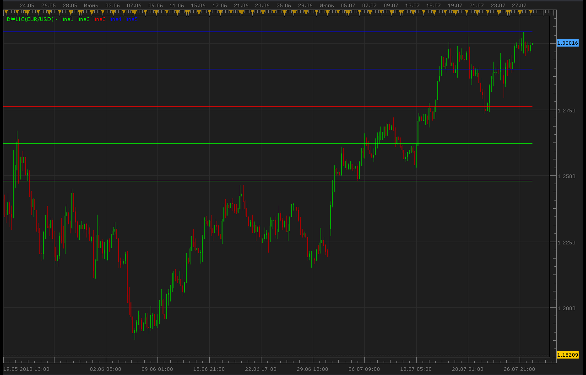
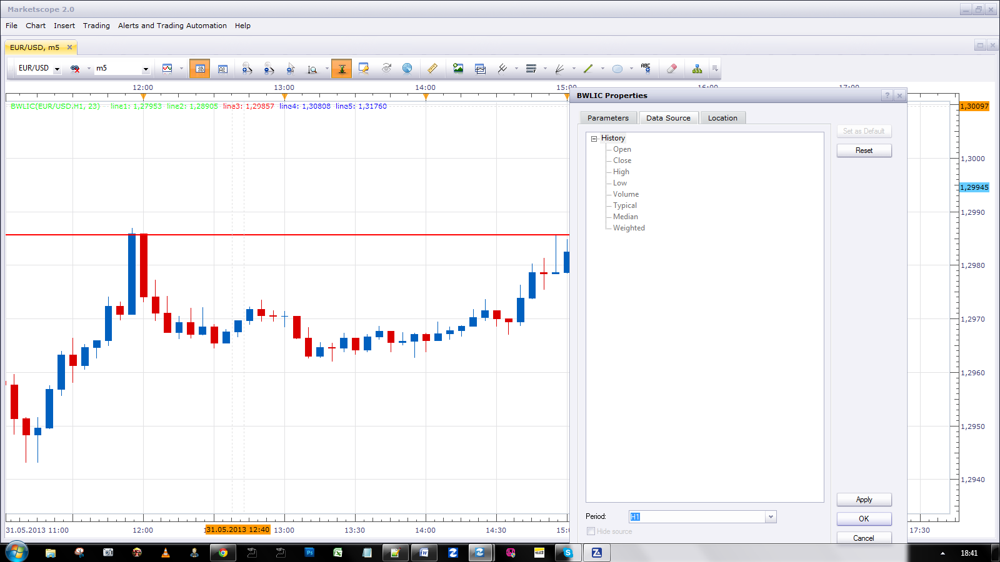

# BWLIC indicator

> Source: https://fxcodebase.com/code/viewtopic.php?f=17&t=1606  
> Forum: 17 · Topic 1606 · 6 post(s)

---

## BWLIC indicator

**Alexander.Gettinger** · Wed Jul 28, 2010 12:30 am

Line1=minimum price for [Days] last days,
Line5=maximum price for [Days] last days;
Line3=medium price for Line1 and Line5,
Line2=medium price for Line1 and Line3,
Line4=medium price for Line3 and Line5.

 



```lua
function Init()
    indicator:name("BWLIC indicator");
    indicator:description("");
    indicator:requiredSource(core.Bar);
    indicator:type(core.Indicator);

    indicator.parameters:addInteger("Days", "Days", "No description", 23);
    indicator.parameters:addColor("Color1", "Color 1", "Color 1", core.rgb(0, 255, 0));
    indicator.parameters:addColor("Color2", "Color 2", "Color 2", core.rgb(0, 255, 0));
    indicator.parameters:addColor("Color3", "Color 3", "Color 3", core.rgb(255, 0, 0));
    indicator.parameters:addColor("Color4", "Color 4", "Color 4", core.rgb(0, 0, 255));
    indicator.parameters:addColor("Color5", "Color 5", "Color 5", core.rgb(0, 0, 255));
end

local first;
local source = nil;
local buff1;
local buff2;
local buff3;
local buff4;
local buff5;
local Days;

function Prepare()
    Days = instance.parameters.Days;
    source = instance.source;
    first = source:first();
    local name = profile:id() .. "(" .. source:name() .. ", " .. Days .. ")";
    instance:name(name);
    buff1 = instance:addStream("line1", core.Line, name .. ".line1", "line1", instance.parameters.Color1, first);
    buff2 = instance:addStream("line2", core.Line, name .. ".line2", "line2", instance.parameters.Color2, first);
    buff3 = instance:addStream("line3", core.Line, name .. ".line3", "line3", instance.parameters.Color3, first);
    buff4 = instance:addStream("line4", core.Line, name .. ".line4", "line4", instance.parameters.Color4, first);
    buff5 = instance:addStream("line5", core.Line, name .. ".line5", "line5", instance.parameters.Color5, first);
end

function Update(period, mode)
    if (period>first) then
     local d,t,d1,t1;
     local TimeDiff;
     local PriceMin=source.low[period];
     local PriceMax=source.high[period];
     d,t=source:date(period);
     for i=first,period-1,1 do
      d1,t1=source:date(i);
      TimeDiff=d-d1;
      if TimeDiff<=Days then
       PriceMin=math.min(PriceMin,source.low[i]);
       PriceMax=math.max(PriceMax,source.high[i]);
      end
     end
     local m=(PriceMin+PriceMax)/2.;
     for i=first,period,1 do
      buff1[i]=PriceMin;
      buff2[i]=(PriceMin+m)/2.;
      buff3[i]=m;
      buff4[i]=(PriceMax+m)/2.;
      buff5[i]=PriceMax;
     end
    end
end
```

The indicator was revised and updated

---

## Re: BWLIC indicator

**fxcyberman** · Mon May 27, 2013 11:12 am

can it be modified to use at low time frame. like m5, m30, h1..etc ?
Thanks in advance.

---

## Re: BWLIC indicator

**Apprentice** · Sun Jun 02, 2013 11:46 am



Have you try to use Data Source Period Selector

---

## Re: BWLIC indicator

**fxcyberman** · Sun Jun 09, 2013 1:35 pm

Sorry, already tried. It doesn't work for lower time frame.

---

## Re: BWLIC indicator

**Apprentice** · Mon Jun 10, 2013 3:41 am

For lower time frames, this is not possible,
at least not with this method of presentation.
For example ...
If u use H1 Chart Time Frame.
For every line You'll will have two lines on m30,
four lines on m15 and so on ....

---

## Re: BWLIC indicator

**Apprentice** · Tue May 23, 2017 6:05 am

Indicator was revised and updated.
