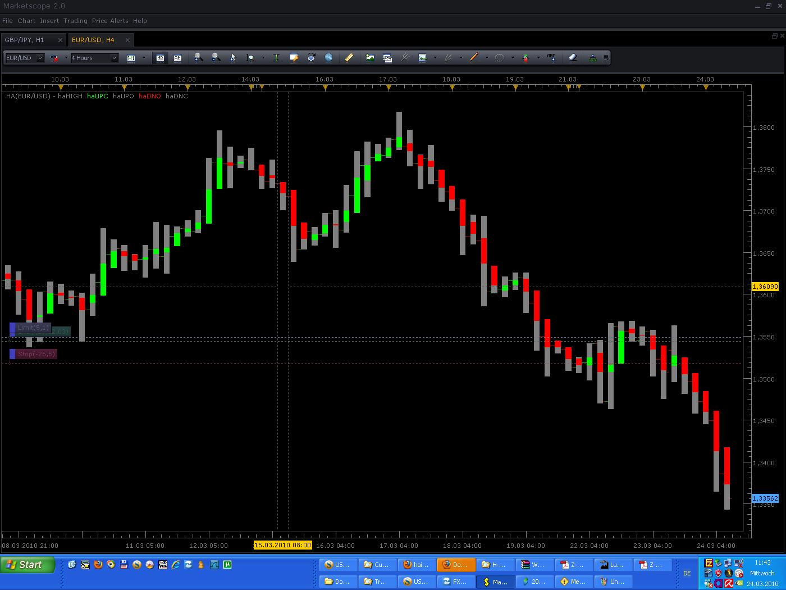

# Can't wait for Heiken Ashi Support ????

> Source: https://fxcodebase.com/code/viewtopic.php?f=17&t=518  
> Forum: 17 · Topic 518 · 4 post(s)

---

## Can't wait for Heiken Ashi Support ????

**Gidien** · Wed Mar 24, 2010 5:51 am

Because i couldn't wait for new Marketscope Version , i wrote an Heiken Ashi Candlestick Indicator with a litle Trik.

NOTICE the Color for haLow must be you chart background Color.

Use also BarChart in the background.

 

Sorry, found some failure in the Heiken Ashi Calculation

Should now correct.

 [HA1.lua](files/882/HA1.lua)

The indicator was revised and updated

---

## Re: Can't wait for Heiken Ashi Support ????

**Nikolay.Gekht** · Wed Mar 24, 2010 9:41 am

cool. I renamed the indicator to HA1.lua. The standard indicator in the new version is also named HA.lua, and after the update this custom indicator (if it is installed) will override the standard indicator.

---

## Re: Can't wait for Heiken Ashi Support ????

**Nikolay.Gekht** · Wed Mar 24, 2010 10:38 pm

BTW, in lua you don't need to use constructions like this
haHIGH[period] = math.max(source.high[period],math.max(haOPEN[period],haCLOSE[period]));
unlike many other language lua supports variable number of arguments, so you can use
the following instead:
haHIGH[period] = math.max(source.high[period], haOPEN[period], haCLOSE[period]);

---

## Re: Can't wait for Heiken Ashi Support ????

**Apprentice** · Sun Dec 25, 2016 7:23 am

Indicator was revised and updated.
