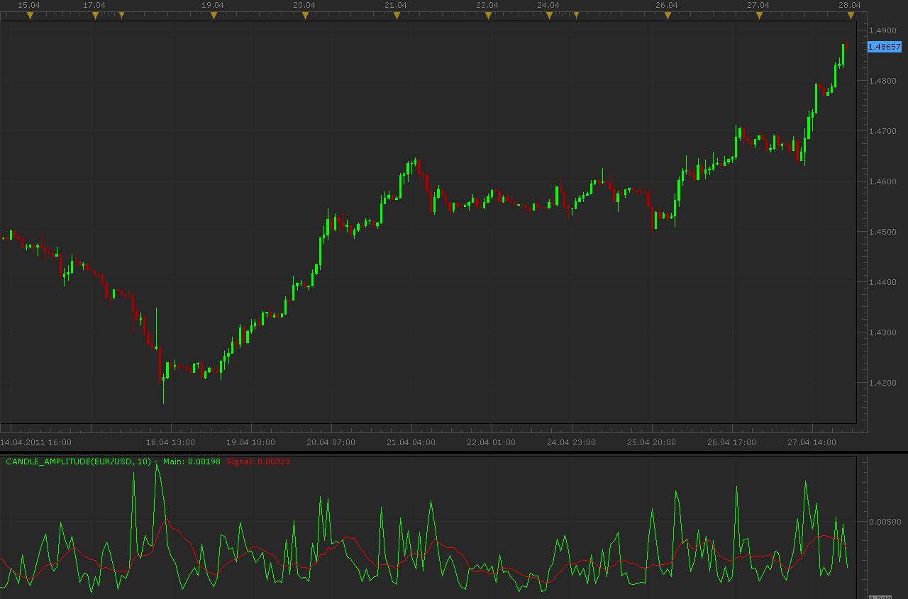

# Candle amplitude indicator

> Source: https://fxcodebase.com/code/viewtopic.php?f=17&t=4049  
> Forum: 17 · Topic 4049 · 2 post(s)

---

## Candle amplitude indicator

**Alexander.Gettinger** · Wed Apr 27, 2011 10:53 pm

Indicator have a 2 mode:
1. show High-Low
2. show Close-Open.

In addition indicator draw average value as a signal line.

 

Download:

 [Candle_Amplitude.lua](files/10133/Candle_Amplitude.lua)

The indicator was revised and updated

---

## Re: Candle amplitude indicator

**Apprentice** · Wed Mar 08, 2017 5:31 pm

Indicator was revised and updated.
