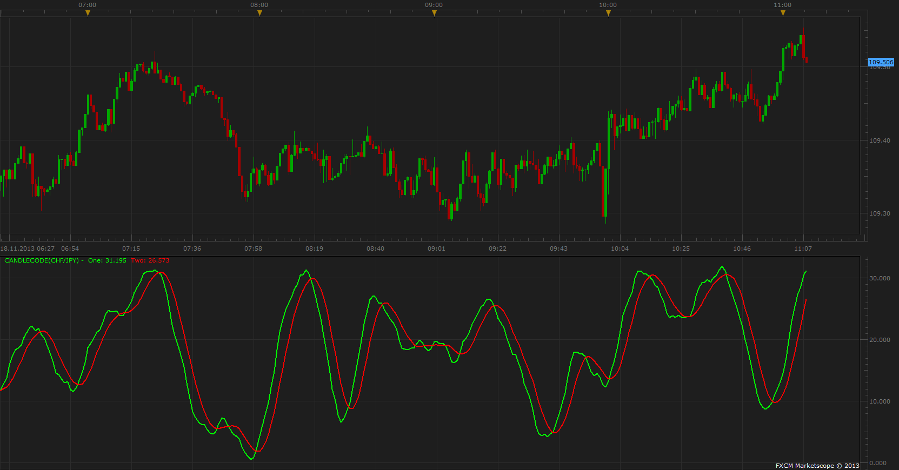

# Candle Codes

> Source: https://fxcodebase.com/code/viewtopic.php?f=17&t=59880  
> Forum: 17 · Topic 59880 · 3 post(s)

---

## Candle Codes

**Apprentice** · Mon Nov 18, 2013 5:11 am

 [CandleCode.lua](files/90881/CandleCode.lua)

The indicator was revised and updated

---

## Re: Candle Codes

**Alexander.Gettinger** · Fri Sep 12, 2014 2:06 pm

MQL4 version of Candle Codes indicator: [viewtopic.php?f=38&t=61128](https://fxcodebase.com/code/viewtopic.php?f=38&t=61128).

---

## Re: Candle Codes

**Apprentice** · Thu Jun 29, 2017 5:48 am

The indicator was revised and updated.
