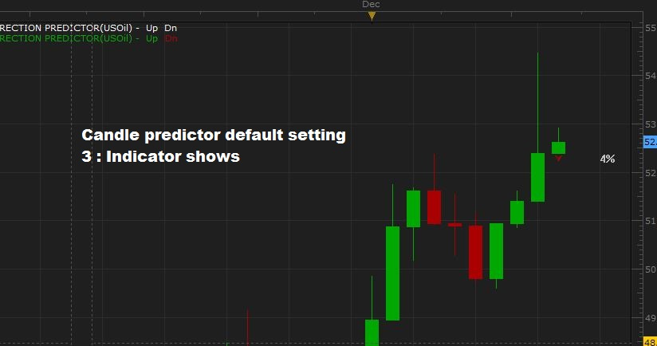
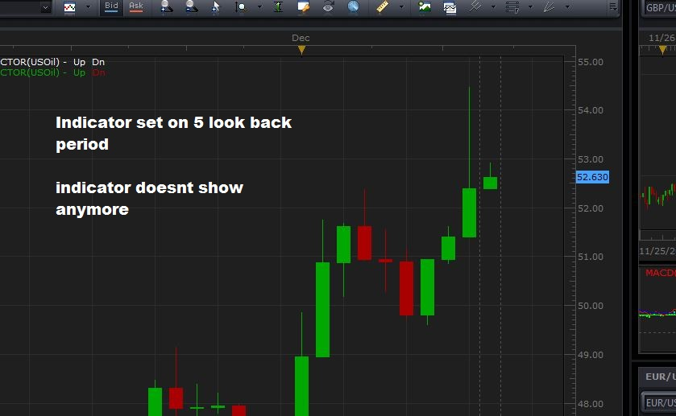

# Candle Direction Predictor

> Source: https://fxcodebase.com/code/viewtopic.php?f=17&t=64201  
> Forum: 17 · Topic 64201 · 4 post(s)

---

## Candle Direction Predictor

**Apprentice** · Mon Dec 12, 2016 2:42 pm

Based on the request.
[viewtopic.php?f=27&t=64199](https://fxcodebase.com/code/viewtopic.php?f=27&t=64199)

Indicator will predict current candle close.
Indicator analyzes previous candle patterns,
will try to find a pattern similar to current candle pattern.

 [Candle Direction Predictor.lua](files/109803/Candle%20Direction%20Predictor.lua)

 [Historical Candle Direction Predictor.lua](files/109803/Historical%20Candle%20Direction%20Predictor.lua)

MT4/MT5 version.
[viewtopic.php?f=38&t=70031](https://fxcodebase.com/code/viewtopic.php?f=38&t=70031)

---

## Re: Candle Direction Predictor

**Apprentice** · Mon Dec 12, 2016 4:44 pm

Bump up.

---

## Re: Candle Direction Predictor

**Hailkayy** · Tue Dec 13, 2016 12:41 am

Thanks,

Two issues seemingly.

1: Look back period**work until 5 or 10,** beyond that, [for exemple 15 or 200] the indicator doesnt display anymore.

Or to be able to predict candle direction indicator should be able to analyse the last 100...200+candles so that it can find patterns

For example crude works with 3 but doesnt show when I type 5.
**So you can you please have a greater look back period work please ? [200.. infinite...]**

2: It seems its working fine on Eurusd or otehr but sometimes when I switch instrument like crude oil, it doest show anymore. Can you please quick fix it it happens for you? Thanks.

3 : Sometimes CandlePredictor is wrong, which is fine. Yet when historical Candle Predictor is on the chart it doesnt show the mistakes, like if it thought this candle was going to be long, but instead it closed red, vice versa.

 it shows the actual direction the candle went in.
Is it possible to correct ?

Other than that thats it thanks =]
Please see attached files.

 [17202](files/109829/test1.JPG)

 [17203](files/109829/test2.JPG)

 

 

 

---

## Re: Candle Direction Predictor

**Hailkayy** · Tue Dec 13, 2016 12:57 am

Hello,

I just realised Historical works fine. Stunningly.

So now only :

Historical works with 100 etc.. [but In fact working with small numbers seems to be better.]

Just Candle Predictor doesnt do same, probably just a small bug in Candlepredictor.

Thanks !
