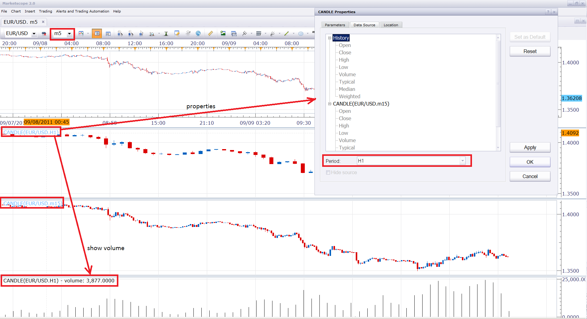

# Candle indicator

> Source: https://fxcodebase.com/code/viewtopic.php?f=17&t=6491  
> Forum: 17 · Topic 6491 · 2 post(s)

---

## Candle indicator

**Nikolay.Gekht** · Mon Sep 12, 2011 11:19 am

The simple indicator which can be used to display candles of the current instrument. The indicator is useful together with new [Other time frame indicator](https://fxcodebase.com/wiki/index.php/Applying_other_time_frame_indicator_in_Trading_Station_Beta) feature to display prices of other timeframe on the same chart.

See the snapshot for an example of application of the indicator. The chart shows 5 minute, 1 hour and 15 minutes candles on the same chart:

 

(click on image to enlarge)

Download:

 [candle.lua](files/14830/candle.lua)

The indicator was revised and updated

---

## Re: Candle indicator

**Apprentice** · Sun Mar 19, 2017 10:13 am

Indicator was revised and updated.
