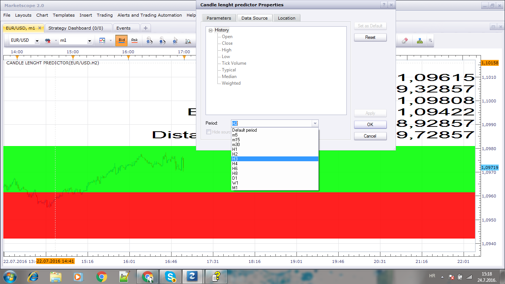
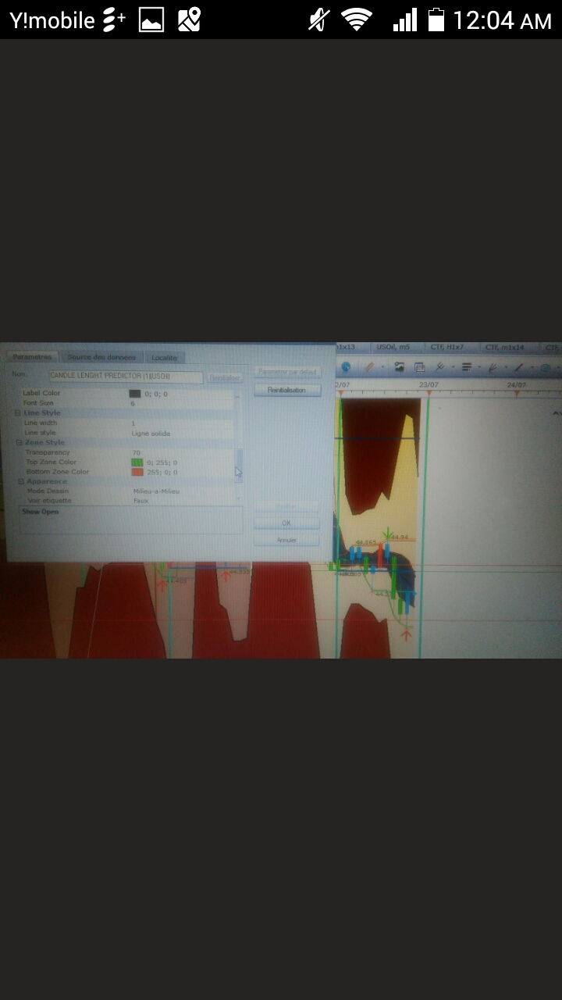
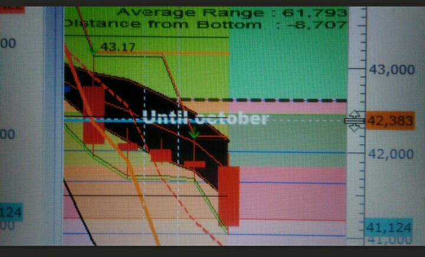

# Candle lenght predictor

> Source: https://fxcodebase.com/code/viewtopic.php?f=17&t=63690  
> Forum: 17 · Topic 63690 · 13 post(s)

---

## Candle lenght predictor

**Apprentice** · Wed Jul 20, 2016 7:22 am

Based on request.
[viewtopic.php?f=27&t=63687](https://fxcodebase.com/code/viewtopic.php?f=27&t=63687)

 [Candle lenght predictor.lua](files/107237/Candle%20lenght%20predictor.lua)

---

## Re: Candle lenght predictor

**Hailkayy** · Wed Jul 20, 2016 9:43 am

Very satisfiying.

As a last tweak, can you add :

**Selector** (H2-H4... "default" being the timeframe of the active window)

**Line of the open style (just in between of the up target and down target)**Color :
Width :
Style :

**Open-uptarget Zone**Color :
Transparency :

**Open-down target Zone**Color :
Transparency :

Open to uptarget zone and Open to downtarget zone are 100% filled (until extreme right of the graph) with the user chosen colors.

I think I am good now. Thanks for your job.

---

## Re: Candle lenght predictor

**Hailkayy** · Wed Jul 20, 2016 10:11 am

Nb : zones will be 100% filled with the chosen colors (from infinite extreme left to infinite extreme right of the graph, between the zones). Thanks a lot.

---

## Re: Candle lenght predictor

**Apprentice** · Sun Jul 24, 2016 8:51 am

U can use period selector.

---

## Re: Candle lenght predictor

**Hailkayy** · Sun Jul 24, 2016 9:53 am

Thanks !

I think there is an error in the code as I can see in the menu the colors, but I don't see them appear on chart.
the modified indicator does not show. Can you please take a look in it ?

Thanks !

---

## Re: Candle lenght predictor

**Apprentice** · Sun Jul 24, 2016 9:59 am

Make sure to re-download
See Top/Bottom Zone Color.

---

## Re: Candle lenght predictor

**Hailkayy** · Sun Jul 24, 2016 10:39 am

Sure,
I have redownloaded and tried to place it on a regular H2 TF, please see screenshot. After clicking on 'ok' no colors appear, the indi doesnt load, the CLP indicator on the chart is the former one.

Thanks !

 

*CLP*

---

## Re: Candle lenght predictor

**Hailkayy** · Mon Jul 25, 2016 11:31 am

This post is the follow up of the "wick predictor" indicator request.
I think this can be implemented in this indicator as it is complementary.

You can add the options :
"Wicks" : Y/N
"Show upwick line" Y/N
"Show upwick level "Y/N
"Show downwick line" Y/N
"Show downwick level" Y/N

If "Y" then indicator will place lines at the potential wicks level up or down.

**This indicator is averaging candle's lenght and setting future potential targets based on historical.
The same way indicator will average only wicks and set lines where where the potential wicks will come.**

Example :
Two consecutives bearish candles are on the chart.
The second has a wick up that retraced 50% of the first candle fore heading down.

At the end of the first candle, indicator will show potential target down and now potential wick retracement level based on the calculation described above.

That way user may get the target down (based on the indicator as it is now) but instead of taking an entry at the end of the first candle if he takes one (and taking some heat),he will trigger his trade around the retracement level shown by indicator and better time his entry.

Same process, indicator will average all wicks of the period and display lines.

Usually as the wicks are smaller than the body there will be the 2 current lines of this indicator, and 1 or 2 other lines (depending on Y/N) [u]inside showing wick retracement potential level.[/u]

Thanks !

---

## Re: Candle lenght predictor

**Apprentice** · Wed Jul 27, 2016 5:55 am

What will be the reference point? to which we will add average wick value.

---

## Re: Candle lenght predictor

**Hailkayy** · Wed Jul 27, 2016 11:42 am

Hello !

Reference point ? Can you expand ?

Let's say :

4 **Down** candles on the chart
Those 4 candles have **up**wicks of 16, 14, 5, 10 ticks or pips.
Indicator does (16+14+10+10)/4 =10
Meaning average wickup (or tail to the upside) of the period is 10. =**In a down trend after a new candle price may go up 10 ticks in average, then go back down**

Indicator will draw lines 10 ticks up and 10 ticks down from the new candle entry.
This means price may wick up or down around this zone before going the other way.

Therefore if you could average just the**upwick in a down trend** and the **down wicks in a uptrend** That would make it more relevant, than taking all into consideration but It shouldn't really change someting I think.

Other example :
2 candles going up : 1 from 40 to 40.5 and the other from 40.5 to 41
**But** second candle has a wick down of 20 ticks below the entry at 40.5 (retracement)

Indicator would average these types of wicks to give a retracement average.
Tell me if you have other questions or if you understood !

Thanks !

With respect to the basic parameters of this indicator please add (value):
1.Min Y/N(Minimum size of the candle of the selected period ie 20 ticks)

---

## Re: Candle lenght predictor

**Apprentice** · Thu Jul 28, 2016 6:18 am

Wick lines added.

---

## Re: Candle lenght predictor

**Hailkayy** · Thu Jul 28, 2016 1:21 pm

Working solid.
Thanks for your dedication in coding.

 

---

## Re: Candle lenght predictor

**Apprentice** · Fri Sep 07, 2018 11:08 am

The indicator was revised and updated.
