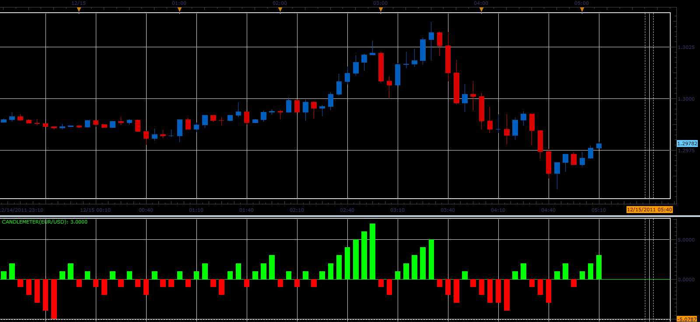

# Candle meter

> Source: https://fxcodebase.com/code/viewtopic.php?f=17&t=9706  
> Forum: 17 · Topic 9706 · 30 post(s)

---

## Candle meter

**Alexander.Gettinger** · Thu Dec 15, 2011 5:12 am

Indicator counts the sequence of candles in one direction.
Give number of consecutive candles in one direction.

 

Download:

 [CandleMeter.lua](files/20700/CandleMeter.lua)

 [CandleMeter with Alert.lua](files/20700/CandleMeter%20with%20Alert.lua)

 [CandleMeter Overlay with Alert.lua](files/20700/CandleMeter%20Overlay%20with%20Alert.lua)

---

## Re: Candle meter

**Apprentice** · Wed Sep 30, 2015 6:02 am

Update.

---

## Re: Candle meter

**hp983989** · Thu Oct 08, 2015 1:03 am

Hi Alex,

Can you add the option to have zig zig into this indicator.

Thank you in advance,

HP

---

## Re: Candle meter

**Apprentice** · Thu Oct 08, 2015 4:21 am

Can you explain your request a little further.
Provide drawing maybe.

---

## Re: Candle meter

**hp983989** · Thu Oct 08, 2015 3:26 pm

Hi Apprentice,

Just like ZigZag_Oscillator ind you already had (pls see attached below)

Thank you,

HP

---

## Re: Candle meter

**Apprentice** · Mon Oct 12, 2015 5:46 am

Like this?

---

## Re: Candle meter

**hp983989** · Mon Oct 12, 2015 12:17 pm

Hi Apprentice;

Thank you for you quick response. Please use the inds ZIGZAG_OSILLATOR that I had attached (needs zz_semafor for this). I need alert same like the CandleMeter but the alert is base on zizzag not by candle up or down since I used renko chart view. Here is the screenshot for USDJPY I like the arrow to alert when zigzag crosses above or below zero line. [http://screencast.com/t/uSgpBb1495h](http://screencast.com/t/uSgpBb1495h)

Regards,

HP

---

## Re: Candle meter

**hp983989** · Tue Oct 13, 2015 4:15 pm

Hi Apprentice;

I hope the screencast explanation sufficiently clear to you. Please lets me know if you need further information.

Thanks

---

## Re: Candle meter

**Apprentice** · Thu Oct 15, 2015 3:14 am

Your request is added to the development list.

---

## Re: Candle meter

**hp983989** · Sun Oct 25, 2015 4:56 pm

Hi Alex/Apprentice;

Any news on the possibility to develop this indicator?

Thank you,

HP

---

## Re: Candle meter

**7510109079** · Fri Nov 13, 2015 4:28 am

Hi Apprentice,

is it possible to add an option to the alert version of this indicator to 'count small' where the consecutive count or bar run will still continue if successive small body bars fall within a user specified value?

The value would be able to be specified to a fineness of 0.1 pip increments.

e.g. this:

would become this:

many thx in advance

---

## Re: Candle meter

**Apprentice** · Mon Nov 16, 2015 5:33 am

Your request is added to the development list.

---

## Re: Candle meter

**7510109079** · Tue Nov 17, 2015 7:34 am

MANY THX

---

## Re: Candle meter

**Apprentice** · Sun Dec 06, 2015 4:44 am

Compatibility issue fixed.
_Alert Helper is not longer needed.

---

## Re: Candle meter

**7510109079** · Fri Jan 08, 2016 11:08 am

bumping this one up for 2016
thx in advance

---

## Re: Candle meter

**Apprentice** · Sun Jan 10, 2016 5:57 am

"Count Doji" option added.

---

## Re: Candle meter

**7510109079** · Wed Jan 13, 2016 5:56 am

excellent thx

---

## Re: Candle meter

**Apprentice** · Thu Sep 13, 2018 3:20 am

The indicator was revised and updated.

---

## Re: Candle meter

**Forexer** · Thu Sep 13, 2018 7:59 am

I have just started using this indicator. The first time I got a notification I got error messages and the indicator display area goes blank. No email was received.

I have screenshots but don't know how to attach them here?

---

## Re: Candle meter

**Apprentice** · Thu Sep 13, 2018 8:30 am

Fixed.

---

## Re: Candle meter

**Forexer** · Thu Sep 13, 2018 6:26 pm

Thanks for the quick reply. Does "Fixed" mean I need to download it and try again?

---

## Re: Candle meter

**Apprentice** · Thu Sep 13, 2018 7:31 pm

Sure.

---

## Re: Candle meter

**Forexer** · Fri Sep 21, 2018 10:41 am

Two questions.

1. Can someone please supply a link to the latest iteration of the Renko.

2. In FXCM MarketScope the bars don't automatically update to follow the price, is that a known problem with the Renko?

I lie,

3. I have to click on another Symbol then return to update the chart. Is there a simpler way to Refresh the MarketScope?

---

## Re: Candle meter

**Apprentice** · Fri Sep 21, 2018 3:40 pm

Try this version.
[viewtopic.php?f=17&t=66269](https://fxcodebase.com/code/viewtopic.php?f=17&t=66269)

---

## Re: Candle meter

**Forexer** · Fri Sep 21, 2018 4:03 pm

Thanks Apprentice, will do.

---

## Re: Candle meter

**7510109079** · Thu Oct 17, 2019 11:23 am

Is there any way to get the CANDLEMETER OVERLAY WITH ALERT indicator to alert properly on a renko view?

Currently the alert only happens when the second reversal brick prints on the charts. The arrow displays in the correct place i.e. on the first reversal brick , but only when the second brick appears. This makes the alert late.

This is obviously some peculiarity associated with the renko view (the indicator works OK on a normal chart) but can it be corrected?

thx in advance

---

## Re: Candle meter

**7510109079** · Fri Oct 18, 2019 1:08 pm

> **Apprentice wrote:**
>
>
> The attachment **CandleMeter_with_Alert.lua** is no longer available
>
>
> Try this version.

thx but i get this:

 

Also, is this the overlay version I quoted which prints on the chart only?

---

## Re: Candle meter

**Apprentice** · Sun Oct 20, 2019 3:38 am

Your request is added to the development list.
Development reference 218.

---

## Re: Candle meter

**Apprentice** · Mon Oct 21, 2019 5:17 am

[CandleMeter_with_Alert.lua](files/129348/CandleMeter_with_Alert.lua)

Try this version.

---

## Re: Candle meter

**7510109079** · Mon Oct 21, 2019 8:05 am

> **Apprentice wrote:**
>
>
> CandleMeter_with_Alert.lua
>
>
> Try this version.

This works! Thanks!
