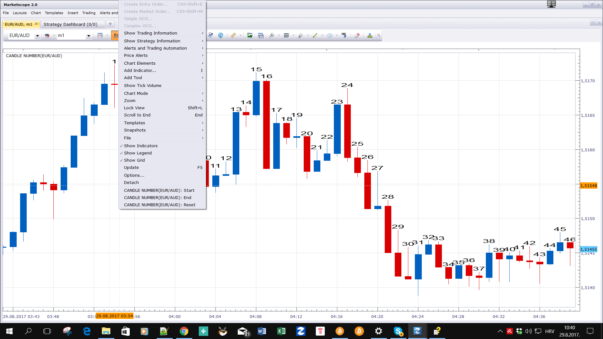

# Candle number

> Source: https://fxcodebase.com/code/viewtopic.php?f=17&t=65034  
> Forum: 17 · Topic 65034 · 12 post(s)

---

## Candle number

**Apprentice** · Tue Aug 29, 2017 5:32 am

Based on the request.
[viewtopic.php?f=27&t=64985](https://fxcodebase.com/code/viewtopic.php?f=27&t=64985)

 

Will enumerate the candles from Start till Stop.
If Stop is NOT set, enumeration will continue till the last candle.
You define the Start / Stop position via the right mouse button menu.

 [Candle number.lua](files/114546/Candle%20number.lua)

---

## Re: Candle number

**Reymondpolanco** · Tue Aug 29, 2017 2:45 pm

Give me that error.

---

## Re: Candle number

**Apprentice** · Wed Aug 30, 2017 4:22 am

Fixed.

---

## Re: Candle number

**Reymondpolanco** · Wed Aug 30, 2017 10:38 am

Thanks, God bless you my friend

---

## Re: Candle number

**Reymondpolanco** · Tue Sep 12, 2017 4:13 pm

Can you modify the front because when i put the chart small the numbers loss clarity, can you put a front like the image i attached

---

## Re: Candle number

**Apprentice** · Wed Sep 13, 2017 2:47 am

Font selector added.

> Can you modify the front because when i put the chart small the numbers loss clarity, can you put a front like the image i attached

Can you specify necessary changes?

---

## Re: Candle number

**Reymondpolanco** · Wed Oct 04, 2017 3:46 pm

if you see the last photo i attached check the numbers in the candles are small and the number can be read easy even the small front. I think the solution is change the front.

---

## Re: Candle number

**Apprentice** · Thu Oct 05, 2017 4:11 am

U can change font via Font parameter.

---

## Re: Candle number

**Apprentice** · Sun Oct 21, 2018 5:15 am

The Indicator was revised and updated.

---

## Re: Candle number

**Reymondpolanco** · Fri Oct 04, 2024 3:10 pm

Indicator is not working, maybe is outdated.

---

## Re: Candle number

**Apprentice** · Sun Oct 06, 2024 3:45 am

We have added your request to the development list.
Development reference 762

---

## Re: Candle number

**Apprentice** · Wed Mar 26, 2025 8:42 am

You have to define the starting candle as shown here.
