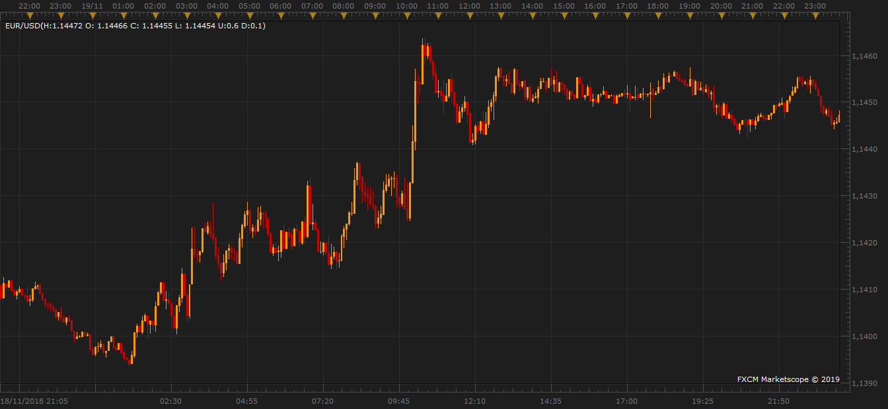

# Candle Price Indicator

> Source: https://fxcodebase.com/code/viewtopic.php?f=17&t=68185  
> Forum: 17 · Topic 68185 · 2 post(s)

---

## Candle Price Indicator

**ReinaldoM** · Thu Mar 28, 2019 8:09 am

This indicator shows the High Open Close Low prices of last closed candle or actual drawing candle, also you can choose to show the shadows too (U) Upper (D) Lower.

 

 [HOCL.lua](files/125386/HOCL.lua)

---

## Re: Candle Price Indicator

**ReinaldoM** · Mon Apr 01, 2019 4:36 pm

Here is a second version of the indicator, I added total candle(difference between high and low), now you can choose between prices and pips-diference to show.

 [HOCL.lua](files/125539/HOCL.lua)
