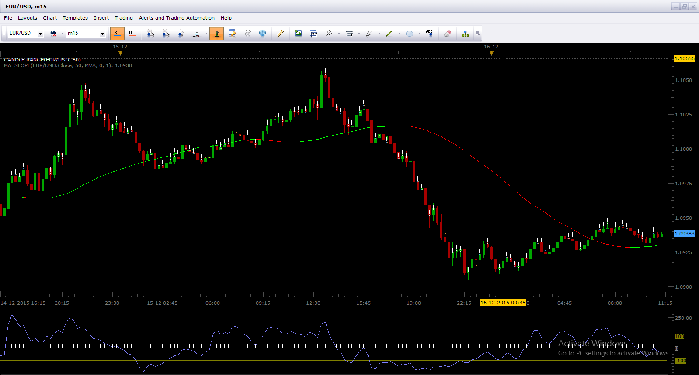
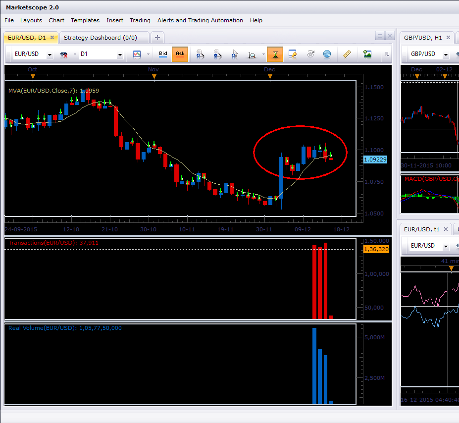

# Candle Range

> Source: https://fxcodebase.com/code/viewtopic.php?f=17&t=61656  
> Forum: 17 · Topic 61656 · 9 post(s)

---

## Candle Range

**Apprentice** · Mon Jan 05, 2015 3:27 am

Based on request.
[viewtopic.php?f=27&t=61651#p97950](https://fxcodebase.com/code/viewtopic.php?f=27&t=61651#p97950)

Will show a dot in the middle of candle identifying a candle whose body is smaller than Set percentage of the total High/Low range

 [Candle Range.lua](files/97965/Candle%20Range.lua)

The indicator was revised and updated

---

## Re: Candle Range

**Alexander.Gettinger** · Mon Feb 23, 2015 11:29 am

MQL4 version of Candle Range indicator: [viewtopic.php?f=38&t=61861](https://fxcodebase.com/code/viewtopic.php?f=38&t=61861).

---

## Re: Candle Range

**bsr9363** · Wed Dec 16, 2015 1:50 am

*CANDLE RANGE TOOL BEHAVING STRANGELY*

Dear Apprentice,

Been using the Candle Range Tool with many thanks , but recently it has started behaving strangely (showing vertical marks in addition to dots) when I add other Indicators like CCI, MA_Slope, ATR_Pips, Fractals, etc.

Kindly resolve at your earliest.

Thanks in advance.

---

## Re: Candle Range

**Apprentice** · Wed Dec 16, 2015 4:49 am

I was not able to repeat this issue.
Can you please completely uninstall your TS.
Make clean installations of the last TS version.
Report back with screenshots if problem persists.

---

## Re: Candle Range

**bsr9363** · Wed Dec 16, 2015 5:26 am

> **Apprentice wrote:**
> I was not able to repeat this issue.
> Can you please completely uninstall your TS.
> Make clean installations of the last TS version.
> Report back with screenshots if problem persists.

Thanks for your quick response.
'Fully Uninstalled" my TS, restarted my PC & installed fresh version of TS.
The problem persists even in the default layout (I assumed that saved & imported layouts might be the reason, but not so). Screenshot added.
Waiting for a solution. Thanks.

 

*PROBLEM PERSISTS*

---

## Re: Candle Range

**Apprentice** · Mon Dec 21, 2015 5:47 am

Will investigate this in more detail.

---

## Re: Candle Range

**Apprentice** · Mon Dec 21, 2015 7:15 am

It is known TS bug.
This issue will be fixed updated in next TS update.

---

## Re: Candle Range

**bsr9363** · Mon Dec 21, 2015 11:40 am

> **Apprentice wrote:**
> It is known TS bug.
> This issue will be fixed updated in next TS update.

Thanks, any expected date?

---

## Re: Candle Range

**Apprentice** · Tue Aug 01, 2017 6:12 am

The indicator was revised and updated.
