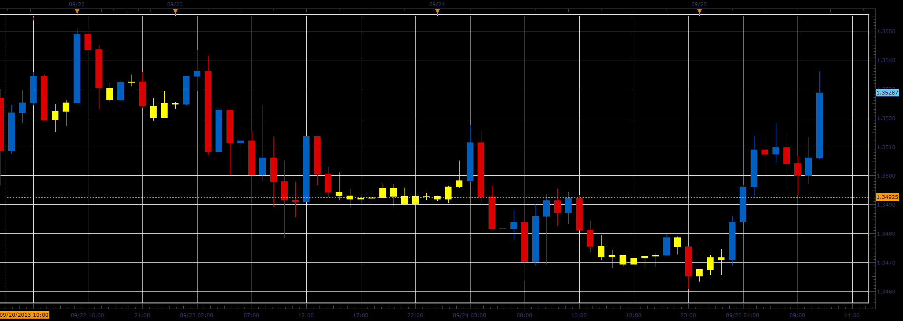

# Candles by size

> Source: https://fxcodebase.com/code/viewtopic.php?f=17&t=59580  
> Forum: 17 · Topic 59580 · 3 post(s)

---

## Candles by size

**Alexander.Gettinger** · Wed Sep 25, 2013 2:32 pm

The indicator marks candle that match the criteria:
- High/Low more/less then level,
- Open-Close more/less then level.

 

Download:

 [Candles_By_Size.lua](files/89694/Candles_By_Size.lua)

The indicator was revised and updated

---

## Re: Candles by size

**Alexander.Gettinger** · Wed Sep 25, 2013 2:33 pm

MQL4 version of indicator: [viewtopic.php?f=38&t=59581](https://fxcodebase.com/code/viewtopic.php?f=38&t=59581).

---

## Re: Candles by size

**Apprentice** · Mon Jun 12, 2017 6:21 am

The indicator was revised and updated.
