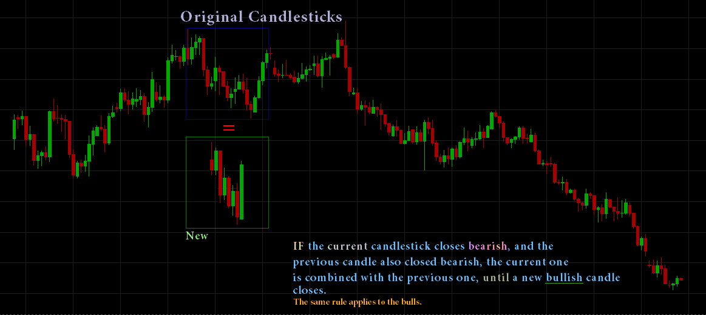
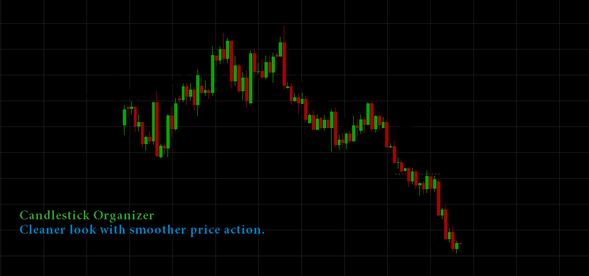

# Candlestick Organizer View

> Source: https://fxcodebase.com/code/viewtopic.php?f=17&t=61101  
> Forum: 17 · Topic 61101 · 8 post(s)

---

## Candlestick Organizer View

**Apprentice** · Thu Sep 04, 2014 1:42 pm

If the current candlestick closes bearish, and the previous candle also closed bearish, the current one should be combined with the previous one > until a new bullish candle is formed and closes bullish. The same should be for bullish candlesticks.

 

*Explanation*

Here is the final product.

 

*Candlestick Organizer*

 [Candlestick Organizer.lua](files/95699/Candlestick%20Organizer.lua)

Candlestick Organizer in not Your Regulat Indicator
U can only add it as View.

MT4/Mq4 version.
[viewtopic.php?f=38&t=65375&p=116106#p116106](https://fxcodebase.com/code/viewtopic.php?f=38&t=65375&p=116106#p116106)

---

## Opening Candlestick Organizer In Marketscope 2.0:

**mennzz** · Thu Sep 04, 2014 5:44 pm

Hi,

1. Download the Candlestick Organizer file.
2. In the Marketscope window, click 'File' at the top left-hand corner and click on 'Create View'.
3. In the Create View window, find the 'Candlestick Organizer' 'View' file and press 'OK'.
4. Set your custom parameters, and your done!

As with a regular candlestick chart, you can add moving averages, indicators, and other tools that help you analyze the market. This indicator just organizes the candlestick data to give a more simplified and uniform setup, making it easier to identify Butterfly patterns, Gartley patterns, Fibonacci retracements and loads of other patterns.

Have fun!

---

## Re: Candlestick Organizer View

**juju1024** · Mon Nov 02, 2015 7:43 pm

Can you convert this file to mq4 please?

---

## Re: Candlestick Organizer View

**Apprentice** · Tue Nov 03, 2015 5:48 am

Your request is added to the development list.

---

## Re: Candlestick Organizer View

**maikel.top** · Thu Aug 25, 2016 2:28 pm

Hello,

Is it possible to make mt4 version of this indicator?

Please

---

## Re: Candlestick Organizer View

**maikel.top** · Sun May 28, 2017 7:59 am

Please?

---

## Re: Candlestick Organizer View

**Apprentice** · Sun Nov 19, 2017 4:06 pm

Try this version.
[viewtopic.php?f=38&t=65375&p=116106#p116106](https://fxcodebase.com/code/viewtopic.php?f=38&t=65375&p=116106#p116106)

---

## Re: Candlestick Organizer View

**Apprentice** · Fri Apr 13, 2018 8:58 am

The Indicator was revised and updated.
