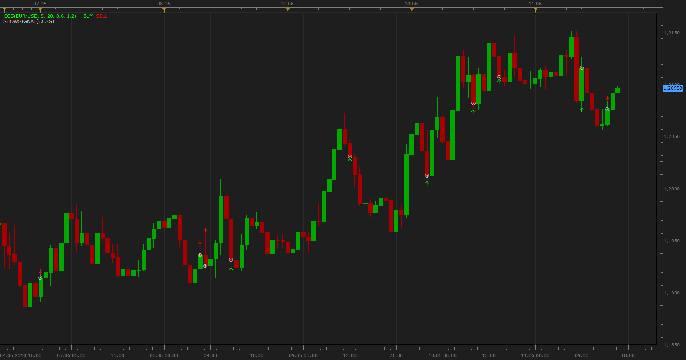

# Cash Cow Strategy Indikator

> Source: https://fxcodebase.com/code/viewtopic.php?f=17&t=1316  
> Forum: 17 · Topic 1316 · 3 post(s)

---

## Cash Cow Strategy Indikator

**Apprentice** · Sun Jun 13, 2010 4:45 am

*Cash Cow Strategy Indikator & Signal*

This indicator was created based on requests,

**Entry Signal (Long)**
EMA (5) & EMA(20) are raising
EMA (5) > EMA (20)

Close > Lower 1.2% * Ema (5) Envelope
Close < Ema (5)

High < Upper 0.6% * Ema (5) Envelope
High > Ema (5)

**Entry Signal (Short)**
EMA (5) & EMA(20) are falling
EMA (5) < EMA (20)

Close < Higher 1.2% * Ema (5) Envelope
Close > Ema (5)

Low > Lower 0.6% * Ema (5) Envelope
Low < Ema (5)

Request and complete strategy can be found here
[http://fxcodebase.com/code/viewtopic.php?f=27&t=1223&start=0](https://fxcodebase.com/code/viewtopic.php?f=27&t=1223&start=0)

 [CCS.lua](files/2516/CCS.lua)

---

## Re: Cash Cow Strategy Indikator

**colinr** · Tue Jun 15, 2010 1:47 pm

Many Thanks !

---

## Re: Cash Cow Strategy Indikator

**Apprentice** · Sun Jan 08, 2017 7:23 am

Indicator was revised and updated.
