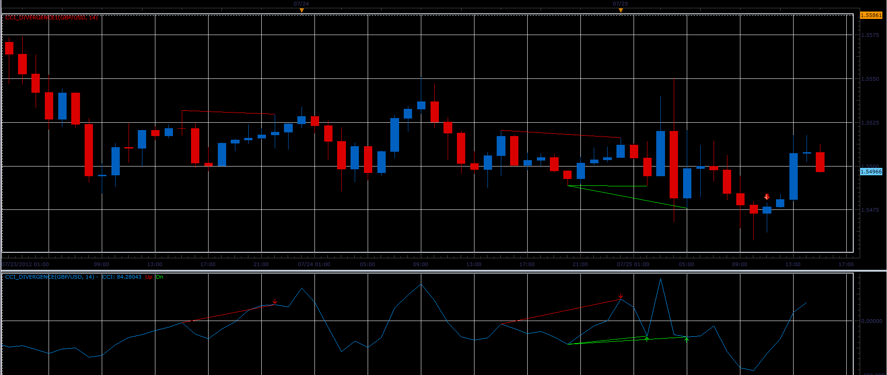

# CCI divergence indicator

> Source: https://fxcodebase.com/code/viewtopic.php?f=17&t=21362  
> Forum: 17 · Topic 21362 · 23 post(s)

---

## CCI divergence indicator

**Alexander.Gettinger** · Wed Jul 25, 2012 2:34 pm

The indicator shows the divergence between price and CCI.

 

Download divergence oscillator:

 [CCI_Divergence.lua](files/37374/CCI_Divergence.lua)

Download divergence indicator for main chart:

 [CCI_Divergence1.lua](files/37374/CCI_Divergence1.lua)

CCI_Divergence_Histogram.lua
[https://fxcodebase.com/code/viewtopic.p ... 01#p158501](https://fxcodebase.com/code/viewtopic.php?f=17&t=75675&p=158501#p158501)

---

## Re: CCI divergence indicator

**RJH501** · Wed Jul 25, 2012 6:54 pm

Great indicator Alex!

Very good supporting indicator.

Would you please add capability to change line width.

Thanks,

RJH

---

## Re: CCI divergence indicator

**RJH501** · Thu Jul 26, 2012 12:57 pm

Alex, could you include CCI DIVERGENCE as a part of the Woodie CCI indicator that was developed on this forum.

Thanks and Regards

RJH

---

## Re: CCI divergence indicator

**Alexander.Gettinger** · Fri Jul 27, 2012 3:40 pm

> **RJH501 wrote:**
> Would you please add capability to change line width.
> RJH

Updated.

---

## Re: CCI divergence indicator

**RJH501** · Fri Jul 27, 2012 4:33 pm

Thanks much!!!

---

## Re: CCI divergence indicator

**RJH501** · Sat Jul 28, 2012 10:18 am

Alex is it possible to also modify the width of the divergenci lines?

This would make the divergences stand out on the charts.

Thank you for your work!

RJH

---

## Re: CCI divergence indicator

**cash4u** · Mon Jul 30, 2012 1:10 am

can you create strategy based on this indicator

---

## Re: CCI divergence indicator

**Alexander.Gettinger** · Mon Jul 30, 2012 1:33 pm

> **cash4u wrote:**
> can you create strategy based on this indicator

OK

---

## Re: CCI divergence indicator

**Alexander.Gettinger** · Mon Aug 06, 2012 6:16 pm

> **cash4u wrote:**
> can you create strategy based on this indicator

Please, see this strategy: [viewtopic.php?f=31&t=22114](https://fxcodebase.com/code/viewtopic.php?f=31&t=22114)

---

## Re: CCI divergence indicator

**cash4u** · Tue Aug 07, 2012 4:33 am

thank you for this great work.

---

## Re: CCI divergence indicator

**briansummy** · Sat Oct 06, 2012 11:21 am

Very nice work here. I was also looking for a MACD Divergence,RSI, and Full Stochastic Divergence indicators which provides alerts and arrows. That would make a great addition the the trading platform.

It seems to me that divergences are the only best way as a leading indication for price moves.

---

## Re: CCI divergence indicator

**Apprentice** · Mon Oct 08, 2012 4:16 am

Try this Indicators
For MACD
[viewtopic.php?f=17&t=869&p=1571&hilit=divergence#p1571](https://fxcodebase.com/code/viewtopic.php?f=17&t=869&p=1571&hilit=divergence#p1571)

MACD Histogram divergence
[viewtopic.php?f=17&t=9555&p=20492&hilit=divergence#p20492](https://fxcodebase.com/code/viewtopic.php?f=17&t=9555&p=20492&hilit=divergence#p20492)

For RSI
[viewtopic.php?f=17&t=846&hilit=divergence](https://fxcodebase.com/code/viewtopic.php?f=17&t=846&hilit=divergence)

Generic Version
[viewtopic.php?f=17&t=3846&p=9410&hilit=divergence#p9410](https://fxcodebase.com/code/viewtopic.php?f=17&t=3846&p=9410&hilit=divergence#p9410)

I hope this will help.

---

## Re: CCI divergence indicator

**7510109079** · Fri Nov 25, 2016 8:54 am

I have noticed that this indicator gets out of sync/step with regular CCI indicators, and was wondering why this was and if it can be fixed.

When compared to the regular CCI and the CCI_highlight indicators (which both plot exactly over each other), the CCI_Divergence line starts to plot ahead of the others from the time when it is placed on the chart. To see this, load up the standard CCI, then this CCI_Divergence both in the same chart area.
Wait for 5mins on a m1 chart and you will start to notice this happening like this:

Can this be fixed please?

If so many thx in advance

---

## Re: CCI divergence indicator

**Apprentice** · Sat Nov 26, 2016 6:11 am

Try it now.

---

## Re: CCI divergence indicator

**7510109079** · Mon Nov 28, 2016 5:24 am

Whatever you did, it WORKED!

thank you very much

---

## Re: CCI divergence indicator

**7510109079** · Mon Nov 28, 2016 5:37 am

I note that there is the same sync issue with the generic Divergence Indicator here :
[viewtopic.php?f=17&t=3846&hilit=indicator+divergence](https://fxcodebase.com/code/viewtopic.php?f=17&t=3846&hilit=indicator+divergence)

Could i please request the same fix for this as well (including the alert version)

many thx in advance

---

## Re: CCI divergence indicator

**7510109079** · Mon Nov 28, 2016 10:12 am

Actually its ok. I compared your revised code and made the same changes in the Indicator_Divergence.lua

You may want to update the download file at viewtopic.php?f=17&t=3846&hilit=indicator+divergence

---

## Re: CCI divergence indicator

**7510109079** · Mon May 15, 2017 5:11 pm

can a very quick edit be made to the main chart indicator, cci_indicator1.lua so that the user can specify line thickness
thanks in advance

---

## Re: CCI divergence indicator

**Apprentice** · Wed May 17, 2017 12:55 pm

Try it now.

---

## Re: CCI divergence indicator

**7510109079** · Fri May 19, 2017 11:50 am

thats great many thx

---

## Re: CCI divergence indicator

**7510109079** · Mon May 22, 2017 1:19 pm

Question:

Are both these indicators coded the same? (CCI Divergence & CCI_Divergence1)

They give slightly different results when comparing main chart to the lower oscillator area (with the same period setting)

---

## Re: CCI divergence indicator

**Apprentice** · Tue May 23, 2017 4:32 am

Everything looks okay.

---

## Re: CCI divergence indicator

**7510109079** · Tue May 23, 2017 5:48 am

see attached
