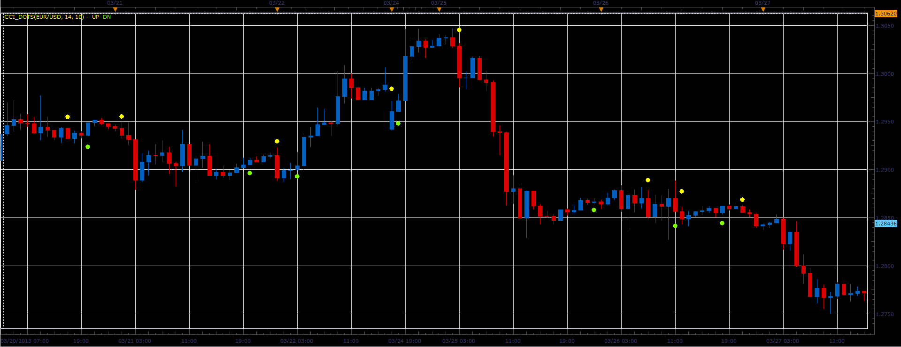
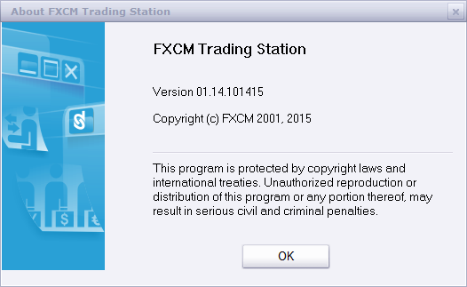

# CCI dots indicator

> Source: https://fxcodebase.com/code/viewtopic.php?f=17&t=34071  
> Forum: 17 · Topic 34071 · 45 post(s)

---

## CCI dots indicator

**Alexander.Gettinger** · Wed Apr 03, 2013 3:38 pm

The indicator shows the points of intersection CCI and zero line on the main chart.

 

Download:

 [CCI_Dots.lua](files/57911/CCI_Dots.lua)

 [CCI_Dots with Alert.lua](files/57911/CCI_Dots%20with%20Alert.lua)

This indicator provides Audio / Email Alertson CCI / (Zero/OB/OS) line cross.

Compatibility issue fixed.
_Alert Helper is not longer needed.

---

## Re: CCI dots indicator

**NidalTrader** · Sat Apr 06, 2013 6:19 am

Hi guys,

 is it possible to make the indicator more customisable. To add a ability to see dots on cross on majors levels (-100 ; 100) or user's levels.

Regards.

P.S : you're doing a great job

---

## Re: CCI dots indicator

**Apprentice** · Tue Apr 09, 2013 5:10 am

Your request is added to the development list.

---

## Re: CCI dots indicator

**Alexander.Gettinger** · Wed Apr 10, 2013 4:21 pm

MQL4 version of this indicator: [viewtopic.php?f=38&t=34367](https://fxcodebase.com/code/viewtopic.php?f=38&t=34367)

---

## Re: CCI dots indicator

**rch05000** · Wed Mar 19, 2014 12:48 pm

Hello Apprentice,
Is it possible to put an alert/signal on this indicator?
Thank you in advance

---

## Re: CCI dots indicator

**Apprentice** · Thu Mar 20, 2014 4:34 am

CCI_Dots with Alert.lua Added.
OB / OS Level Alert is now supported.

---

## Re: CCI dots indicator

**rch05000** · Thu Mar 20, 2014 7:20 am

Thank you apprentice

---

## Re: CCI dots indicator

**7510109079** · Mon Sep 01, 2014 9:46 am

quick question:

we have 'CCI period' and 'period' in the indicators settings. whats the difference between the two?

---

## Re: CCI dots indicator

**Apprentice** · Mon Sep 01, 2014 10:51 am

CCI Period is Used in CCI Indicator Calculation.
Period is used in in this Line of Code for Range Calculation.

Code: [Select all](https://fxcodebase.com/code/)
`local Range=(mathex.avg(source.high, period-Period+1, period)-mathex.avg(source.low, period-Period+1, period))/2;`
Range is used in indication (circles) placement.

Code: [Select all](https://fxcodebase.com/code/)
`if CCI.DATA[period-1]>=0 and CCI.DATA[period]<0 then
     UP[period]=source.high[period]+Range;
     DN[period]=nil;
    elseif CCI.DATA[period-1]<=0 and CCI.DATA[period]>0 then
     UP[period]=nil;
     DN[period]=source.low[period]-Range;
    else
     UP[period]=nil;
     DN[period]=nil;
    end`

---

## Re: CCI dots indicator

**7510109079** · Tue Sep 23, 2014 10:08 am

quick question:

we have 'CCI period' and 'period' in the indicators settings. whats the difference between the two?

---

## Re: CCI dots indicator

**baccicin** · Wed Sep 24, 2014 7:34 am

Hello!
I am really sorry for boring you with a "stupid" question: what'a the difference among zero, OB and OS? and also, is it possible to apply the alert just for the zero line on the main chart?
many thanks for your great job and support! have a nice day!

---

## Re: CCI dots indicator

**7510109079** · Tue Oct 07, 2014 5:08 am

No questions are stupid. We are all learning here.

The user specifies the OB (overbought) and OS (oversold) levels. These are extreme +/- levels (showing momentum is slowing) on the original CCI oscillator, which oscillates above and below the zero line. To start set them both to +/- 100 to get a feel for the oscillations. If you add a CCI indicator below the chart you can see why/when the dots get plotted i.e. when the CCI line crosses the OB/OS levels.

N.B. I would also like to see each OB/OS/Zero option to be independently turn on/off-able.

In the meantime as a workaround i set any dots that i dont want to see as the same colour as my chart back ground, then set the indicator to 'background'. Its not ideal but works OK.

---

## Re: CCI dots indicator

**Apprentice** · Tue Oct 07, 2014 8:38 am

For which indicator you want this option.

---

## Re: CCI dots indicator

**7510109079** · Tue Oct 07, 2014 8:52 am

CCI_Dots with Alert.lua

---

## Re: CCI dots indicator

**7510109079** · Tue Mar 03, 2015 6:43 am

Just revisiting this one- do you think there will be any time to do the above option

---

## Re: CCI dots indicator

**Apprentice** · Wed Mar 04, 2015 3:32 pm

Will try to find the time in next few days.

---

## Re: CCI dots indicator

**7510109079** · Thu Mar 05, 2015 6:08 am

excellent, many thx for the update

---

## Re: CCI dots indicator

**7510109079** · Thu Mar 05, 2015 6:21 am

just a heads up. I know its a pain but if as requested, we are able to specify exactly which ALERT STYLES we want to switch on/off, then you would also need to incorporate additional options to turn on/off the corresponding alert.

e.g. if we decide to only show symbols & colour for, let's say, an OB line CROSS OVER, then OB line cross alerts should only appear for the CROSS OVER and not the cross under

i.e. alerts should only correspond with what styles are set to 'visible' by the user
TIA

---

## Re: CCI dots indicator

**Apprentice** · Sun Mar 08, 2015 8:07 am

Please Test Updated Version.

---

## Re: CCI dots indicator

**7510109079** · Tue Mar 10, 2015 5:07 am

Elegant solution. works like a dream. Many thanks indeed!

---

## Re: CCI dots indicator

**7510109079** · Wed Mar 11, 2015 6:15 am

Would it be possible to put a YES/NO option in here called something like USE OFFSET

~ If OFFSET set to YES, the dots plot as they currently are doing (i.e. dot above or below candlestick)

~ If OFFSET set to NO, the dot is plotted exactly on the part of the candle that the drawing mode is set to (i.e. open/middle close)

This would allow for a better estimate of P/L at a glance

TIA

---

## Re: CCI dots indicator

**7510109079** · Wed Apr 15, 2015 12:07 pm

just bumping this post again.

If i could be able to choose to plot the marker on the actual close of the candle that would be great

many TIA

---

## Re: CCI dots indicator

**Apprentice** · Fri Apr 17, 2015 3:58 am

Try This Version.

 [CCI_Dots with Alert.lua](files/99856/CCI_Dots%20with%20Alert.lua)

---

## Re: CCI dots indicator

**7510109079** · Fri Apr 17, 2015 4:15 am

That is perfect! MAny thx

---

## Re: CCI dots indicator

**Apprentice** · Fri Dec 11, 2015 7:45 am

Compatibility issue fixed.
_Alert Helper is not longer needed.

---

## Re: CCI dots indicator

**7510109079** · Fri Dec 11, 2015 8:07 am

still using this. Great indicator on price!

---

## Re: CCI dots indicator

**vesanthosh** · Tue Dec 22, 2015 12:55 am

This works fine without sound alert but whenever i select the Alerts Sound and Alerts email to yes...it gives error...i think there is problem with sound alert or email alert, can you fix it?

---

## Re: CCI dots indicator

**Apprentice** · Tue Dec 22, 2015 3:31 am

Try it now.

---

## Re: CCI dots indicator

**vesanthosh** · Tue Dec 22, 2015 11:42 pm

i tried again...still having problem with sound alert and email alert when i select yes for sound alert and email alert

---

## Re: CCI dots indicator

**vesanthosh** · Mon Dec 28, 2015 3:08 am

I am using FXCM TS2, the email and sound alert gives error whenever the line is triggered...please check it and fix it.

---

## Re: CCI dots indicator

**Apprentice** · Mon Dec 28, 2015 3:16 am

Which version of TS you use.

 

 Should be.

---

## Re: CCI dots indicator

**vesanthosh** · Mon Dec 28, 2015 11:35 am

Now it's working, thanks for your responses...thanks a lot

---

## Re: CCI dots indicator

**vesanthosh** · Mon Feb 15, 2016 4:59 am

can you filter the cci dots indicator with simple moving average.

BUY - if PRICE above MVA and CCI CROSS OVER -100
SELL - if PRICE below MVA and CCI CROSS UNDER +100

---

## Re: CCI dots indicator

**Apprentice** · Wed Feb 17, 2016 4:45 am

Filter Option Added.

---

## Re: CCI dots indicator

**vesanthosh** · Mon Feb 22, 2016 6:11 am

Thanks It's working fine thanks a lot

---

## Re: CCI dots indicator

**7510109079** · Wed May 18, 2016 8:18 am

I still like this indicator.

The user is already able to specify 4 different colours for the four kinds CCI crossing action.

Can you modify it so that the user can specify 4 different independent CCI values for the four kinds of crossing action i.e. an independent value for each colour

Thx

---

## Re: CCI dots indicator

**Apprentice** · Thu May 19, 2016 3:52 am

Your request is added to the development list.

---

## Re: CCI dots indicator

**7510109079** · Mon Jun 06, 2016 8:49 am

> **Apprentice wrote:**
> Try This Version.
>
>
> CCI_Dots with Alert.lua

FYI: My last request for the 4 independent values CCI indicator was for the one above that plots the dots exactly on the price close points

Any chance to implement this yet? thx

---

## Re: CCI dots indicator

**7510109079** · Tue Jun 14, 2016 4:30 am

bump

---

## Re: CCI dots indicator

**7510109079** · Wed Jun 22, 2016 7:15 am

any chance of doing this one? thx

---

## Re: CCI dots indicator

**Apprentice** · Tue Jun 28, 2016 8:58 am

Try this version.

 [CCI_Dots with Alert.lua](files/106948/CCI_Dots%20with%20Alert.lua)

---

## Re: CCI dots indicator

**Apprentice** · Mon Sep 04, 2017 9:41 am

The indicator was revised and updated.

---

## Re: CCI dots indicator

**7510109079** · Mon Sep 04, 2017 10:44 am

Hi Apprentice,

i see you post a lot of these "The indicator was revised and updated." messages.

Looks like some routine updating you are doing.

Can you explain a bit more about what these updates mean?

Will the older indicator versions still work?

How are the updated versions different?

thx

---

## Re: CCI dots indicator

**Apprentice** · Mon Sep 04, 2017 11:31 am

This is the project of my,
the idea is to test all indicator on the forum,
with a special interest in bugs, performance issues.
Fixes if necessary, should keep backward compatibility.

---

## Re: CCI dots indicator

**Apprentice** · Mon Sep 24, 2018 10:27 am

The indicator was revised and updated.
