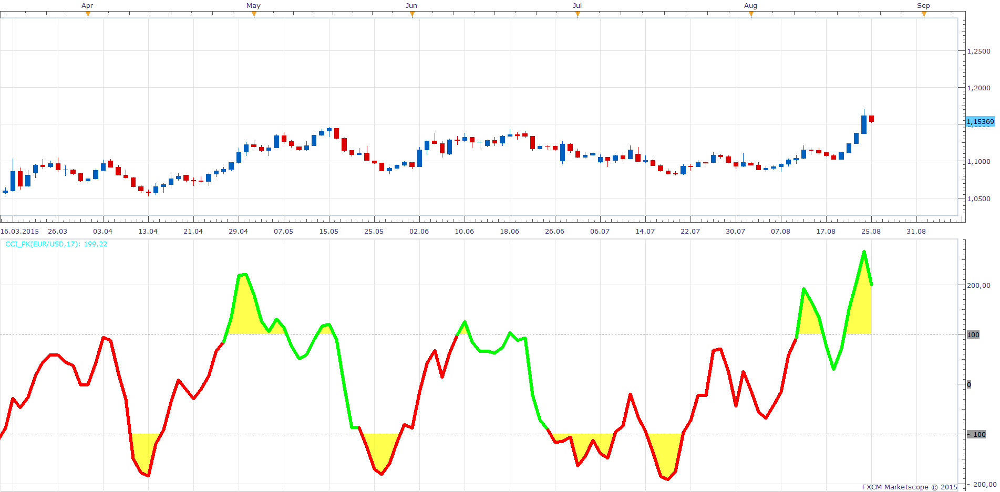

# CCI highlight

> Source: https://fxcodebase.com/code/viewtopic.php?f=17&t=62576  
> Forum: 17 · Topic 62576 · 15 post(s)

---

## CCI highlight

**Apprentice** · Tue Aug 25, 2015 5:23 am

Based on the request.
[viewtopic.php?f=27&t=62552](https://fxcodebase.com/code/viewtopic.php?f=27&t=62552)

 [CCI highlight.lua](files/101946/CCI%20highlight.lua)

 [CCI highlight with Alert.lua](files/101946/CCI%20highlight%20with%20Alert.lua)

Mq4/MT4 version.
[viewtopic.php?f=38&t=64112](https://fxcodebase.com/code/viewtopic.php?f=38&t=64112)

The indicator was revised and updated

---

## Re: CCI highlight

**daniel.kovacik** · Tue Aug 25, 2015 5:40 am

Awesome, can be also created histogram around zero line?

Thanks
DK

---

## Re: CCI highlight

**7510109079** · Tue Aug 25, 2015 8:17 am

very cool, many thanks

---

## Re: CCI highlight

**mulligan** · Tue Aug 25, 2015 11:13 am

Upon reloading updated version, getting error message "unexpected symbol near i".

---

## Re: CCI highlight

**Apprentice** · Tue Aug 25, 2015 5:40 pm

Fixed.

---

## Re: CCI highlight

**7510109079** · Wed Aug 26, 2015 4:23 am

many thx

---

## Re: CCI highlight

**mulligan** · Wed Aug 26, 2015 7:31 am

Thanks for the quick fix. I'd like to request an alert or strategy for this indicator. I know there is almost every imaginable strategy for CCI and CCI plus other indicators available. The one that is not is based on the color change of this indicator from red to green and green to red. No overbought and oversold involved. Just the color change of the line. Your consideration is appreciated. Thanks again for an excellent indicator.

---

## Re: CCI highlight

**Apprentice** · Wed Aug 26, 2015 11:17 am

Requested can be found here.
[viewtopic.php?f=31&t=62588](https://fxcodebase.com/code/viewtopic.php?f=31&t=62588)
Please re-download CCI highlight Indicator.

---

## Re: CCI highlight

**allerner** · Thu Oct 27, 2016 12:21 pm

Hi Apprentice,
Is it possible to have the indictor signal with email alert when the condition is met .
Many thanks!

---

## Re: CCI highlight

**Apprentice** · Fri Oct 28, 2016 5:04 am

CCI highlight with Alert.lua added.

---

## Re: CCI highlight

**6-sycamor** · Thu Nov 10, 2016 11:43 am

Hi,

look very interested.

You have maybe for MT4 this indicator ?

Regards,

S.

---

## Re: CCI highlight

**Apprentice** · Fri Nov 11, 2016 12:12 pm

Your request is added to the development list, Under Id Number 3666
 If someone is interested to do this task, please contact me.

---

## Re: CCI highlight

**6-sycamor** · Mon Nov 14, 2016 6:09 am

Thank you very much.

Regards,

S.

---

## Re: CCI highlight

**Apprentice** · Fri Nov 18, 2016 12:19 pm

Try this version.
[viewtopic.php?f=38&t=64112](https://fxcodebase.com/code/viewtopic.php?f=38&t=64112)

---

## Re: CCI highlight

**6-sycamor** · Thu Nov 24, 2016 10:12 am

Thank you

Regards,

S.
