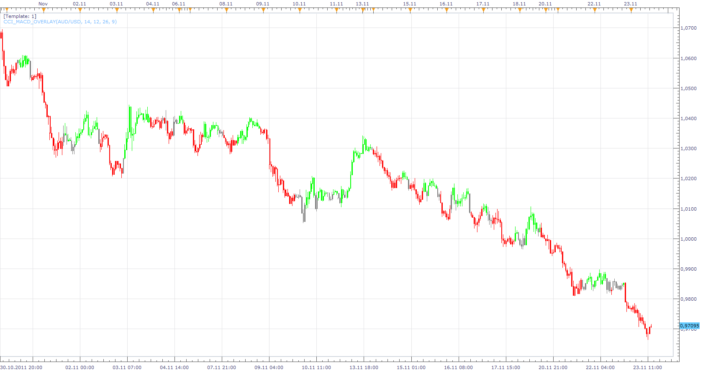

# CCI MACD Overlay

> Source: https://fxcodebase.com/code/viewtopic.php?f=17&t=8389  
> Forum: 17 · Topic 8389 · 20 post(s)

---

## CCI MACD Overlay

**Apprentice** · Wed Nov 23, 2011 1:31 pm

**GREEN COLOR:**

1. cci [period 14] > 0 and macd line > signal line

**RED COLOR:**
1. cci [ period 14] < 0 and macd line < signal line

**YELLOW COLOR**
1. cci > 0 and macd line< signal line {or}
2. cci < 0 and macd line> signal line

 [CCI_MACD_Overlay.lua](files/18552/CCI_MACD_Overlay.lua)

You can select other Time Frames by changing the indicator Source time frame.

The indicator was revised and updated
MT4/MQ4 version
[viewtopic.php?f=38&t=66151](https://fxcodebase.com/code/viewtopic.php?f=38&t=66151)

---

## Re: CCI MACD Overlay

**transformer** · Wed Nov 23, 2011 4:29 pm

sir,

thank you for this work.

cci macd overlay on the chart is difficult to compare the time frames. because H1 bar , H4 bar , D1 Bar all have same size in horizontally [breath ] .can you creat like a bar below the chart.

thank you

---

## Re: CCI MACD Overlay

**Apprentice** · Wed Nov 23, 2011 6:09 pm

In the initial request.
As I recall MTF was not specified.
You have to be exact.
Then i have more freedom.
When I find time I'll try to write something.

---

## Re: CCI MACD Overlay

**transformer** · Thu Nov 24, 2011 2:35 am

sir,

i am extremely sorry for my mistake.

---

## Re: CCI MACD Overlay

**Apprentice** · Thu Nov 24, 2011 3:46 am

 [Multitimeframe MACD CCI Heat Map.lua](files/18587/Multitimeframe%20MACD%20CCI%20Heat%20Map.lua)

---

## Re: CCI MACD Overlay

**transformer** · Thu Nov 24, 2011 4:21 am

Thank you sir.

---

## Re: CCI MACD Overlay

**Jigit Jigit** · Tue Jan 24, 2012 2:04 am

Thank you for this excellent indicator.
Would you be so kind as to move the label a bit to the right (see picture).
Also, as I'm trying to learn lua, could you please let us know which part of the script actually determines the position of this label.

Cheers

---

## Re: CCI MACD Overlay

**Apprentice** · Tue Jan 24, 2012 3:27 am

Your request is added to the developmental cue.

---

## Re: CCI MACD Overlay

**Timon55** · Thu Jan 26, 2012 5:35 am

> **Jigit Jigit wrote:**
> Thank you for this excellent indicator.
> Would you be so kind as to move the label a bit to the right (see picture).
> Also, as I'm trying to learn lua, could you please let us know which part of the script actually determines the position of this label.
>
> Cheers

In attached version label is locked to the right border of the oscillator area.

There are two function to draw labels:
Simple( [http://www.fxcodebase.com/documents/Ind ... Label.html](http://www.fxcodebase.com/documents/IndicoreSDK/web-content.html?key=host.execute_drawLabel.html) ). In this function label's position determines by date for x axis and price for y axis.
Advanced ( [http://www.fxcodebase.com/documents/Ind ... abel1.html](http://www.fxcodebase.com/documents/IndicoreSDK/web-content.html?key=host.execute_drawLabel1.html) ). This is more customizable function for drawing labels. You can specify x and y coordinates relatively to chart values(date/price) or chart area border(left, right, center, top, bottom).
You can find more details and samples by specified links.

---

## Re: CCI MACD Overlay

**Jigit Jigit** · Sat Jan 28, 2012 6:33 am

Cheers mate.

---

## Re: CCI MACD Overlay

**pipsqueak** · Mon Jan 30, 2012 2:27 am

Wow, this looks very close to what I was asking for in my posts for MACD and CCI collaboration.

Very interesting indeed!?!

---

## Re: CCI MACD Overlay

**pipsqueak** · Mon Jan 30, 2012 2:38 am

....The code that was developed for my requests gave false signals. This maybe occurred because my tests were poor or incomplete. It looks, at least initially, that you have solved those issues.

I also wanted to rule out those instances when the MACD and CCI didn't agree.

It was getting very complex, at least I thought, to perform all of the tests that I could "see" by watching the price action develop. I became overwhelmed by all of the "If" statements I thought were needed.

I will attempt to study your code.

Again, thanks for solving what I was thinking was a very complex problem.

---

## Re: CCI MACD Overlay

**pipsqueak** · Mon Jan 30, 2012 2:56 am

Okay I've looked at this indicator a little more with some other pairs.

It appears that some issues still exist. It is showing a bullish move even though a bearish trend seems to be developing, at least from my viewpoint. I have been looking at the DNC and thinking that it could improve the MACD-CCI collaboration. The DNC is very powerful.

Also I was noticing that when this indicator was suggesting a move that was in opposition to the EMA 200,100 and at times the 50 there should be no action or at least I mild action. This perplexes me for the MACD is developed from the EMA. Consequently, I wanted to add EMA tests for the EMA's do show the overall trend very well. Tests that if the collaboration was suggesting a position contrary to the EMA's that some hesitation should be suggested.

Maybe all of my discussion shows how little I understand how the indicators were developed, but when I "see" the MACD oppose the EMA's from which it was derived confuses me.

---

## Re: CCI MACD Overlay

**pipsqueak** · Mon Jan 30, 2012 3:18 am

Lets take the usd/chf price action right now!

The pair has been as is in a downtrend. the EMA's show this. The MACD histogram has peaked indicating an upcoming downward push. The MACD is showing a reduction in upward momentum hence suggesting a downward push developing. Also, the CCI is indicating same. in addition the DNC is showing lowering of the upper price and the lower price has not as yet shown a raising of the lows.

All of this suggests to me that the time is ripe to go short.

Am I wrong in this lengthy analysis.

I know that this goes against the "thinking" by many to "keep it simple". My thoughts are that even tough ALL indicators lag their ability to predict the possible future can be "seen" by the changes that take place in at least all of these indicators. Their "derivatives" if you will.

What little i can remember from Calculus makes me think that it should work.

I realize that these indicators use integration so why should I want to be differentiating them.

Maybe I am all "wet" in my poor immature look at all of this for I realize that ALL indicators were developed by individuals with much better math skills than I and, as such, should not be taken lightly.

Maybe you wold rather I go "away" but I just had to get this off of my mind.

---

## Re: CCI MACD Overlay

**Apprentice** · Mon Jan 30, 2012 3:43 am

Thank you for sharing your orgasmic moment.

---

## Re: CCI MACD Overlay

**PipGrabber** · Thu Feb 02, 2012 8:38 pm

> **Apprentice wrote:**
> Thank you for sharing your orgasmic moment.

---

## Re: CCI MACD Overlay

**Apprentice** · Sun Mar 26, 2017 4:21 pm

Indicator was revised and updated.

---

## Re: CCI MACD Overlay

**Sumone** · Thu Jun 10, 2021 5:59 pm

> **Apprentice wrote:**
>
>
> Multitimeframe MACD CCI Heat Map.png
>
>
>
>
> Multitimeframe MACD CCI Heat Map.lua

Does anyone has this indicator in MT4?

---

## Re: CCI MACD Overlay

**Apprentice** · Sun Jun 13, 2021 7:15 am

Your request is added to the development list.
Development reference 571.

---

## Re: CCI MACD Overlay

**Apprentice** · Tue Jun 15, 2021 1:50 pm

Try this version.
[https://fxcodebase.com/code/viewtopic.php?f=38&t=66151](https://fxcodebase.com/code/viewtopic.php?f=38&t=66151)
