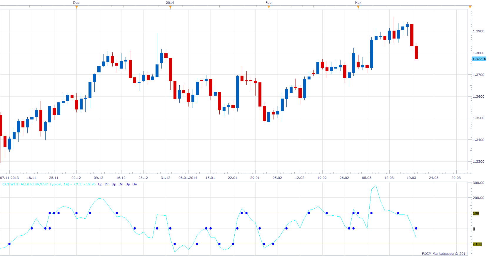

# CCI oscillator with alert

> Source: https://fxcodebase.com/code/viewtopic.php?f=17&t=12937  
> Forum: 17 · Topic 12937 · 13 post(s)

---

## CCI oscillator with alert

**Alexander.Gettinger** · Mon Feb 06, 2012 3:34 pm

The indicator shows how to make alert from the custom indicator.

Call the "alertEmail", "alertMessage" and "alertSound" methods of the terminal from the indicator impossible. But can be used the following way. Will use an auxiliary signal which will be called from the indicator.

The indicator will display a warning when CCI crossing the zero line.

Download:

 [CCI_Alert.lua](files/25328/CCI_Alert.lua)

 

This indicator provides Audio / Email Alertson CCI / (Zero/OB/OS) line cross.
Dec 21, 2015: Compatibility issue Fix. _Alert helper is not longer needed.

 [CCI with Alert.lua](files/25328/CCI%20with%20Alert.lua)

The indicator was revised and updated

---

## Re: CCI oscillator with alert

**Tim123** · Tue Mar 18, 2014 2:08 pm

I would like to be able to set the value of the CCI where the alert happens. Can you add that to this alert?
Thanks

---

## Re: CCI oscillator with alert

**Apprentice** · Wed Mar 19, 2014 5:38 am

Your request is added to the development list.

---

## Re: CCI oscillator with alert

**7510109079** · Wed Mar 19, 2014 8:33 am

isnt there a strategy for this functionality. Search on HIGHLY ADAPTIVE CCI STRATEGY and there is one WITH CONFIRMATION too.

---

## Re: CCI oscillator with alert

**Apprentice** · Thu Mar 20, 2014 4:53 am

7510109079 Can you define rules for this strategy.

---

## Re: CCI oscillator with alert

**7510109079** · Thu Mar 20, 2014 6:53 am

I originally got the strategy from this site.

when i now search for it, it cannot be found. Have you lost some pages during the last site down time?

i have attached it along with another modification which i could never get to work

---

## Re: CCI oscillator with alert

**7510109079** · Fri Mar 21, 2014 8:12 am

Omar, have you taken over Mario's role?

---

## Re: CCI oscillator with alert

**Apprentice** · Sat Mar 22, 2014 3:14 am

No, as you know, for some time now, I was in search for helpers.
Omar was the first who was willing to accept this job.
And have that appropriate "know how", passion.

For now, for the most part will use his expertise in strategy development.

You can find this strategy here.
[viewtopic.php?f=31&t=4562&p=16620&hilit=Highly+adaptable+CCI+Strategy.lua#p16620](https://fxcodebase.com/code/viewtopic.php?f=31&t=4562&p=16620&hilit=Highly+adaptable+CCI+Strategy.lua#p16620)

---

## Re: CCI oscillator with alert

**FX Gator** · Wed Mar 26, 2014 1:03 pm

Hello,

What values do you put in to have a position buy when CCI is crossing the zero line from the south to the north and then a sell from the north to the south? I have not been able to make this work.

---

## Re: CCI oscillator with alert

**Apprentice** · Thu Mar 27, 2014 2:27 pm

CCI_Alert.lua will not be able to do this task.
You need to use Highly adaptable CCI Strategy.lua
[viewtopic.php?f=31&t=4562&p=16620&hilit=Highly+adaptable+CCI+Strategy.lua#p16620](https://fxcodebase.com/code/viewtopic.php?f=31&t=4562&p=16620&hilit=Highly+adaptable+CCI+Strategy.lua#p16620)

---

## Re: CCI oscillator with alert

**mulligan** · Wed Nov 05, 2014 7:30 pm

Can you please add line color option for the zero line. I use the black chart background and can't see it.

Thanks

---

## Re: CCI oscillator with alert

**Apprentice** · Thu Nov 06, 2014 6:09 am

Color Option Added.

---

## Re: CCI oscillator with alert

**Apprentice** · Tue Jul 18, 2017 6:56 am

The indicator was revised and updated.
